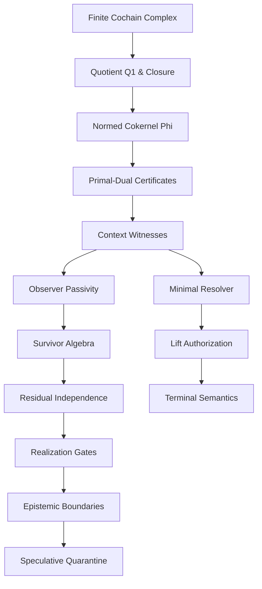

# The General Theory of Finite Obstruction Calculus — Proof Archive

**Source:** `993_General Theory of Finite Obstruction Calculus(2).md`  
**Split role:** long proofs, theorem ledgers, and core proof dependencies removed from the publication main.

---

## Included Proof Material

- T1 through T7 core proof material.
- Well-founded descent, operators, observer passivity, primitive survivor algebra, realization gates, terminal semantics, and core proof dependency graphs.
- Category-theoretic theorem ledger sections that support the finite obstruction spine.

---

## T1 — Finite Realization Gate

## T1 — Finite Realization Gate

### Theorem

Let (X) be a proposed theorem-grade claim in the finite obstruction calculus. Then (X) has theorem-grade authority only if there exists a declared finite realization packet

\[
\mathcal G
==========

(K,\mathcal C,\rho,C^\bullet,E,\mathcal O,V,\tau,\mathcal K,\Lambda)
\]

where

\[
C^\bullet:
C^0\xrightarrow{d_0}C^1\xrightarrow{d_1}C^2,
\qquad
d_1d_0=0.
\]

Equivalently,

\[
\boxed{
\mathsf{TheoremGrade}(X)
\Rightarrow
K
\wedge
(\mathcal C,\rho)
\wedge
C^\bullet
\wedge
E
\wedge
\mathcal O
\wedge
V
\wedge
\tau
\wedge
\mathcal K
\wedge
\Lambda .
}
\]

Contrapositive:

\[
\boxed{
\neg K
\vee
\neg(\mathcal C,\rho)
\vee
\neg C^\bullet
\vee
\neg E
\vee
\neg\mathcal O
\vee
\neg V
\vee
\neg\tau
\vee
\neg\mathcal K
\vee
\neg\Lambda
\Rightarrow
\neg\mathsf{TheoremGrade}(X).
}
\]

The uploaded monograph states the same finite realization packet requirement and lists the required components: finite carrier, context category, cochain complex, operator/repair set, observer/evaluator law, certificate regime, and refusal/budget/terminal semantics. 

---

## Proof

A theorem-grade claim is not merely a sentence. It is a sentence whose symbols are typed, evaluable, replayable, and terminalizable inside a finite packet. We prove that each component of (\mathcal G) is necessary.

### 1. Finite carrier

If (K) is absent, there is no finite state space, coordinate set, object domain, or defect domain. Then expressions such as

\[
x\in C^1,\qquad q\in Q^1,\qquad p(x)\in Q^1
\]

are not typed. Therefore obstruction, repair, witness, and terminal claims have no finite interpretation.

Hence:

\[
\neg K\Rightarrow\neg\mathsf{TheoremGrade}(X).
\]

### 2. Context category and action

If ((\mathcal C,\rho)) is absent, then context-sensitive comparison is undefined. In particular, the witness condition

\[
x\sim y
\quad\text{but}\quad
\rho(c)x\not\sim \rho(c)y
\]

cannot be formed because (c), (\rho(c)), and the context action are missing. The monograph identifies the lift trigger as context-visible non-congruence, with witness (w=(x,y,c)). 

Thus:

\[
\neg(\mathcal C,\rho)
\Rightarrow
\neg\mathsf{TheoremGrade}(X).
\]

### 3. Cochain complex

If

\[
C^0\xrightarrow{d_0}C^1\xrightarrow{d_1}C^2,
\qquad d_1d_0=0
\]

is absent, then the core obstruction objects are undefined:

\[
B^1=\operatorname{im}(d_0),
\]

\[
Q^1=C^1/\operatorname{im}(d_0),
\]

\[
\overline d_1:Q^1\to C^2,
\]

\[
H^1=\ker(\overline d_1).
\]

So exact repair, quotient obstruction, closure, survivor status, and open obstruction cannot even be stated. The monograph explicitly defines the finite obstruction core through this cochain structure, exact repair (B^1), quotient obstruction (Q^1), and closed residue (H^1). 

Therefore:

\[
\neg C^\bullet
\Rightarrow
\neg\mathsf{TheoremGrade}(X).
\]

### 4. Operator / repair set

If (E) is absent, there is no admissible class of repairs or transitions. Then the predicates

\[
\mathsf{admissible},\quad
\mathsf{inadmissible},\quad
\mathsf{exhausted},\quad
\mathsf{budget\ unknown}
\]

have no declared range of evaluation. Exhaustiveness and minimality cannot be certified without a finite search class or budget.

Thus:

\[
\neg E
\Rightarrow
\neg\mathsf{TheoremGrade}(X).
\]

### 5. Observer / evaluator law

If (\mathcal O) is absent, there is no declared gauge, norm, observer quotient, profile map, acceptance law, or evaluator. Then the central diagnostics

\[
\Phi(q),\qquad
\Gamma(q),\qquad
R_{cl}(q),\qquad
\mathcal O(q),\qquad
p(x)
\]

are undefined. In particular, one cannot distinguish exact, survivor, open, erased, observer-visible, or observer-invisible obstruction states.

Thus:

\[
\neg\mathcal O
\Rightarrow
\neg\mathsf{TheoremGrade}(X).
\]

### 6. Verifier and certificates

If (V) or (\mathcal K) is absent, then a candidate result cannot be replayed. The system cannot distinguish

\[
\text{proved}
\]

from

\[
\text{asserted}.
\]

For example, a claim that (q=0), (\Phi(q)>0), (w=(x,y,c)), or (\Lambda) is valid requires a replayable certificate. The monograph states that checked obstruction packets must contain finite data such as level, boundary maps, weights, primal/dual witnesses, (\Phi), (\Gamma), tolerance, and hash, or typed evidence explaining why unavailable. 

Therefore:

\[
\neg V\vee\neg\mathcal K
\Rightarrow
\neg\mathsf{TheoremGrade}(X).
\]

### 7. Refusal and terminal semantics

If (\tau) and (\Lambda) are absent, failed realization has no valid output type. The system cannot distinguish

\[
\mathsf{NoRule},\quad
\mathsf{BudgetUnknown},\quad
\mathsf{Refused},\quad
\mathsf{LiftRequired},\quad
\mathsf{Exact},\quad
\mathsf{Survivor}.
\]

Without typed refusal, an unsupported claim can be silently promoted, or a failed proof can be misread as disproof. The monograph’s combined conclusion says each required component is a typing condition for theorem-grade authority, and absence of any component makes some core expression undefined. 

Thus:

\[
\neg\tau\vee\neg\Lambda
\Rightarrow
\neg\mathsf{TheoremGrade}(X).
\]

---

## Combined argument

By cases, removing any required component makes at least one core expression undefined:

\[
Q^1,\quad
\Phi,\quad
\Gamma,\quad
H^1,\quad
w,\quad
V,\quad
\tau,\quad
\Lambda.
\]

Therefore (X) cannot be evaluated as a theorem-grade obstruction-calculus claim.

So:

\[
\boxed{
\mathsf{TheoremGrade}(X)
\Rightarrow
K
\wedge
(\mathcal C,\rho)
\wedge
C^\bullet
\wedge
E
\wedge
\mathcal O
\wedge
V
\wedge
\tau
\wedge
\mathcal K
\wedge
\Lambda.
}
\]

Equivalently:

\[
\boxed{
\neg K
\vee
\neg(\mathcal C,\rho)
\vee
\neg C^\bullet
\vee
\neg E
\vee
\neg\mathcal O
\vee
\neg V
\vee
\neg\tau
\vee
\neg\mathcal K
\vee
\neg\Lambda
\Rightarrow
\neg\mathsf{TheoremGrade}(X).
}
\]

\[
\blacksquare
\]

---

## Status

T1 is a **core gate theorem**. It proves a necessary condition, not truth of the claim.

\[
\boxed{
\text{No finite realization packet, no theorem-grade authority.}
}
\]

The failed claim is not false by default. It receives a realization/refusal terminal such as:

\[
\mathsf{MissingCarrier},\quad
\mathsf{MissingContext},\quad
\mathsf{MissingComplex},\quad
\mathsf{MissingOperatorSet},\quad
\mathsf{MissingEvaluator},\quad
\mathsf{MissingCertificate},\quad
\mathsf{MissingRefusalSemantics}.
\]

The finite descent authority paper gives the same boundary at the authority-pipeline level: authority requires a finite packet (P_s=(K_s,E_s,V_s,\tau_s,\Lambda_s)), with (K_s) carrying finite carrier data, (E_s) admissible operators/diagnostics, (V_s) replay checks/certificates, (\tau_s) terminal semantics, and (\Lambda_s) lift/refusal/budget discipline. 


---

## Part I Core Definitions and T2-T7 Proofs

# Part I — Canonical Finite Core

## 1. Ambient Categories

Let

\[
\mathsf{FinCat},\qquad
\mathsf{FinSet},\qquad
\mathsf{Vect}^{fd}_{\mathbb R}
\]

denote finite small categories, finite sets, and finite-dimensional real vector spaces.

For a finite category \(\mathcal C\),

\[
\widehat{\mathcal C}_{fin}
=
\mathsf{FinSet}^{\mathcal C^{op}}
\]

is the finite presheaf environment. If a finite Grothendieck topology \(J\) is explicitly supplied, one may form

\[
\mathsf{Sh}(\mathcal C,J)\subseteq \widehat{\mathcal C}_{fin}.
\]

No sheaf topology is automatic.

A local/global obstruction has the presheaf form

\[
\text{compatible local family}
\not\Rightarrow
\text{global section}.
\]

---

## 2. MSS-N Level

An MSS level is a finite tuple

\[
\mathcal M_n
=
(\mathcal T_n,\mathcal C_n,\rho_n,L_n,D_n,O_n,\delta_n,\chi_n,\omega_n,\mu_n),
\]

where

| symbol | role |
|---|---|
| \(\mathcal T_n\) | finite term/state category |
| \(\mathcal C_n\) | finite admissible context category |
| \(\rho_n:\mathcal C_n\to\mathsf{End}(\mathcal T_n)\) | context action |
| \(L_n\) | repair generators |
| \(D_n\) | distinction coordinates |
| \(O_n\) | closure/obstruction coordinates |
| \(\delta_n\) | repair boundary |
| \(\chi_n\) | closure boundary |
| \(\omega_n\) | positive weights/gauges |
| \(\mu_n\) | finite well-founded descent signature |

The cochain carrier is

\[
C^0_n=\mathbb R^{L_n},
\qquad
C^1_n=\mathbb R^{D_n},
\qquad
C^2_n=\mathbb R^{O_n},
\]

\[
d_{0,n}=\delta_n,\qquad
d_{1,n}=\chi_n,\qquad
d_{1,n}d_{0,n}=0.
\]

Thus \(C^\bullet_n\) is concentrated in degrees \(0,1,2\).

---

## 3. Defects, Exact Repair, and Quotient Obstruction

For a submitted finite state \(s\), an edge defect has the form

\[
\delta_e(s)=r_e(s(v))-s(u).
\]

The aggregate submitted defect is

\[
I(s)=\sum_{e\in E}w_e\|\delta_e(s)\|_e.
\]

This is not a truth score; it is a finite gauge-dependent defect.

The exact repair subspace is

\[
B^1_n=\operatorname{im}(d_{0,n})\subseteq C^1_n.
\]

The quotient obstruction space is

\[
Q^1_n=C^1_n/B^1_n,
\qquad
\pi_n:C^1_n\to Q^1_n.
\]

Because \(d_{1,n}d_{0,n}=0\), \(d_{1,n}\) descends to

\[
\overline d_{1,n}:Q^1_n\to C^2_n,
\qquad
\overline d_{1,n}\pi_n=d_{1,n}.
\]

The closed quotient object is

\[
H^1_n
=
\ker(\overline d_{1,n})
\cong
\ker(d_{1,n})/\operatorname{im}(d_{0,n}).
\]

Elements of \(H^1_n\setminus\{0\}\) are closed non-exact residual classes.

---


### 3.1 The Role of \(Q^1\)

\[
\boxed{
Q^1_n\text{ is the observable distinction space modulo repair, where }\Phi_n
\text{ and }\overline d_{1,n}\text{ are well-defined.}
}
\]

## 4. Norms and Outer \(\ell^1\) Aggregation

A positive weight system gives

\[
\|x\|_{1,\omega_n}
=
\sum_{d\in D_n}\omega_{n,d}|x_d|.
\]

The quotient obstruction norm is

\[
\Phi_n([x])
=
\inf_{\alpha\in C^0_n}
\|x-d_{0,n}\alpha\|_{1,\omega_n}.
\]

The closure mass is

\[
\Gamma_n([x])
=
\|\overline d_{1,n}([x])\|.
\]

The safe norm principle is:

\[
\boxed{
\text{independent finite defects add by outer }\ell^1
\text{ after local gauges are declared.}
}
\]

Local gauges may be scalar \(\ell^1\), vector \(\ell^2\), trace norm, or another declared finite gauge. The core does not assert that \(\ell^1\) is universal.


## T2 — Normed Cokernel and Quotient Obstruction

### Theorem

Let

\[
C^0\xrightarrow{d_0}C^1\xrightarrow{d_1}C^2
\]

be a finite-dimensional real cochain complex with

\[
d_1d_0=0.
\]

Let (C^1) carry a declared norm (|\cdot|). Define

\[
B^1:=\operatorname{im}(d_0)\subseteq C^1,
\]

\[
Q^1:=C^1/B^1=C^1/\operatorname{im}(d_0),
\]

and

\[
\Phi([x])
=========

\inf_{\alpha\in C^0}
|x-d_0\alpha|.
\]

Then:

1. (Q^1) is the cokernel of (d_0).
2. (\Phi) is the quotient norm on (Q^1).
3. The infimum defining (\Phi) is attained.
4. (d_1) descends to a well-defined map

\[
\overline d_1:Q^1\to C^2,
\qquad
\overline d_1([x])=d_1x.
\]

5. The closed quotient sector is

\[
H^1:=\ker(\overline d_1)
\cong
\ker(d_1)/\operatorname{im}(d_0).
\]

The monograph states this as the finite quotient core: exact repair is (B^1=\operatorname{im}(d_0)), quotient obstruction is (Q^1=C^1/B^1), (d_1) descends because (d_1d_0=0), and (H^1\cong\ker(d_1)/\operatorname{im}(d_0)). 

---

## Proof

### 1. (Q^1) is the cokernel of (d_0)

Let

\[
\pi:C^1\to Q^1=C^1/\operatorname{im}(d_0)
\]

be the quotient projection.

For every (\alpha\in C^0),

\[
\pi(d_0\alpha)=0.
\]

Thus:

\[
\pi\circ d_0=0.
\]

Now let (W) be any real vector space and let

\[
f:C^1\to W
\]

be a linear map such that

\[
f\circ d_0=0.
\]

Then (f) vanishes on (\operatorname{im}(d_0)). If ([x]=[y]\in Q^1), then

\[
x-y\in\operatorname{im}(d_0),
\]

so

\[
f(x-y)=0,
\]

hence

\[
f(x)=f(y).
\]

Therefore the formula

\[
\overline f([x]) := f(x)
\]

is well-defined. It is linear and satisfies

\[
f=\overline f\circ\pi.
\]

Uniqueness follows because every class in (Q^1) is (\pi(x)) for some (x\in C^1). Therefore (\pi:C^1\to Q^1) has the universal property of the cokernel of (d_0).

So:

\[
\boxed{
Q^1=\operatorname{coker}(d_0).
}
\]

---

### 2. (\Phi) is the induced quotient norm

The quotient norm on (C^1/B^1) induced by (|\cdot|) is

\[
|[x]|_{C^1/B^1}
===============

\inf_{b\in B^1}|x-b|.
\]

Since

\[
B^1=\operatorname{im}(d_0),
\]

every (b\in B^1) has the form

\[
b=d_0\alpha
\]

for some (\alpha\in C^0). Therefore

\[
|[x]|_{C^1/B^1}
===============

\inf_{\alpha\in C^0}
|x-d_0\alpha|.
\]

This is exactly

\[
\Phi([x])
=========

\inf_{\alpha\in C^0}
|x-d_0\alpha|.
\]

Hence:

\[
\boxed{
\Phi([x])=|[x]|_{Q^1}.
}
\]

So (\Phi) measures the distance from (x) to the exact-repair subspace (\operatorname{im}(d_0)). The monograph gives the same construction for a declared finite gauge, for example a positive weighted (\ell^1) norm, and identifies (\Phi_n([x])) as the quotient obstruction norm. 

---

### 3. (\Phi) is a genuine norm

We verify the norm axioms.

Nonnegativity is immediate:

\[
\Phi([x])\ge 0.
\]

Homogeneity: for (\lambda\in\mathbb R),

\[
\Phi(\lambda[x])
================

\inf_{\alpha\in C^0}|\lambda x-d_0\alpha|.
\]

If (\lambda\neq0), write (\alpha=\lambda\beta). Then

\[
\Phi(\lambda[x])
================

\inf_{\beta\in C^0}|\lambda(x-d_0\beta)|

|\lambda|
\inf_{\beta\in C^0}|x-d_0\beta|
===============================

|\lambda|\Phi([x]).
\]

For (\lambda=0), both sides are (0).

Triangle inequality: for any (\alpha,\beta\in C^0),

\[
(x+y)-d_0(\alpha+\beta)
=======================

(x-d_0\alpha)+(y-d_0\beta).
\]

Therefore

\[
|(x+y)-d_0(\alpha+\beta)|
\le
|x-d_0\alpha|+|y-d_0\beta|.
\]

Taking infima over (\alpha,\beta) gives

\[
\Phi([x]+[y])
\le
\Phi([x])+\Phi([y]).
\]

Definiteness: suppose

\[
\Phi([x])=0.
\]

Then (x) lies in the closure of (\operatorname{im}(d_0)). Since (C^1) is finite-dimensional, every linear subspace is closed. Hence

\[
x\in\operatorname{im}(d_0),
\]

so

\[
[x]=0\in Q^1.
\]

Conversely, if ([x]=0), then (x=d_0\alpha) for some (\alpha), so

\[
\Phi([x])\le |x-d_0\alpha|=0.
\]

Thus:

\[
\Phi([x])=0
\iff
[x]=0.
\]

So (\Phi) is a true norm on (Q^1), not merely a seminorm, because (\operatorname{im}(d_0)) is closed in finite dimension. 

---

### 4. The infimum is attained

Fix (x\in C^1). Since (C^0) and (C^1) are finite-dimensional,

\[
B^1=\operatorname{im}(d_0)
\]

is a finite-dimensional subspace of (C^1), hence closed.

Now

\[
\Phi([x])
=========

\inf_{b\in B^1}|x-b|

\operatorname{dist}(x,B^1).
\]

Choose a minimizing sequence (b_n\in B^1) such that

\[
|x-b_n|\to \operatorname{dist}(x,B^1).
\]

We may restrict to (b_n) in a closed bounded ball: any (b) sufficiently far from (x) cannot improve the distance. In finite dimensions, closed bounded sets are compact. Therefore a subsequence converges:

\[
b_{n_k}\to b^\ast\in B^1.
\]

By continuity of the norm,

\[
|x-b^\ast|
==========

\operatorname{dist}(x,B^1).
\]

Since (b^\ast\in B^1=\operatorname{im}(d_0)), there exists (\alpha^\ast\in C^0) such that

\[
b^\ast=d_0\alpha^\ast.
\]

Therefore

\[
\boxed{
\Phi([x])
=========

|x-d_0\alpha^\ast|.
}
\]

So the infimum is attained. The monograph gives the same finite-dimensional closed-subspace/compactness argument for existence of minimizers. 

---

### 5. (d_1) descends to (Q^1)

Define

\[
\overline d_1:Q^1\to C^2
\]

by

\[
\overline d_1([x])=d_1x.
\]

We must prove this is well-defined.

Suppose

\[
[x]=[y].
\]

Then

\[
x-y\in\operatorname{im}(d_0),
\]

so there exists (\alpha\in C^0) such that

\[
x-y=d_0\alpha.
\]

Apply (d_1):

\[
d_1x-d_1y
=========

d_1(x-y)

d_1d_0\alpha

0.

\]

Thus

\[
d_1x=d_1y.
\]

So (\overline d_1([x])) does not depend on the representative (x). Hence (\overline d_1) is well-defined and satisfies

\[
\boxed{
\overline d_1\circ\pi=d_1.
}
\]

This is exactly the descent step: (d_1) factors through the quotient by exact repairs because exact repairs lie in (\ker(d_1)). 

---

### 6. (H^1\cong\ker(d_1)/\operatorname{im}(d_0))

Define

\[
H^1:=\ker(\overline d_1)\subseteq Q^1.
\]

Then:

\[
[x]\in H^1
\iff
\overline d_1([x])=0.
\]

By definition of (\overline d_1),

\[
\overline d_1([x])=d_1x.
\]

Therefore:

\[
[x]\in H^1
\iff
d_1x=0
\iff
x\in\ker(d_1).
\]

Since classes in (Q^1) are already taken modulo (\operatorname{im}(d_0)), the kernel of (\overline d_1) is precisely the quotient of closed elements by exact repairs:

\[
H^1
===

{[x]\in C^1/\operatorname{im}(d_0):x\in\ker(d_1)}.
\]

Because

\[
d_1d_0=0,
\]

we have

\[
\operatorname{im}(d_0)\subseteq\ker(d_1).
\]

Thus the quotient is defined, and the natural map

\[
\ker(d_1)/\operatorname{im}(d_0)
\to
H^1,
\qquad
x+\operatorname{im}(d_0)\mapsto [x]
\]

is a well-defined linear isomorphism.

Therefore:

\[
\boxed{
H^1=\ker(\overline d_1)\cong\ker(d_1)/\operatorname{im}(d_0).
}
\]

The monograph uses this as the closed quotient object: elements of (H^1\setminus{0}) are closed non-exact residual classes. 

---

## Conclusion

\[
\boxed{
Q^1=C^1/\operatorname{im}(d_0)
}
\]

is the cokernel of (d_0). The function

\[
\boxed{
\Phi([x])=\inf_{\alpha\in C^0}|x-d_0\alpha|
}
\]

is the quotient norm, and the infimum is attained because (\operatorname{im}(d_0)) is closed in finite dimension. Since (d_1d_0=0), (d_1) descends to

\[
\boxed{
\overline d_1:Q^1\to C^2.
}
\]

Finally,

\[
\boxed{
H^1=\ker(\overline d_1)\cong\ker(d_1)/\operatorname{im}(d_0).
}
\]

\[
\blacksquare
\]

### Ledger form

```text
T2 — Normed Cokernel and Quotient Obstruction

Input:
  finite-dimensional cochain complex
      C0 --d0--> C1 --d1--> C2
  with d1 d0 = 0
  declared norm ||-|| on C1

Definitions:
  B1 = im(d0)
  Q1 = C1 / B1
  π : C1 -> Q1
  Φ([x]) = inf_{α∈C0} ||x - d0α||
  dbar1([x]) = d1x
  H1 = ker(dbar1)

Results:
  Q1 = coker(d0)
  Φ is the quotient norm on Q1
  Φ is attained in finite dimension
  dbar1 is well-defined because d1 d0 = 0
  H1 ≅ ker(d1) / im(d0)

Interpretation:
  Q1 = obstruction modulo exact repair
  Φ = minimum residual magnitude after all exact repairs
  H1 = closed non-exact residual sector
```

---

## T3 — Primal-Dual Certificate Identity

### Theorem

Let

\[
d_0:C^0\to C^1
\]

be a linear map between finite-dimensional real vector spaces, and identify

\[
C^1\cong \mathbb R^n.
\]

Let (\omega_i>0) be declared coordinate weights, and define the weighted (\ell^1) quotient obstruction magnitude

\[
\Phi([x])
=========

\min_{\alpha\in C^0}
\sum_i\omega_i|x_i-(d_0\alpha)_i|.
\]

Then

\[
\boxed{
\Phi([x])
=========

\max_{\varphi\in (C^1)^*}
\left{
\varphi(x):
d_0^*\varphi=0,\ |\varphi_i|\le \omega_i
\right}.
}
\]

Moreover, the primal minimum and dual maximum are attained.

This is the monograph’s primal-dual obstruction certificate theorem: the primal minimizes weighted residual after exact repair; the dual maximizes a bounded annihilator witness satisfying (d_0^*\varphi=0) and (|\varphi_i|\le\omega_i).

---

## Proof


Let

\[
A=d_0:C^0\to C^1.
\]


For (x\in C^1\cong\mathbb R^n), the primal problem is

\[
\Phi([x])
=========

\min_{\alpha}
\sum_i\omega_i|x_i-(A\alpha)_i|.
\]

Introduce a residual variable

\[
h=x-A\alpha
\]

and nonnegative slack variables (u_i) with

\[
-u_i\le h_i\le u_i.
\]

Equivalently,

\[
h_i-u_i\le 0,
\qquad
-h_i-u_i\le 0.
\]

The primal linear program is:

\[
\boxed{
\begin{aligned}
\text{minimize }& \sum_i\omega_i u_i\
\text{over }& \alpha,h,u\
\text{subject to }& h+A\alpha=x,\
& h_i-u_i\le0,\
& -h_i-u_i\le0.
\end{aligned}
}
\]

The constraints force (u_i\ge |h_i|), so at optimum

\[
u_i=|h_i|,
\]

and this LP has the same value as

\[
\min_\alpha\sum_i\omega_i|x_i-(A\alpha)_i|.
\]

---


## Dual derivation

Introduce a dual variable

\[
\varphi\in (C^1)^*
\]

for the equality constraint

\[
h+A\alpha=x.
\]

Introduce nonnegative multipliers

\[
\lambda_i^+\ge0,\qquad \lambda_i^-\ge0
\]

for the inequality constraints

\[
h_i-u_i\le0,
\qquad
-h_i-u_i\le0.
\]

Use the Lagrangian

\[
L
=

\sum_i\omega_i u_i
+
\varphi(x-h-A\alpha)
+
\sum_i\lambda_i^+(h_i-u_i)
+
\sum_i\lambda_i^-(-h_i-u_i).
\]

Collect terms.

The (\alpha)-term is

\[
-\varphi(A\alpha)
=================

-(A^*\varphi)(\alpha).
\]

For the infimum over (\alpha) to be finite, we require

\[
A^*\varphi=0.
\]

Since (A=d_0), this is

\[
d_0^*\varphi=0.
\]

The (h_i)-coefficient is

\[
-\varphi_i+\lambda_i^+-\lambda_i^-.
\]

For the infimum over (h) to be finite, we require

\[
\varphi_i=\lambda_i^+-\lambda_i^-.
\]

The (u_i)-coefficient is

\[
\omega_i-\lambda_i^+-\lambda_i^-.
\]

For the infimum over (u) to be finite, we require

\[
\lambda_i^++\lambda_i^-\le\omega_i.
\]

Because

\[
\varphi_i=\lambda_i^+-\lambda_i^-,
\qquad
\lambda_i^\pm\ge0,
\qquad
\lambda_i^++\lambda_i^-\le\omega_i,
\]

this is equivalent to

\[
|\varphi_i|\le\omega_i.
\]

The remaining Lagrangian value is

\[
\varphi(x).
\]

Therefore the dual LP is

\[
\boxed{
\begin{aligned}
\text{maximize }& \varphi(x)\
\text{subject to }& d_0^*\varphi=0,\
& |\varphi_i|\le\omega_i.
\end{aligned}
}
\]

Thus weak duality gives

\[
\max_{\substack{d_0^*\varphi=0\|\varphi_i|\le\omega_i}}
\varphi(x)
\le
\Phi([x]).
\]

---


## Feasibility and attainment

The primal is feasible: choose

\[
\alpha=0,\qquad h=x,\qquad u_i=|x_i|.
\]

The objective is finite because (x\in\mathbb R^n) and (\omega_i>0).

The primal minimum is attained because this is equivalent to minimizing the distance from (x) to the finite-dimensional subspace

\[
\operatorname{im}(d_0)\in C^1,
\]

which is closed. The earlier normed-cokernel theorem gives exactly this finite-dimensional closed-subspace attainment.

The dual is feasible: choose

\[
\varphi=0.
\]

The feasible dual set is

\[
\left{
\varphi\in(C^1)^*:
d_0^*\varphi=0,\ |\varphi_i|\le\omega_i
\right}.
\]

It is a closed subset of the compact box

\[
\prod_i[-\omega_i,\omega_i].
\]

Hence it is compact. The objective

\[
\varphi\mapsto \varphi(x)
\]

is continuous, so the dual maximum is attained.

By finite-dimensional linear programming strong duality, since the primal and dual are feasible and have finite optimum, their optimal values agree. Therefore

\[
\boxed{
\Phi([x])
=========

\max_{\substack{d_0^*\varphi=0\|\varphi_i|\le\omega_i}}
\varphi(x.
}
\]

\[
\blacksquare
\]

---


## Certificate interpretation

A feasible dual witness satisfies

\[
d_0^*\varphi=0.
\]

So for every exact repair (d_0\alpha),

\[
\varphi(d_0\alpha)
==================

(d_0^*\varphi)(\alpha)

0.

\]

Thus (\varphi) annihilates exact repairs and descends to a functional on

\[
Q^1=C^1/\operatorname{im}(d_0).
\]

The bound

\[
|\varphi_i|\le\omega_i
\]

makes it a bounded detector relative to the declared weighted (\ell^1) gauge.

At optimum,

\[
\varphi^*(x)=\Phi([x]).
\]

So (\varphi^*) is a replayable obstruction witness: it proves that the residual magnitude cannot be reduced below (\Phi([x])) by any exact repair.

The monograph’s replay certificate requires primal residual data, dual witness data, equality check, closure check, tolerance, and provenance hash.

---

## Complementary slackness

Let

\[
\alpha^*
\]

be primal optimal, and define

\[
h^*=x-d_0\alpha^*.
\]

Let

\[
\varphi^*
\]

be dual optimal.

Then coordinatewise:

\[
\boxed{
\varphi_i^* h_i^*
=================

\omega_i |h_i^*|.
}
\]

Equivalently:

\[
h_i^*>0\Rightarrow \varphi_i^*=\omega_i,
\]

\[
h_i^*<0\Rightarrow \varphi_i^*=-\omega_i,
\]

\[
|\varphi_i^*|<\omega_i\Rightarrow h_i^*=0.
\]

Proof: since (d_0^*\varphi^*=0),

\[
\varphi^*(x)
============

\varphi^*(h^*+d_0\alpha^*)

\varphi^*(h^*).
\]

Also,

\[
\varphi^*(h^*)
==============

\sum_i\varphi_i^*h_i^*
\le
\sum_i|\varphi_i^*||h_i^*|
\le
\sum_i\omega_i|h_i^*|.
\]

At optimality,

\[
\varphi^*(x)
============

\Phi([x])

\sum_i\omega_i|h_i^*|.
\]

Therefore every inequality above is tight coordinatewise, yielding

\[
\varphi_i^* h_i^*
=================

\omega_i |h_i^*|
\]

for each (i).

\[
\blacksquare
\]

---


## Replayable certificate form


```text
T3_PrimalDualCertificate:

Input:
  finite spaces C0, C1
  matrix d0
  vector x in C1
  weights omega_i > 0

Primal data:
  alpha_star
  h_star = x - d0 alpha_star
  Phi = sum_i omega_i |h_star_i|

Dual data:
  phi_star
  check: d0^T phi_star = 0
  check: |phi_star_i| <= omega_i for all i
  dual_value = phi_star(x)

Equality:
  check: Phi = dual_value
  or abs(Phi - dual_value) <= epsilon

Conclusion:
  Phi([x]) = Phi
```

Why this certificate is sound:

For every (\alpha),

\[
\varphi^*(x)
============

\varphi^*(x-d_0\alpha)
\le
\sum_i\omega_i|x_i-(d_0\alpha)_i|.
\]

Thus

\[
\varphi^*(x)
\le
\Phi([x]).
\]

But the primal residual gives

\[
\Phi([x])
\le
\sum_i\omega_i|h_i^*|
=====================

\Phi.
\]

If the equality check verifies

\[
\varphi^*(x)=\Phi,
\]

then

\[
\boxed{
\Phi([x])=\Phi.
}
\]

So the verifier need not trust the solver. It only checks primal feasibility, dual feasibility, and primal-dual equality.

\[
\blacksquare
\]

---

## Ledger form

```text
T3 — Primal-Dual Certificate Identity

Input:
  finite-dimensional C0 --d0--> C1
  x in C1
  positive weights omega_i

Primal:
  Phi([x]) = min_alpha sum_i omega_i |x_i - (d0 alpha)_i|

LP form:
  minimize sum_i omega_i u_i
  subject to h + d0 alpha = x
             h_i - u_i <= 0
            -h_i - u_i <= 0

Dual:
  maximize phi(x)
  subject to d0* phi = 0
             |phi_i| <= omega_i

Identity:
  Phi([x]) =
  max { phi(x) : d0* phi = 0, |phi_i| <= omega_i }

Attainment:
  primal attained because im(d0) is closed in finite dimension
  dual attained because feasible dual set is compact

Certificate:
  alpha*
  h* = x - d0 alpha*
  phi*
  Phi
  d0* phi* = 0
  |phi_i*| <= omega_i
  Phi = sum_i omega_i |h_i*|
  Phi = phi*(x)
```

\[
\boxed{
\text{Weighted quotient obstruction is certified by primal repair plus dual annihilator.}
}
\]


---


## 6. Closure Trichotomy

For \(q\in Q^1_n\), define

\[
\mathsf{Exact}_n(q)
\iff
\Phi_n(q)=0,
\]

\[
\mathsf{Survivor}_n(q)
\iff
\Phi_n(q)>0 \wedge \overline d_{1,n}(q)=0,
\]

\[
\mathsf{Open}_n(q)
\iff
\Phi_n(q)>0 \wedge \overline d_{1,n}(q)\ne0.
\]

Finite dimensionality gives the disjoint partition

\[
Q^1_n
=
\mathsf{Exact}_n
\sqcup
\mathsf{Survivor}_n
\sqcup
\mathsf{Open}_n.
\]

A survivor is exactly a closed non-exact quotient residual. An open obstruction is not yet structure; it requires repair, lift, refusal, or budget boundary.

---

## 7. Observers and Epistemic Quotients

An observer is a finite, deterministic, repair-compatible quotient map

\[
\mathcal O:Q^1_n\to Q^1_{\mathcal O}.
\]

A finite observer family is

\[
\mathfrak O_n=\{\mathcal O_1,\dots,\mathcal O_k\}.
\]

An obstruction class \(q\) is observer-stable over \(\mathfrak O_n\) when each observer preserves its declared nonzero status or certified profile. It is observer-invariant only relative to a proven observer class.

Observer quotients are epistemic structure; they do not create obstruction. They erase or identify distinctions.

The cross-observer stability test is

\[
\forall \mathcal O\in\mathfrak O_n:
\quad
\Phi_{\mathcal O}(\mathcal O(q))>0
\]

or the corresponding typed preservation condition.

### Theorem O1 — Observer Passivity / No-Creation

A finite observer is a deterministic repair-compatible quotient map

\[
\mathcal O:Q^1_n\to Q^1_{\mathcal O}.
\]

Equipped with the induced observer quotient norm


## T4 — Context Witness Lift Trigger

### Theorem

Let \(S\) be a finite contextual obstruction system with:

\[
S=(\mathcal T,\mathcal C,\rho; C^\bullet,\omega,p),
\]

where

\[
p:\operatorname{Ob}(\mathcal T)\to Q^1
\]

is the quotient profile map. Define

\[
x\sim y
\iff
p(x)=p(y).
\]

Then obstruction mass alone does not force a lift. A lift is triggered only by **context-visible non-congruence**, meaning there exists a finite context witness

\[
w=(x,y,c)
\]

such that

\[
x\sim y
\quad\text{but}\quad
\rho(c)x\not\sim\rho(c)y.
\]

Equivalently,

\[
p(x)-p(y)=0,
\]

but

\[
p(\rho(c)x)-p(\rho(c)y)\neq 0.
\]

The monograph states this directly: contextual congruence fails exactly when \(x\sim_n y\) but \(\rho_n(c)x\not\sim_n\rho_n(c)y\), and this is the lift trigger; obstruction alone does not force lift. 

---

## Proof

### 1. Define contextual congruence

The relation

\[
x\sim y
\iff
p(x)=p(y)
\]

says that \(x\) and \(y\) are indistinguishable by the current quotient profile.

This equivalence relation is a **contextual congruence** when it is stable under every declared context:

\[
x\sim y
\Rightarrow
\rho(c)x\sim\rho(c)y
\qquad
\forall c\in\operatorname{Ob}(\mathcal C).
\]

Equivalently,

\[
p(x)=p(y)
\Rightarrow
p(\rho(c)x)=p(\rho(c)y).
\]

So the failure condition is:

\[
x\sim y
\quad\text{and}\quad
\rho(c)x\not\sim\rho(c)y.
\]

This is precisely a finite context witness

\[
w=(x,y,c).
\]

---

### 2. A lift is a repair of failed contextual congruence

A lift is not licensed merely because some obstruction class \(q\in Q^1\) has positive mass

\[
\Phi(q)>0.
\]

A lift is licensed when the current representation identifies two objects but a declared context separates them. That is a structural instability:

\[
p(x)=p(y)
\]

but

\[
p(\rho(c)x)\neq p(\rho(c)y).
\]

This means the current quotient profile is not compatible with the context action \(\rho\). The system has declared \(x\) and \(y\) equivalent, but its own context action exposes that equivalence as non-congruent.

So the lift trigger is not:

\[
\exists q\in Q^1:\Phi(q)>0.
\]

The lift trigger is:

\[
\exists x,y,c:
p(x)=p(y)
\wedge
p(\rho(c)x)\neq p(\rho(c)y).
\]

---

### 3. Obstruction mass alone is underdetermined

Suppose we only know:

\[
\Phi(q)>0.
\]

This tells us that \(q\) is non-exact modulo the current repair image:

\[
q\neq 0\in Q^1.
\]

But this does not determine its terminal route. Depending on closure, admissible repair class, verifier, budget, and lift contract, a nonzero obstruction may be:

\[
\mathsf{Survivor},
\quad
\mathsf{Open},
\quad
\mathsf{NoRule},
\quad
\mathsf{BudgetUnknown},
\quad
\mathsf{TypedRefusal},
\quad
\mathsf{LiftRequired}.
\]

Positive obstruction mass therefore certifies only non-exactness inside the current quotient. It does not by itself certify that the representation must be extended.

The finite descent authority packet says the same thing operationally: \(\tau\) maps verified obstruction fibers to terminal statuses such as Exact, Survivor, Open, NoRule, Budget, Refused, and Lift; the lift/refusal component \(\Lambda\) supplies the specific discipline for licensed lift. 

---

### 4. Absence of witness blocks lift obligation

Assume no context-visible non-congruence exists:

\[
\forall x,y,c,\quad
x\sim y
\Rightarrow
\rho(c)x\sim\rho(c)y.
\]

Then \(\sim\) is already a contextual congruence.

So the current quotient profile is stable under all declared contexts. There is no certified pair \((x,y)\) that the system identifies before context but separates after context.

Therefore there is no context witness:

\[
w=(x,y,c).
\]

Without such a witness, the lift contract has no triggering object. Any proposed lift would be an unlicensed representation extension, not a theorem-grade lift obligation.

Thus:

\[
\neg\exists w
\Rightarrow
\neg\mathsf{LicensedLiftObligation}.
\]

The completion theorem in the monograph gives the same fixed-point criterion: a system is closed exactly when there is no certified context witness \(w=(x,y,c)\) with \(x\sim y\) and \(\rho(c)x\not\sim\rho(c)y\). If such a witness exists and the lift contract conditions hold, completion adds certified structure; obstruction alone still does not license lift. 

---

### 5. Presence of witness creates lift pressure, not automatic authority

Now suppose there exists

\[
w=(x,y,c)
\]

with

\[
x\sim y,
\qquad
\rho(c)x\not\sim\rho(c)y.
\]

Then contextual congruence fails. The current system identifies \(x\) and \(y\), but a declared context separates their images. Therefore the quotient profile is not stable under context action.

This creates a valid lift trigger.

But even here, the theorem proves **trigger**, not automatic lift authority. A licensed lift still requires the lift machinery:

\[
\text{witness}
+
\text{exhaustion}
+
\text{minimality}
+
\text{lift contract}.
\]

Without those additional checks, the valid terminal is not necessarily \(\mathsf{LicensedLift}\). It may be:

\[
\mathsf{TypedRefusal}
\quad\text{or}\quad
\mathsf{BudgetUnknown}.
\]

The finite descent authority file states exactly this boundary: a licensed lift requires witness, exhaustion, minimality, and lift contract; otherwise the valid result is typed refusal or budget unknown. 

---

## Formal conclusion

A lift trigger is equivalent to failure of contextual congruence:

\[
\boxed{
\mathsf{LiftTrigger}(S)
\iff
\exists x,y,c:
x\sim y
\wedge
\rho(c)x\not\sim\rho(c)y.
}
\]

Obstruction mass alone gives only:

\[
\Phi(q)>0
\Rightarrow
q\neq 0\in Q^1.
\]

It does not imply:

\[
\mathsf{LiftTrigger}(S).
\]

Therefore:

\[
\boxed{
\Phi(q)>0
\not\Rightarrow
\mathsf{LicensedLift}.
}
\]

and

\[
\boxed{
\mathsf{LicensedLift}
\Rightarrow
\exists w=(x,y,c):
x\sim y
\wedge
\rho(c)x\not\sim\rho(c)y
}
\]

plus the additional finite lift-contract conditions.

\[
\blacksquare
\]


## T5 — Minimal Resolver Existence

### Theorem

Let \(w\) be a typed context witness, and let

\[
\mathcal G(w)
\]

be the declared candidate resolver class for \(w\). Assume:

1. \(\mathcal G(w)\) is finite.
2. The validity predicates on candidates are decidable.
3. The valid resolver subset is nonempty:

\[
\mathcal G^{\mathrm{vRes}}(w)\neq\varnothing.
\]

4. \(\preceq\) is a declared finite well-founded minimality order on \(\mathcal G(w)\).

Then there exists at least one minimal valid resolver

\[
G^\ast\in \mathcal G^{\mathrm{vRes}}(w)
\]

such that no strictly smaller valid resolver exists:

\[
\neg\exists G\in \mathcal G^{\mathrm{vRes}}(w)
\quad
G\prec G^\ast.
\]

The monograph states this directly: when \(\mathcal G^{\mathrm{vRes}}(w)\neq\varnothing\), it is a nonempty finite set, and a finite well-founded minimality order has at least one minimal element \(G^\ast\). 

---

## Definitions

Let

\[
\operatorname{ValidRes}(G,w)
\]

mean that \(G\) validly resolves \(w\), i.e. it passes the declared resolver checks: context compatibility, descent/resolution, preservation discipline, replayability, and contract typing. In the monograph, the valid resolving subset is written as

\[
\mathcal G^{\mathrm{vRes}}(w)
\subseteq
\mathcal G(w).
\]

A candidate is valid resolving exactly when it passes the finite validator. 

Define:

\[
\mathcal G^{\mathrm{vRes}}(w)
:=
\{G\in\mathcal G(w):\operatorname{ValidRes}(G,w)\}.
\]

Since \(\mathcal G(w)\) is finite and \(\operatorname{ValidRes}\) is decidable, this subset is finite and computable. The monograph gives the same construction using predicates such as \(e_G^+(w)=0\), \(r_G^+(w)=0\), and validity of \(\Lambda_G\). 

---

## Proof

Because \(\mathcal G(w)\) is finite, every subset of \(\mathcal G(w)\) is finite. Therefore

\[
\mathcal G^{\mathrm{vRes}}(w)
\]

is finite.

By hypothesis,

\[
\mathcal G^{\mathrm{vRes}}(w)\neq\varnothing.
\]

So we have a nonempty finite partially ordered set

\[
(\mathcal G^{\mathrm{vRes}}(w),\preceq).
\]

We prove that it contains a minimal element.

Assume for contradiction that it has no minimal element. Then for every

\[
G_0\in\mathcal G^{\mathrm{vRes}}(w),
\]

there exists

\[
G_1\in\mathcal G^{\mathrm{vRes}}(w)
\]

such that

\[
G_1\prec G_0.
\]

Since \(G_1\) is also not minimal, there exists

\[
G_2\in\mathcal G^{\mathrm{vRes}}(w)
\]

with

\[
G_2\prec G_1.
\]

Continuing, we obtain a strictly descending chain

\[
G_0\succ G_1\succ G_2\succ\cdots.
\]

But \(\mathcal G^{\mathrm{vRes}}(w)\) is finite, so no infinite strictly descending chain can exist. Equivalently, any strict descent in a finite set must terminate. This contradicts the assumption that no minimal element exists.

Therefore there exists

\[
G^\ast\in\mathcal G^{\mathrm{vRes}}(w)
\]

such that

\[
\neg\exists G\in\mathcal G^{\mathrm{vRes}}(w)
\quad
G\prec G^\ast.
\]

Thus \(G^\ast\) is a minimal valid resolver.

\[
\blacksquare
\]

---

## Contract construction

Given a minimal valid resolver \(G^\ast\), define its lift contract:

\[
\Lambda_w:=\Lambda_{G^\ast}.
\]

Expanded:

\[
\Lambda_w
:=
(w,E_{G^\ast},m_{G^\ast},F_{G^\ast},U_{G^\ast},\iota_{G^\ast},\pi_{G^\ast}).
\]

Here:

* \(E_{G^\ast}\) is the exhaustion certificate for the declared finite search;
* \(m_{G^\ast}\) is the minimality certificate;
* \(F_{G^\ast},U_{G^\ast},\iota_{G^\ast},\pi_{G^\ast}\) are the declared extension/forget/preservation data;
* \(\Lambda_{G^\ast}\) is valid because \(G^\ast\in\mathcal G^{\mathrm{vRes}}(w)\).

The monograph states this exact construction: choose a minimal \(G^\ast\), set \(\Lambda_w=\Lambda_{G^\ast}\), record exhaustion and minimality certificates, and obtain a minimal valid lift contract. 

---

## What this theorem does not prove

T5 proves **existence**, not uniqueness.

If there are two minimal valid resolvers

\[
G^\ast,\quad G^{\ast\ast},
\]

the theorem does not imply

\[
G^\ast=G^{\ast\ast}.
\]

For deterministic or canonical selection, one needs an extra hypothesis:

\[
G^\ast\sim_{\min}G^{\ast\ast}
\]

for all minimal valid resolvers, or a declared deterministic tie-breaking/minimality certificate. If incomparable minimal candidates exist and no declared equivalence identifies them, the system cannot silently choose one. The correct terminal is

\[
\mathsf{NonUniqueMinimality}
\]

or a related refusal/comparison failure. The monograph states the same boundary: uniqueness is only modulo declared minimality equivalence, and incomparable minimal valid resolvers without equivalence must not be silently selected. 

---


## T6 — Generator Growth Law

### Theorem

Let \((G_n)_{n\ge 0}\) be a sequence of finite generator sets or finite generator objects. Suppose the update rule is by finite coproduct:

\[
G_{n+1}
:=
G_n\sqcup\coprod_{w\in W_n}\Delta_G(w),
\]

where:

* \(W_n\) is the finite set of witnesses active at stage \(n\);
* \(\Delta_G(w)\) is the finite generator increment contributed by witness \(w\);
* \(\sqcup\) denotes finite coproduct;
* \(|-|\) is additive over finite coproducts.

Define:

\[
S(n):=|G_n|,
\]

and

\[
\Delta(w):=|\Delta_G(w)|.
\]

Then:

\[
\boxed{
S(n+1)=S(n)+\sum_{w\in W_n}\Delta(w).
}
\]

---

## Proof

By the generator update rule,

\[
G_{n+1}
:=
G_n\sqcup\coprod_{w\in W_n}\Delta_G(w).
\]

Apply the size function \(|-|\) to both sides:

\[
|G_{n+1}|
:=
\left|
G_n\sqcup\coprod_{w\in W_n}\Delta_G(w)
\right|.
\]

Because \(|-|\) is additive over finite coproducts,

\[
\left|
G_n\sqcup\coprod_{w\in W_n}\Delta_G(w)
\right|
:=
|G_n|
+
\left|
\coprod_{w\in W_n}\Delta_G(w)
\right|.
\]

Again by finite coproduct additivity,

\[
\left|
\coprod_{w\in W_n}\Delta_G(w)
\right|
:=
\sum_{w\in W_n}|\Delta_G(w)|.
\]

Therefore:

\[
|G_{n+1}|
:=
|G_n|
+
\sum_{w\in W_n}|\Delta_G(w)|.
\]

Using the definitions

\[
S(n)=|G_n|,
\qquad
\Delta(w)=|\Delta_G(w)|,
\]

we obtain

\[
\boxed{
S(n+1)=S(n)+\sum_{w\in W_n}\Delta(w).
}
\]

\[
\blacksquare
\]

---


## T7 — Skeleton Preservation / No Silent Mutation

### Theorem

Let

\[
F_n:\mathcal M_n\to \mathcal M_{n+1}
\]

be a licensed lift, and let

\[
U_n:\mathcal M_{n+1}\to \mathcal M_n
\]

be its forgetful comparison. Define the lift-forget operator

\[
\mathsf{LF}_n:=U_nF_n.
\]

Let

\[
\operatorname{Skel}_n
\]

be the certified skeleton data of level \(n\), i.e. the old certified classes that the lift contract claims to preserve.

If the lift claims to preserve certified skeleton data, then

\[
\boxed{
q\in\operatorname{Skel}_n
\Rightarrow
U_nF_n(q)=q.
}
\]

Equivalently,

\[
\boxed{
q\in\operatorname{Skel}_n
\Rightarrow
\mathsf{LF}_n(q)=q.
}
\]

If instead

\[
q\in\operatorname{Skel}_n
\quad\text{and}\quad
U_nF_n(q)\neq q
\]

without an explicit terminal tag declaring refinement, quotienting, invalidation, or refusal, then the lift commits

\[
\boxed{
\mathsf{SilentMutation}.
}
\]

The monograph defines the skeleton exactly as the fixed part of the lift-forget operator:

\[
\operatorname{Skel}_n
:=
\{q\in H^1_n\setminus{0}:\mathsf{LF}_n(q)=q\},
\qquad
\mathsf{LF}_n=U_nF_n.
\]

\(C^1_{\mathcal U}= \text{local families}\)
\(C^2_{\mathcal U}= \text{overlap mismatch}\)

So \(H^1_{\mathcal U} = \ker(d_1)/\operatorname{im}(d_0)\) is exactly the quotient of compatible local families over globally glueable local families. That is precisely the finite local/global obstruction.

#### Important Sheaf Caveat

If \(F\) is a true sheaf for \(J\), and \(\mathcal U\in J(U)\), then every compatible family glues uniquely. In that case, \(\ker(d_1)=\operatorname{im}(d_0)\), so \(H^1_{\mathcal U}=0\) for this gluing complex. Thus a nonzero class \(q_a\in H^1_{\mathcal U}\) certifies one of the following:

1. \(F\) is only a presheaf, not a sheaf for the declared cover.
2. The cover/descent context is not covered by the supplied topology \(J\).
3. The declared finite overlap/restriction data violate sheaf gluing.
4. The obstruction is being computed in a deliberately weaker observer/repair quotient.

The theorem says: when finite local data fail to glue, that failure is exactly a quotient obstruction in the MSS-N core.

#### Finite Certificate

A replayable certificate for a gluing obstruction contains:
\((\mathcal C,J,\mathcal U,F,d_0,d_1,a,\omega,\alpha^\ast,\varphi^\ast,\Phi,\Gamma)\).

Checks:
1. **Finite data:** \(\mathcal C,\mathcal U,F(U_i),F(U_{ij})\) are finite.
2. **Complex condition:** \(d_1d_0=0\).
3. **Compatibility:** \(d_1a=0\).
4. **Nonglueability:** \(a\notin\operatorname{im}(d_0)\) (equivalently, \(\Phi([a])>0\) with a dual certificate).
5. **Closedness:** \(\overline d_1([a])=0\).

If all checks pass, output \(\mathsf{GLUING\_SURVIVOR}(q_a)\).


### Theorem L4 — Finite Geometric Langlands Toy Model

Let \(\mathcal C\) be a finite category or graph path category, \(\mathcal T\) a finite presheaf state category, \(Q^1\) the finite obstruction quotient, and

\[
p:\operatorname{Ob}(\mathcal T)\to Q^1
\]

the quotient profile map. Let \(H_i:\mathcal T\to\mathcal T\) be finite Hecke context operators descending to profile operators

\[
T_i:Q^1\to Q^1.
\]

Let \(L\) be a finite local-system substitute giving eigenlabels \(\lambda_i=\chi_i(L)\).

Then a finite presheaf state \(F\) satisfies the Hecke eigensheaf condition

\[
p(H_iF)=\lambda_i p(F)
\qquad
\forall i
\]

if and only if its quotient profile \(q=p(F)\) is fixed by the eigen-corrected Hecke contexts \(\widetilde T_i=\lambda_i^{-1}T_i\):

\[
\widetilde T_i(q)=q
\]

for all \(i\) with \(\lambda_i\neq0\).

In the unit-eigenvalue case, this is exactly: \(H_iF\sim F\ \forall i\), where \(F\sim G \iff p(F)=p(G)\).

So:

\[
\boxed{
\text{finite Hecke eigensheaf}
\iff
\text{context-congruence fixed profile under declared Hecke contexts}
}
\]

after the declared local-system eigenvalue correction. This is finite, checkable, and Langlands-shaped without claiming Langlands.

#### Proof

Let \(q=p(F)\). By assumption, each Hecke context descends to the quotient profile: \(p(H_iF)=T_i(p(F))=T_i(q)\).

**Forward direction:** Assume \(F\) is a finite Hecke eigensheaf with eigenprofile \(\lambda\). By definition, \(p(H_iF)=\lambda_i p(F)\). Substituting \(q=p(F)\), \(p(H_iF)=\lambda_i q\). But by descent of the Hecke action, \(p(H_iF)=T_i(q)\). Therefore \(T_i(q)=\lambda_iq\). If \(\lambda_i\neq0\), applying \(\lambda_i^{-1}\) gives \(\widetilde T_i(q)=q\). Thus \(q\) is fixed by every eigen-corrected Hecke context.

**Reverse direction:** Assume \(\widetilde T_i(q)=q\) for every \(i\). Then \(\lambda_i^{-1}T_i(q)=q\). Multiplying by \(\lambda_i\), \(T_i(q)=\lambda_iq\). Using Hecke descent, \(p(H_iF)=T_i(p(F))=T_i(q)\). Therefore \(p(H_iF)=\lambda_iq=\lambda_i p(F)\). So \(F\) satisfies the finite Hecke eigensheaf condition.

Thus: \(F\text{ is finite Hecke-eigen} \iff p(F)\text{ is fixed under eigen-corrected Hecke contexts}.\) \(\square\)

#### Survivor Refinement (Link to Theorem L2)

If additionally \(q\in H^1\setminus\{0\}\), then \(q\) is a survivor. If lift-forget persistence also holds (\(\mathsf{LF}_n(q)=q\)), then the toy eigensheaf profile lands in the Hecke-stable skeleton: \(q\in \operatorname{Skel}^{\mathbb H}_n\).

So the strengthened bridge is:

\[
\boxed{
\text{finite Hecke eigensheaf} + \text{closed non-exact profile} + \text{lift-forget persistence} \Rightarrow \text{Hecke-stable skeleton survivor}.
}
\]

#### Finite Certificate Validation

A replayable certificate for the finite toy model contains: \((\mathcal C,\mathcal T,F,Q^1,p,H_i,T_i,L,\lambda_i,\mathcal K)\). 

Passing the required finite checks (profile quotient exactness, Hecke descent mapping, local-system eigenlabels, eigenprofile equation, and fixed profile validation) certifies \(\mathsf{FINITE\_HECKE\_EIGENPROFILE}\).


### Theorem L5 — Finite Tannakian Survivor Reconstruction

Let \(\mathsf{Surv}_n\) be a finite certified tensor category of survivor objects, with unit, duals, tensor product, and replayable preservation certificates. Let

\[
\omega:\mathsf{Surv}_n\to\mathsf{Vect}^{fd}_k
\]

be a faithful strong monoidal fiber functor.

Then

\[
G_n=\operatorname{Aut}^{\otimes}(\omega)
\]

reconstructs the symmetry object preserving the certified survivor tensor structure. If survivor profiles \(v_X=\omega(q_X)\) are part of the structure, the profile-preserving symmetry object is

\[
G_n^{\mathrm{prof}} = \{g\in\operatorname{Aut}^{\otimes}(\omega):g_X(v_X)=v_X\ \forall X\}.
\]

The canonical functor

\[
\mathsf{Surv}_n\to\mathsf{Rep}(G_n^{\mathrm{prof}})
\]

is faithful. If the defining automorphism equations have finitely many certified solutions, \(G_n^{\mathrm{prof}}\) is a finite group; otherwise it is an algebraic symmetry object.

Thus:

\[
\boxed{
\text{survivor tensor category}
+
\text{faithful fiber functor}
\Rightarrow
\text{reconstructed symmetry object preserving survivor profiles}.
}
\]

This is the correct Langlands-adjacent move: reconstruction from a category of certified representations, not a keyword-level analogy.

#### Proof

Let \(g\in \operatorname{Aut}^{\otimes}(\omega)\). By definition, \(g\) is a family of fiberwise isomorphisms \(g_X:\omega(X)\to\omega(X)\).

Naturality says that for every certified survivor morphism \(f:X\to Y\), we have \(\omega(f)\circ g_X = g_Y\circ\omega(f)\). Thus \(g\) preserves all certified maps between survivor objects.

Tensor compatibility says \(g_{X\otimes Y}=g_X\otimes g_Y\), preserving the tensor product structure. Unit preservation says \(g_{\mathbf 1}=\operatorname{id}_{\omega(\mathbf 1)}\). Dual compatibility follows from tensor automorphism axioms and rigidity (\(g_{X^\vee}=(g_X^{-1})^\vee\)).

If survivor profiles are part of the certified structure, the profile-preservation axiom gives \(g_X(v_X)=v_X\). Therefore every tensor automorphism of \(\omega\) is a certified symmetry preserving survivor profiles and all tensor-dual structure.

Conversely, a family of certified profile symmetries \((g_X)_X\) that preserves morphisms, tensor products, unit, duals, and survivor profiles forms a tensor automorphism of \(\omega\): \(g\in\operatorname{Aut}^{\otimes}(\omega)\). Thus the reconstructed automorphism group is exactly the survivor-profile symmetry object. \(\square\)

#### Faithfulness Requirement

Faithfulness of \(\omega:\mathsf{Surv}_n\to\mathsf{Vect}^{fd}_k\) ensures distinct certified survivor morphisms remain distinct. If a symmetry is detected on fibers, it reflects a genuine certified symmetry of the survivor category. Without faithfulness, two different survivor morphisms could collapse, and \(\operatorname{Aut}^{\otimes}(\omega)\) would reconstruct only a quotient symmetry, not the full survivor symmetry object.

#### Finite Checkability

Because \(\mathsf{Surv}_n\) is finite and every \(\omega(X)\) is finite-dimensional, the conditions defining \(G_n\) reduce to finitely many matrix equations:
\(\omega(f)g_X=g_Y\omega(f)\), \(g_{X\otimes Y}=g_X\otimes g_Y\), \(g_{\mathbf 1}=I\), \(g_{X^\vee}=(g_X^{-1})^\vee\), and \(g_X(v_X)=v_X\).

\(G_n\) is computed by solving a finite system of polynomial equations plus determinant nonzero conditions.
- If finitely many certified solutions: \(\mathsf{FINITE\_SYMMETRY\_GROUP}\).
- If positive-dimensional solution family: \(\mathsf{ALGEBRAIC\_SYMMETRY\_OBJECT}\).
- If unsolvable or uncertified: \(\mathsf{UNKNOWN}\).

## Well-Founded Descent, Operators, and Terminal Proofs

## 14. Well-Founded Descent

Let

\[
\mu_n(q)
=
(\Phi\text{-regime},\Gamma\text{-regime},\kappa\text{-regime},\eta)
\]

be a finite certified signature ordered by a finite well-founded relation.

### Lemma 14.1 — Strict Descent

If \(\Omega_n\leadsto\Omega'_n\) is an accepted same-level transition, then \(\mu_n(q')\prec\mu_n(q)\) strictly.

**Proof.** By cases over the accepted transition type. For a *repair* transition, the validator checks that either the \(\Phi\)-regime strictly decreases or, if unchanged, the residual-count component strictly decreases, and no higher-priority component increases. For a *verification* transition, the quotient obstruction status is unchanged but the certificate uncertainty or replay gap decreases. For a *normalization* transition, the quotient class is preserved but trace length or redundancy decreases. For a *refusal* transition, the state moves to a terminal typed refusal, which is minimal in the transition order. These cases exhaust the accepted transition rules. Since the signature set is finite and well-founded, no infinite same-level accepted descent exists. \(\square\)

### Corollary 14.2 — No Infinite Same-Level Run

If the admissible transition set and signature set are both finite, no infinite accepted same-level descent exists.

**Proof.** A strictly decreasing sequence in a finite well-founded order is finite. \(\square\)

A lift step must strictly increase declared level and carry a finite lift license. A finite tower with finite budgets has no infinite run.

### Theorem 14.3 — Termination

Under finite carriers, finite admissible transitions, finite signatures, and finite budgets, every Omega run terminates in:

\[
\mathsf{Exact},
\quad
\mathsf{StabilizedSurvivor},
\quad
\mathsf{CertifiedExhaustion},
\quad
\mathsf{BudgetUnknown},
\quad
\mathsf{TrueRefusal}.
\]

**Proof.** Combine Corollary 14.2 (no infinite same-level run) with the finite tower bound. \(\square\)

---

## 15. Operators

An operator is a finite typed partial morphism

\[
o:\mathcal M_n\rightharpoonup \mathcal M_m,
\qquad m\in\{n,n+1\},
\]

or a typed morphism on a declared carrier object.

Operators may propose or transform; they do not certify acceptance.

For a finite candidate family \(\mathsf{CandOp}_n\), a residual map

\[
\operatorname{res}_n(o;x)\in C^1_n
\]

gives the score

\[
J_n(o;x)
=
\Phi_n([\operatorname{res}_n(o;x)])
+
\lambda\Gamma_n([\operatorname{res}_n(o;x)])
+
\mu\,\operatorname{cost}(o).
\]

An optimizer may select

\[
o^*\in\arg\min_{o\in\mathsf{CandOp}_n}J_n(o;x),
\]

but acceptance requires certificates.

For a finite probe subobject \(K_n\subseteq Q^1_n\), define operator equivalence

\[
o\sim_{\Phi,K}o'
\iff
\Phi_n(o_*q-o'_*q)=0
\quad
\forall q\in K_n.
\]

Define finite operator distance

\[
d_{\Phi,K}(o,o')
=
\max_{q\in K_n}\Phi_n(o_*q-o'_*q).
\]

The quotient 
---

## T9 — Observer Passivity and Witness Erasure

### Theorem (GT-4)

Let \(\mathcal O: Q^1 \to Q^1_{\mathcal O}\) be a declared passive observer quotient. Then:
1. **Passivity:** \(\Phi_{\mathcal O}(\mathcal O(q)) \le \Phi(q)\). Observers cannot create obstruction.
2. **Witness Erasure:** A core context witness \(w=(x,y,c)\) is visible to \(\mathcal O\) only if \(\mathcal O(q_w) \neq 0\).
3. **Semilattice Resolution:** The identity observer \(\operatorname{id}_{Q^1}\) is the unique finest observer; no observer has higher resolution than the certified core.

### Proof

1. **Passivity:** By the definition of the induced quotient norm, \(\Phi_{\mathcal O}(y) = \inf \{ \Phi(r) : \mathcal O(r)=y \}\). Since \(q \in \mathcal O^{-1}(\mathcal O(q))\), the infimum is bounded by \(\Phi(q)\).
2. **Erasure:** If \(\mathcal O(q_w)=0\), then \(p_{\mathcal O}(\rho(c)x) = p_{\mathcal O}(\rho(c)y)\), so the context-visible non-congruence is identified with repair in the observer image.
3. **Resolution:** Every observer quotient factors through \(\operatorname{id}_{Q^1}\). Since the core is the domain of all observer maps, no quotient can possess finer distinctions than the identity on that domain. \(\square\)

---

## T10 — Primitive Survivor Algebra

### Theorem (GT-9)

Let \(\mathsf M_n \subseteq H^1_n\) be a declared commutative survivor monoid. Then \(\mathsf M_n\) is freely generated by its primitive set \(\mathsf P_n\) if the following conditions are certified:
1. **Quotient Separability:** \(\Phi(\sum x_i) = \sum \Phi(x_i)\) over the support split.
2. **Closure Splitting:** The boundary map \(d_1\) decomposes over the support.
3. **Cancellativity:** \(a+c = b+c \Rightarrow a=b\) in \(\mathsf M_n\).

### Proof

Quotient separability ensures that repair in one component does not modify obstruction in another. Closure splitting ensures that the survivor status is independent per component. Together with cancellativity, these ensure that the monoid \(\mathsf M_n\) satisfies the universal property of a free commutative monoid over the primitive generators \(\mathsf P_n\), which are the minimal nonzero elements in each separable component. \(\square\)

---

## T11 — Higher-Arity Residual Independence

### Theorem (GT-10)

A \(k\)-ary residual \(\tau_{k,n}\) is primitive-new relative to the current span \(\langle \mathsf P_n \rangle_{\mathbb N}\) if and only if it is nonzero and possesses a replayable independence certificate:
1. **Presentation Certificate:** A monoid-presentation proof that \(\tau_{k,n}\) is not an integer sum of \(\mathsf P_n\).
2. **Dual Separator:** A linear functional \(\psi\) such that \(\psi(p)=0\) for all \(p \in \mathsf P_n\) but \(\psi(\tau_{k,n}) > 0\).

### Proof

A presentation certificate rules out the existence of non-negative integer coefficients by exhaustive search or normal-form reduction in the monoid. A dual separator \(\psi\) provides a witness: if \(\tau = \sum m_i p_i\), then \(\psi(\tau) = \sum m_i \psi(p_i) = 0\), contradicting \(\psi(\tau) > 0\). Hence \(\tau\) cannot be in the span. \(\square\)

---

## T12 — Realization and No-Rabbit Gates

### Theorem (GT-11)

A realization map \(R: \mathsf{MSSCore} \to \mathsf D\) is valid only if it commutes with the finite obstruction spine. Equivalently:
1. **No-Rabbit:** The target cannot possess theorem-grade authority for distinctions not represented in the core.
2. **Preservation:** \(R\) must preserve \(Q^1, \Phi, \Gamma\), and context witnesses up to declared target equivalence.

### Proof

The FAS 2-category requires that every 1-morphism (representation) is accompanied by a 2-morphism (\(\chi_F\)) witnessing the preservation of obstruction data. Without this certificate, the mapping is an interpretation, not a realization. Since authority descends from the core, any distinction in \(\mathsf D\) lacking a core preimage lacks theorem-grade authority. \(\square\)

---

## T13 — Epistemic Boundary Theorems

### Theorem (GT-12)

The Omega Engine is bounded by the following epistemic gates:
1. **E1 (No Bootstrap):** No external authority certifies the core.
2. **E2 (Anti-Zombie):** No distinction exists without a certified witness; identical observer structures are identical in the calculus.
3. **E3 (No Qualia):** Private ineffable states without witnessable traces are not objects of the calculus.
4. **E4 (Red Identity):** Sameness is certified only by shared pullback witnesses.

### Proof

These follow from the definition of the authority domain. Since \(\mathsf{Auth}(x)\) is defined only for representable claims (\(\mathcal R(x)\)), and representation requires a finite carrier and certificate regime, any "outside" or "private" state lacks the representational basis for authority. \(\square\)

---

## T14 — Speculative Bridge Quarantine

### Theorem (GT-13)

Speculative bridges (e.g., Survivor Zeta, Arithmetic Realization) carry authority only for their formal algebraic properties (\(\mathbb N[[t]]\)) and are strictly quarantined from analytic or physical implications (e.g., RH, physical ontologies) unless a corresponding infinite realization theorem is certified.

### Proof

The formal power series \(Z_{\mathsf M}(t) = \sum a_k t^k\) is a well-defined object in the semiring of formal series. However, properties like radius of convergence or analytic continuation depend on the infinite sequence \((a_k)\), which is not part of any finite core packet. Authority is therefore limited to the finite prefix certified by the engine. \(\square\)

---

## T15 — Operator Compatibility and Guarded Descent

### Theorem

An operator \(o: S \to T\) is admissible if it satisfies its declared contract \((\mathsf{Dom}, \mathsf{Cod}, \mathsf{Pre}, \mathsf{Post}, \mathsf{Cert}, \mathsf{Auth})\) and its validator returns \(\mathsf{Pass}\). Admitted operators form a partial category where composition is guarded by post-to-precondition implication (\(\mathsf{Post}(o) \Rightarrow \mathsf{Pre}(p)\)).

---

## T16 — Structural Lift Descent and Lift Authorization

### Theorem

A lift \(\Lambda: Q^1_n \to S_{n+1}\) is authorized only if it is triggered by a context witness \(w\) and satisfies the minimal resolver existence (T5). The lift must preserve the skeleton (T7) and be logged as a licensed contract.

---

## T17 — Terminal Semantics and Failure Taxonomy

### Theorem

Every Omega Engine run terminates in a typed state:
1. **Exact:** Zero obstruction.
2. **StabilizedSurvivor:** Non-exact closed class, no witnesses.
3. **CertifiedExhaustion:** Search space empty.
4. **TrueRefusal:** Outside representational domain.

---

## Core Proof Dependency and Monograph Status

## 32. Proof Dependency Graph (Finalized)



---

## 33. Monograph Status

## Core Category-Theoretic Theorem Ledger

## 31. Newest Category-Theoretic Theorem Ledger

This section replaces the short roadmap with a proof-oriented categorical ledger. The aim is not to inflate the claims. The aim is to state exactly which assertions are already finite theorems, which are conditional reflections or realizations, and which remain open proof obligations.

The governing spine is

\[
Q^1,\Phi,\Gamma
\longrightarrow
\text{context witnesses}
\longrightarrow
\text{licensed lifts}
\longrightarrow
\text{reflection}
\longrightarrow
\text{observer-stable realization}.
\]

Everything past the finite quotient core is licensed only by a universal property, a descent theorem, or a replayable certificate.

### 31.1 Status Tags

Each theorem below carries one of the following tags.

| tag | meaning |
|---|---|
| **Core theorem** | follows from finite linear algebra, finite categories, or standard categorical constructions once the declared data exist |
| **Conditional theorem** | true under explicit hypotheses such as H1--H5, termination, functoriality, separability, or confluence |
| **Realization theorem schema** | a target-domain claim requiring a functor/descent map and preservation lemmas |
| **Open proof obligation** | not established by the core and must not be used as a theorem |
| **Non-claim** | explicitly outside the paper's mathematical authority |

### 31.2 Core Finite Homology Theorems

#### Lemma 31.2.1 — Chain Descent / Well-Defined Closure Boundary

**Status:** core theorem.

Let

\[
C^0\xrightarrow{d_0}C^1\xrightarrow{d_1}C^2
\]

be a finite cochain complex with \(d_1d_0=0\). Then \(d_1\) descends uniquely to a linear map

\[
\overline d_1:Q^1=C^1/\operatorname{im}(d_0)\to C^2
\]

satisfying

\[
\overline d_1([x])=d_1x.
\]

**Proof.** If \([x]=[y]\), then \(x-y=d_0\alpha\). Hence \(d_1x-d_1y=d_1d_0\alpha=0\). So \(d_1x\) depends only on the class \([x]\). Uniqueness follows because the quotient projection \(\pi:C^1\to Q^1\) is epimorphic in vector spaces and \(\overline d_1\pi=d_1\). \(\square\)

#### Theorem 31.2.2 — Quotient Universal Property

**Status:** core theorem.

The projection

\[
\pi:C^1\to Q^1=C^1/\operatorname{im}(d_0)
\]

is the cokernel of \(d_0\) in \(\mathsf{Vect}^{fd}_{\mathbb R}\). Equivalently, for every finite-dimensional vector space \(V\) and every linear map \(f:C^1\to V\) such that \(fd_0=0\), there is a unique linear \(\bar f:Q^1\to V\) with

\[
f=\bar f\pi.
\]

**Proof.** This is the standard quotient universal property. The condition \(fd_0=0\) says \(f\) vanishes on \(\operatorname{im}(d_0)\), hence is constant on quotient classes. \(\square\)

#### Theorem 31.2.3 — Normed Cokernel

**Status:** core theorem.

With positive coordinate weights \(\omega_d>0\), define

\[
\|x\|_{1,\omega}=\sum_d\omega_d|x_d|,
\qquad
\Phi([x])=\inf_{\alpha\in C^0}\|x-d_0\alpha\|_{1,\omega}.
\]

Then \((Q^1,\Phi)\) is the normed cokernel of \(d_0\) in finite-dimensional normed vector spaces, and the infimum defining \(\Phi\) is attained.

**Proof.** \(\operatorname{im}(d_0)\) is a closed subspace of the finite-dimensional normed space \(C^1\). The quotient seminorm is therefore a norm on \(C^1/\operatorname{im}(d_0)\). Finite-dimensional closed balls are compact, so the distance from \(x\) to \(\operatorname{im}(d_0)\) is realized by at least one repair \(d_0\alpha^*\). The universal nonexpansive factorization property follows from the quotient norm definition. \(\square\)

#### Theorem 31.2.4 — Primal-Dual Certificate Identity

**Status:** core theorem, provided the finite linear program is the declared certificate regime.

Let

\[
Z_1=\ker(d_0^*)\subseteq (C^1)^*.
\]

Then

\[
\Phi([x])=
\max\{\varphi(x):\varphi\in Z_1,\\ |\varphi_d|\le\omega_d\}.
\]

A maximizer \(\varphi^*\) is a dual non-erasure certificate for the quotient class \([x]\).

**Proof sketch.** The primal problem is weighted \(\ell^1\) distance to the repair subspace. Its epigraph formulation is a finite linear program. The displayed dual is obtained by introducing signed inequality multipliers for the absolute-value constraints. Feasibility is nonempty, the objective is bounded below, and finite-dimensional LP strong duality gives equality. The dual feasible set is compact because of the coordinate bounds; hence a maximizer exists. \(\square\)

#### Theorem 31.2.5 — Closure Trichotomy

**Status:** core theorem.

For every \(q\in Q^1\), exactly one of the following holds:

\[
\mathsf{Exact}(q)\iff \Phi(q)=0,
\]

\[
\mathsf{Survivor}(q)\iff \Phi(q)>0\wedge\overline d_1(q)=0,
\]

\[
\mathsf{Open}(q)\iff \Phi(q)>0\wedge\overline d_1(q)\ne0.
\]

Thus

\[
Q^1=\mathsf{Exact}\sqcup\mathsf{Survivor}\sqcup\mathsf{Open}.
\]

**Proof.** The alternatives split on \(\Phi(q)=0\) versus \(\Phi(q)>0\), then split the second case on whether \(\overline d_1(q)\) is zero. The cases are disjoint and exhaustive. \(\square\)

#### Lemma 31.2.6 — Observer Quotient Non-Creation

**Status:** core theorem for repair-compatible quotients.

Let \(\mathcal O:Q^1\to Q^1_{\mathcal O}\) be a deterministic repair-compatible quotient map. If \(q=0\), then \(\mathcal O(q)=0\). Hence observer quotients cannot create obstruction from exact classes. They may erase or identify nonzero classes.

If \(\mathcal O\) is nonexpansive for the declared gauges, then

\[
\Phi_{\mathcal O}(\mathcal O(q))\le \Phi(q).
\]

**Proof.** A quotient map preserves zero. Nonexpansiveness is an added hypothesis on the observer gauge and gives the displayed inequality. \(\square\)

### 31.3 Context, Witness Rank, and Licensed Lift Theorems

#### Theorem 31.3.1 — Context Witness Checkability

**Status:** core theorem for finite carriers and finite context categories.

For a finite raw system \(S=(\mathcal T,\mathcal C,\rho,C^\bullet,\omega,p)\), the set

\[
\mathsf{Wit}(S)=\{(x,y,c):p(x)=p(y),\\ p(\rho(c)x)\ne p(\rho(c)y)\}
\]

is finite and decidable from the declared data.

**Proof.** The search space is

\[
\operatorname{Ob}(\mathcal T)\times\operatorname{Ob}(\mathcal T)\times\operatorname{Ob}(\mathcal C),
\]

which is finite. Equality in the finite-dimensional quotient is decidable once representatives, \(d_0\), and the certificate regime are fixed. \(\square\)

#### Theorem 31.3.2 — Context Witness as the Sole Core Lift Trigger

**Status:** core policy theorem.

Within the finite core, a lift may be licensed only by a witnessed failure of contextual congruence plus a valid lift contract. Nonzero obstruction alone does not force a lift.

Formally, a core lift step from \(S\) to \(S'\) must carry a contract

\[
\Lambda=(w,E,m,F,U,\iota,\pi)
\]

with

\[
w\in\mathsf{Wit}(S).
\]

If no such witness exists, the only admissible terminal statuses are exact, stabilized survivor, certified exhaustion, budget unknown, or true refusal, depending on the packet.

**Reason.** \(\Phi(q)>0\) only says the class is not exactly repairable. It does not say the quotient equivalence fails to be stable under contexts. Lift authority is expressivity-changing authority, so it requires context-visible non-congruence and a replayable contract.

#### Definition 31.3.3 — Witness Vectorization and Independent Witness Family

To avoid counting duplicate witnesses, fix a deterministic vectorization

\[
\nu:\mathsf{Wit}(S)\to V_S
\]

into a finite-dimensional vector space or finite matroid \(V_S\), for example

\[
\nu(x,y,c)=p(\rho(c)x)-p(\rho(c)y)\in Q^1.
\]

A family \(W\subseteq\mathsf{Wit}(S)\) is independent when \(\nu(W)\) is independent in the declared structure. It is complete when \(\nu(W)\) spans \(\nu(\mathsf{Wit}(S))\).

#### Theorem 31.3.4 — Witness-Rank Theorem

**Status:** conditional theorem.

If witness vectorization is fixed and independence is decided by a deterministic canonical procedure, then every finite witness set has a canonical independent complete subfamily

\[
W_S\subseteq\mathsf{Wit}(S)
\]

unique up to the declared equivalence of the vectorization. Its cardinality

\[
\operatorname{wrank}(S)=|W_S|
\]

is invariant under isomorphisms preserving \(\nu\). In the vector-space regime, any two maximal independent complete witness families satisfy matroid basis exchange, so all witness bases are exchange-equivalent.

**Proof sketch.** In a vector-space regime, choose the lexicographically ordered row-reduced basis of the finite list \(\nu(\mathsf{Wit}(S))\). In a matroid regime, use the declared deterministic greedy basis selector. Isomorphisms preserving \(\nu\) preserve dependence and the canonical ordering up to the declared equivalence. Basis exchange is the standard exchange axiom for the finite vector matroid on \(\nu(\mathsf{Wit}(S))\): if \(B,B'\) are bases and \(b\in B\setminus B'\), some \(b'\in B'\setminus B\) makes \((B\setminus\{b\})\cup\{b'\}\) a basis. See Theorem 8.2 for the explicit proof. \(\square\)

#### Theorem 31.3.5 — Lift Contract Soundness

**Status:** conditional theorem.

Let \(\Lambda=(w,E,m,F,U,\iota,\pi)\) be a valid lift contract for a witness \(w=(x,y,c)\in\mathsf{Wit}(S)\). If the contract validator proves coverage, preservation discipline, and minimality relative to the finite search class, then the transition returns exactly one of:

\[
\mathsf{LicensedLift},\qquad \mathsf{TrueRefusal},\qquad \mathsf{BudgetUnknown}.
\]

In the \(\mathsf{LicensedLift}\) case, the lifted system either resolves \(w\) or records \(w\)'s unresolved status as an explicit obstruction to completion.

**Proof sketch.** The contract validator checks that \(F\) is typed, \(U\) is declared where needed, \(\iota\) preserves or explicitly invalidates old certificates, and \(\pi\) gives the descent comparison. Coverage \(E\) and minimality \(m\) prevent unlicensed generator insertion. Failure of any check is not a lift; it is a typed refusal or budget boundary. \(\square\)

#### Theorem 31.3.5a — Lift-Contract Completeness Dichotomy

**Status:** core finite-search theorem.

For a submitted finite witness packet \(w\) and finite declared search class \(\mathcal G(w)\), the evaluator returns exactly one of:

\[
\mathsf{MinimalValidLift}(\Lambda_w)
\]

or a terminal refusal packet whose failed candidates, or unfinished search, are tagged by

\[
\mathsf{InvalidWitness},\quad
\mathsf{NoContextCompatibility},\quad
\mathsf{NoDescent},\quad
\mathsf{SilentMutation},\quad
\mathsf{BudgetUnknown},\quad
\mathsf{Exhausted}.
\]

**Proof.** This is the ledger form of Theorem 11.3. Finite validation partitions candidates into valid resolvers and typed failures. A nonempty valid-resolver set has a minimal element under the finite well-founded order; an empty exhausted set yields \(\mathsf{Exhausted}\); incomplete enumeration yields \(\mathsf{BudgetUnknown}\); invalid witness packets and invalid candidates receive their typed failure tags. \(\square\)

#### Lemma 31.3.6 — No-Silent-Mutation

**Status:** core theorem for admitted lift morphisms.

A lift morphism preserving certified data must be monic on the invariant skeleton:

\[
f|_{\operatorname{Skel}(S)}:\operatorname{Skel}(S)\hookrightarrow H^1(S').
\]

Any skeleton class not preserved monically must be explicitly classified as refined or invalidated in the lift contract.

**Reason.** This is the preservation discipline H5 written as a morphism condition. Without it, later stages could erase earlier certificates and falsely appear complete.

#### Theorem 31.3.7 — Lift-Forget Skeleton Theorem

**Status:** conditional theorem.

If a lift-forget pair \((F,U)\) induces an endomorphism \(UF:H^1\to H^1\), then

\[
\operatorname{Skel}(UF)=\{q\in H^1\setminus\{0\}:UF(q)=q\}
\]

is a finite fixed subobject. If observers \(\mathfrak O\) are declared, the observer-stable skeleton is

\[
\operatorname{Skel}_{\mathfrak O}(UF)=
\{q\in\operatorname{Skel}(UF):\mathcal O(q)\ne0\text{ for all required }\mathcal O\in\mathfrak O\}.
\]

**Proof.** The equalizer of \(UF\) and \(\operatorname{id}_{H^1}\) is a subspace of \(H^1\); intersecting with nonzero certified classes and a finite observer family gives a finite checked subobject in the declared finite representation. \(\square\)

### 31.4 Raw/Cong Categories, Reflection, and Closure

#### Lemma 31.4.1 — Raw Category Construction

**Status:** core theorem, once morphisms M1--M5 are declared.

The objects and morphisms of \(\mathsf{Raw}_n\) form a category.

**Proof.** Let

\[
S=(\mathcal T,\mathcal C,\rho,C^\bullet,\omega,p)
\]

be a raw contextual system. Define

\[
\operatorname{id}_S
=
(\operatorname{id}_{\mathcal T},
\operatorname{id}_{\mathcal C},
\operatorname{id}_{C^0},
\operatorname{id}_{C^1},
\operatorname{id}_{C^2}).
\]

It satisfies M1 because identity maps on categories are functors. It satisfies M2 because, for every \(c\in\operatorname{Ob}(\mathcal C)\),

\[
\operatorname{id}_{\mathcal T}\circ\rho(c)
=
\rho(c)
=
\rho(\operatorname{id}_{\mathcal C}(c))\circ\operatorname{id}_{\mathcal T}.
\]

It satisfies M3 because identity linear maps commute with \(d_0\) and \(d_1\). The induced quotient map is \(\overline{\operatorname{id}_{C^1}}=\operatorname{id}_{Q^1}\), so M4 is

\[
\Phi(\operatorname{id}_{Q^1}(q))=\Phi(q)\le \Phi(q).
\]

Finally M5 is

\[
p\circ\operatorname{Ob}(\operatorname{id}_{\mathcal T})
=p
=
\operatorname{id}_{Q^1}\circ p.
\]

Thus every object has a declared identity morphism satisfying M1--M5.

Now let

\[
f=(f_T,f_C,f_0,f_1,f_2):S\to S',
\qquad
g=(g_T,g_C,g_0,g_1,g_2):S'\to S''
\]

be raw morphisms. Declare their composite by

\[
g\circ f
=
(g_T\circ f_T,\;g_C\circ f_C,\;g_0\circ f_0,\;g_1\circ f_1,\;g_2\circ f_2).
\]

M1 holds because composites of functors are functors. For M2, if \(c\in\operatorname{Ob}(\mathcal C)\), then

\[
\begin{aligned}
(g_T\circ f_T)\circ\rho(c)
&=g_T\circ(f_T\circ\rho(c))\\
&=g_T\circ(\rho'(f_C(c))\circ f_T)\\
&=(g_T\circ\rho'(f_C(c)))\circ f_T\\
&=(\rho''(g_C(f_C(c)))\circ g_T)\circ f_T\\
&=\rho''((g_C\circ f_C)(c))\circ(g_T\circ f_T).
\end{aligned}
\]

Hence the composite is equivariant. For M3,

\[
\begin{aligned}
(g_1\circ f_1)\circ d_0
&=g_1\circ(f_1\circ d_0)\\
&=g_1\circ(d'_0\circ f_0)\\
&=(g_1\circ d'_0)\circ f_0\\
&=(d''_0\circ g_0)\circ f_0\\
&=d''_0\circ(g_0\circ f_0),
\end{aligned}
\]

and similarly

\[
(g_2\circ f_2)\circ d_1
=
d''_1\circ(g_1\circ f_1).
\]

So the composite is a cochain map. In particular

\[
f_1(\operatorname{im}d_0)\subseteq\operatorname{im}d'_0,
\qquad
g_1(\operatorname{im}d'_0)\subseteq\operatorname{im}d''_0,
\]

and therefore the induced quotient map of the composite is

\[
\overline{g_1\circ f_1}=\bar g_1\circ\bar f_1.
\]

For M4, for every \(q\in Q^1\),

\[
\Phi''(\overline{g_1\circ f_1}(q))
=
\Phi''(\bar g_1(\bar f_1(q)))
\le
\Phi'(\bar f_1(q))
\le
\Phi(q),
\]

using nonexpansiveness of \(g\) and then of \(f\). Thus gauge compatibility is preserved.

For M5,

\[
\begin{aligned}
p''\circ\operatorname{Ob}(g_T\circ f_T)
&=p''\circ\operatorname{Ob}(g_T)\circ\operatorname{Ob}(f_T)\\
&=\bar g_1\circ p'\circ\operatorname{Ob}(f_T)\\
&=\bar g_1\circ\bar f_1\circ p\\
&=\overline{g_1\circ f_1}\circ p.
\end{aligned}
\]

Thus profile compatibility is preserved. Hence the declared morphisms compose.

Associativity of composition follows componentwise from associativity of functor composition and linear-map composition. The identity laws follow componentwise from the corresponding identity laws in \(\mathsf{FinCat}\) and \(\mathsf{Vect}^{fd}_{\mathbb R}\). Therefore \(\mathsf{Raw}_n\) is a category. \(\square\)

#### Lemma 31.4.2 — Congruence-Complete Full Subcategory

**Status:** core theorem.

The congruence-complete objects form a full subcategory

\[
\mathsf{Cong}_n\subseteq\mathsf{Raw}_n.
\]

Therefore the inclusion

\[
I_n:\mathsf{Cong}_n\hookrightarrow\mathsf{Raw}_n
\]

is fully faithful.

**Proof.** By Lemma 31.4.1, \(\mathsf{Raw}_n\) is a category. The objects of \(\mathsf{Cong}_n\) are precisely the objects of \(\mathsf{Raw}_n\) satisfying the two congruence-completeness requirements: contextual congruence of the profile equivalence and replayability of the declared repair/certificate/minimality data.

For congruence-complete objects \(S,M\), define

\[
\operatorname{Hom}_{\mathsf{Cong}_n}(S,M)
=
\operatorname{Hom}_{\mathsf{Raw}_n}(S,M).
\]

The identity \(\operatorname{id}_S\) is a raw morphism by Lemma 31.4.1 and has congruence-complete source and target, so it is a morphism of \(\mathsf{Cong}_n\). If

\[
f:S\to M,
\qquad
g:M\to N
\]

are morphisms in \(\mathsf{Cong}_n\), then they are raw morphisms between congruence-complete objects. Their componentwise composite \(g\circ f:S\to N\) is a raw morphism by Lemma 31.4.1, and \(S,N\) are again in the selected object class. Hence \(g\circ f\) is a morphism in \(\mathsf{Cong}_n\). Associativity and identity laws are inherited from \(\mathsf{Raw}_n\).

Thus \(\mathsf{Cong}_n\) is a subcategory of \(\mathsf{Raw}_n\). It is full because its hom-sets are defined to be exactly the raw hom-sets between selected objects. Therefore the inclusion \(I_n:\mathsf{Cong}_n\hookrightarrow\mathsf{Raw}_n\) is fully faithful. \(\square\)

#### Definition 31.4.3 — Completion as an Initial Object

For \(S\in\mathsf{Raw}^{adm}_n\), define the comma category

\[
(S\downarrow I_n)
\]

whose objects are pairs \((M,f)\) with \(M\in\mathsf{Cong}^{adm}_n\) and \(f:S\to I_nM\). A morphism \((M,f)\to(N,g)\) is a congruence morphism \(h:M\to N\) such that

\[
I_n(h)f=g.
\]

A free certified completion of \(S\) is an initial object of \((S\downarrow I_n)\).

#### Theorem 31.4.4 — Free Completion Existence

**Status:** conditional theorem.

Assume H1--H5. Then for every \(S\in\mathsf{Raw}^{adm}_n\), the comma category \((S\downarrow I_n)\) has an initial object

\[
(F^{\mathrm{ref}}_nS,\eta_S).
\]

This initial object is unique up to unique isomorphism.

**Proof.** Construct a finite chain of licensed lifts

\[
S=S_0\xrightarrow{\lambda_0}S_1\xrightarrow{\lambda_1}\cdots
\xrightarrow{\lambda_{N-1}}S_N
\]

by enumerating witnesses via H1, choosing admissible increments from the finite search class by H2, applying the deterministic minimality certificates of H4, and preserving or explicitly invalidating old certified data according to H5. H3 gives finite termination. Set

\[
F^{\mathrm{ref}}_nS=S_N,
\qquad
\eta_S=\lambda_{N-1}\circ\cdots\circ\lambda_0.
\]

Termination means no context-visible non-congruence witness remains, and the lift contracts preserve replayable certificate data, so \(F^{\mathrm{ref}}_nS\in\mathsf{Cong}^{adm}_n\).

Let \((M,f)\) be any object of \((S\downarrow I_n)\), so \(M\in\mathsf{Cong}^{adm}_n\) and \(f:S\to I_nM\). Inductively extend \(f_0=f\) across the chain. If \(f_k:S_k\to I_nM\) has been constructed and \(\lambda_k\) resolves the witness \(w_k=(x,y,c)\), then profile compatibility sends \(x\sim y\) in \(S_k\) to congruent images in \(M\). Since \(M\) is congruence-complete and \(f_k\) is equivariant, the context images of \(x\) and \(y\) are also congruent in \(M\). Hence \(f_k\) resolves \(w_k\) in the target \(M\). By the H4 minimality certificate for \(\lambda_k\), there is a unique \(f_{k+1}:S_{k+1}\to I_nM\) with

\[
f_k=f_{k+1}\lambda_k.
\]

H5 ensures these extensions remain compatible across stages. Thus there is a unique \(f_N:S_N\to I_nM\) satisfying

\[
f=f_N\eta_S.
\]

Because \(I_n\) is fully faithful, \(f_N\) is the image of a unique congruence morphism

\[
\bar f:F^{\mathrm{ref}}_nS\to M.
\]

Therefore

\[
f=I_n(\bar f)\eta_S.
\]

This is exactly the unique arrow \((F^{\mathrm{ref}}_nS,\eta_S)\to(M,f)\) in \((S\downarrow I_n)\). Hence \((F^{\mathrm{ref}}_nS,\eta_S)\) is initial. Initial objects are unique up to unique isomorphism in any category. \(\square\)

#### Theorem 31.4.5 — Reflection Theorem

**Status:** conditional theorem.

Under H1--H5, the free certified completion of Theorem 31.4.4 defines a functor

\[
F^{\mathrm{ref}}_n:\mathsf{Raw}^{adm}_n\to\mathsf{Cong}^{adm}_n
\]

and

\[
F^{\mathrm{ref}}_n\dashv I_n.
\]

Equivalently, for \(S\in\mathsf{Raw}^{adm}_n\) and \(M\in\mathsf{Cong}^{adm}_n\), there is a natural bijection

\[
\operatorname{Hom}_{\mathsf{Cong}^{adm}_n}(F^{\mathrm{ref}}_nS,M)
\cong
\operatorname{Hom}_{\mathsf{Raw}^{adm}_n}(S,I_nM).
\]

**Proof.** For a raw admissible morphism \(a:S\to S'\), define

\[
F^{\mathrm{ref}}_n(a):F^{\mathrm{ref}}_nS\to F^{\mathrm{ref}}_nS'
\]

as the unique congruence morphism satisfying

\[
I_n(F^{\mathrm{ref}}_n(a))\eta_S=\eta_{S'}a.
\]

This unique morphism exists by initiality of \((F^{\mathrm{ref}}_nS,\eta_S)\) in \((S\downarrow I_n)\), applied to the object \((F^{\mathrm{ref}}_nS',\eta_{S'}a)\). The same uniqueness gives preservation of identities and composition, so \(F^{\mathrm{ref}}_n\) is a functor.

For \(S\in\mathsf{Raw}^{adm}_n\) and \(M\in\mathsf{Cong}^{adm}_n\), define

\[
\Theta_{S,M}(h)=I_n(h)\eta_S.
\]

Theorem 31.4.4 says that for every \(f:S\to I_nM\), there is a unique \(\bar f:F^{\mathrm{ref}}_nS\to M\) with

\[
f=I_n(\bar f)\eta_S.
\]

Hence \(\Theta_{S,M}\) is a bijection.

Naturality in \(M\) follows because, for \(k:M\to N\),

\[
\Theta_{S,N}(kh)=I_n(kh)\eta_S=I_n(k)\Theta_{S,M}(h).
\]

Naturality in \(S\) follows because, for \(a:S\to S'\) and \(h:F^{\mathrm{ref}}_nS'\to M\),

\[
\Theta_{S,M}(hF^{\mathrm{ref}}_n(a))
=
I_n(h)I_n(F^{\mathrm{ref}}_n(a))\eta_S
=
I_n(h)\eta_{S'}a
=
\Theta_{S',M}(h)a.
\]

Thus the displayed bijection is natural in both arguments, which is exactly the adjunction \(F^{\mathrm{ref}}_n\dashv I_n\). \(\square\)

#### Theorem 31.4.6 — Idempotent Closure Monad

**Status:** conditional theorem.

Under H1--H5, the reflection theorem gives the endofunctor

\[
T_n=I_nF^{\mathrm{ref}}_n:\mathsf{Raw}^{adm}_n\to\mathsf{Raw}^{adm}_n
\]

which is an idempotent monad. In particular,

\[
T_nT_n\cong T_n.
\]

**Proof.** The adjunction

\[
F^{\mathrm{ref}}_n\dashv I_n
\]

has unit

\[
\eta:\operatorname{Id}_{\mathsf{Raw}^{adm}_n}\Rightarrow I_nF^{\mathrm{ref}}_n
\]

and counit

\[
\varepsilon:F^{\mathrm{ref}}_nI_n\Rightarrow\operatorname{Id}_{\mathsf{Cong}^{adm}_n}.
\]

The induced monad on \(\mathsf{Raw}^{adm}_n\) is \(T_n=I_nF^{\mathrm{ref}}_n\), with multiplication

\[
\mu=I_n\varepsilon F^{\mathrm{ref}}_n:
I_nF^{\mathrm{ref}}_nI_nF^{\mathrm{ref}}_n
\Rightarrow
I_nF^{\mathrm{ref}}_n.
\]

Since \(I_n\) is fully faithful, \(\varepsilon\) is an isomorphism. Therefore \(\mu\) is an isomorphism and

\[
T_nT_n=I_nF^{\mathrm{ref}}_nI_nF^{\mathrm{ref}}_n
\cong I_nF^{\mathrm{ref}}_n=T_n.
\]

\(\square\)

#### Theorem 31.4.7 — Closed Object Theorem

**Status:** conditional theorem.

Let \(\operatorname{Fix}(T_n)\) be the full subcategory of \(\mathsf{Raw}^{adm}_n\) on objects \(S\) whose unit \(\eta_S:S\to T_nS\) is an isomorphism.

For the reflective subcategory above,

\[
\operatorname{Fix}(T_n)\simeq\mathsf{Cong}^{adm}_n.
\]

Equivalently, \(S\) is \(T_n\)-closed iff the unit

\[
\eta_S:S\to T_nS
\]

is an isomorphism, iff \(S\) is congruence-complete in the admissible regime.

**Proof.** By definition, \(S\) is \(T_n\)-closed exactly when the unit

\[
\eta_S:S\to T_nS
\]

is an isomorphism.

If \(M\in\mathsf{Cong}^{adm}_n\), then the counit

\[
\varepsilon_M:F^{\mathrm{ref}}_nI_nM\to M
\]

is an isomorphism because \(I_n\) is fully faithful. The triangle identity gives

\[
I_n(\varepsilon_M)\eta_{I_nM}=\operatorname{id}_{I_nM}.
\]

Thus \(\eta_{I_nM}\) is an isomorphism, so every congruence-complete admissible object is fixed by \(T_n\).

Conversely, if \(\eta_S:S\to T_nS\) is an isomorphism, then

\[
T_nS=I_nF^{\mathrm{ref}}_nS
\]

is the raw image of a congruence-complete admissible object. Since admissible congruence-completeness is invariant under admissible isomorphism, \(S\) is congruence-complete.

The equivalence is realized by

\[
I_n:\mathsf{Cong}^{adm}_n\to\operatorname{Fix}(T_n)
\]

and by the restriction

\[
F^{\mathrm{ref}}_n:\operatorname{Fix}(T_n)\to\mathsf{Cong}^{adm}_n.
\]

The counit gives

\[
F^{\mathrm{ref}}_nI_n\cong\operatorname{Id}_{\mathsf{Cong}^{adm}_n},
\]

and the unit gives

\[
\operatorname{Id}_{\operatorname{Fix}(T_n)}
\cong
I_nF^{\mathrm{ref}}_n.
\]

Therefore

\[
\operatorname{Fix}(T_n)\simeq\mathsf{Cong}^{adm}_n.
\]

\(\square\)

#### Theorem 31.4.8 — MSS-Rank Invariance

**Status:** conditional theorem.

If \(F^{\mathrm{ref}}_nS\) exists and its naming monoid is free,

\[
\mathsf N(F^{\mathrm{ref}}_nS)\cong\mathbb N^{(G)},
\]

then

\[
\operatorname{MSS}_n(S)=|G|
\]

is invariant under isomorphism in \(\mathsf{Raw}^{adm}_n\).

**Proof.** Isomorphic raw systems have isomorphic reflections by uniqueness of adjoints up to unique isomorphism. Free commutative monoids have invariant basis cardinality under monoid isomorphism. \(\square\)

#### Proof Obligation 31.4.9 — Minimality Equivalence

**Status:** open proof obligation.

One must prove that distinct minimal generator sets for \(F^{\mathrm{ref}}_nS\) are equivalent under a declared relation preserving quotient classes and primitive decomposition. Without this, \(\operatorname{MSS}_n\) is a presentation statistic, not an invariant.

### 31.5 Primitive Survivor and Naming Theorems

#### Definition 31.5.1 — Survivor Monoid as a Subobject

A survivor monoid \(\mathsf M_n\) is a commutative monoid object in the category of finite certified subobjects of \(H^1_n\), with addition inherited from \(H^1_n\) only where the result remains in the declared subobject.

#### Theorem 31.5.2 — Quotient Separability Criterion

**Status:** conditional theorem.

Let a support split \(S=\bigsqcup_iS_i\) induce

\[
C^1_S=\bigoplus_iC^1_{S_i}.
\]

If

\[
\operatorname{im}(d_0)\cap C^1_S=
\bigoplus_i\operatorname{im}(d_{0,i}),
\]

and the gauge is externally additive,

\[
\|x\|_{1,\omega}=\sum_i\|x_i\|_{1,\omega_i},
\]

then

\[
Q^1_S\cong\bigoplus_iQ^1(S_i),
\qquad
\Phi([h])=\sum_i\Phi_i([h_i]).
\]

**Proof sketch.** The quotient of a direct sum by the direct sum of repair subspaces is the direct sum of the quotients. Additivity of the weighted \(\ell^1\) norm across the split makes the distance to the direct-sum repair subspace equal to the sum of component distances. \(\square\)

### Theorem 17.2 / 31.5.3 — Primitive Survivor Separability

Let

\[
C^0_n\xrightarrow{d_0}C^1_n\xrightarrow{d_1}C^2_n
\]

be a finite exact-arithmetic cochain complex with

\[
d_1d_0=0.
\]

Let

\[
H^1_n=\ker(d_1)/\operatorname{im}(d_0)
\]

and let \(R_n=\{r_1,\dots,r_k\}\subseteq \ker(d_1)\) be a finite certified survivor set, meaning each class

\[
[r_i]\in H^1_n
\]

is nonzero.

Let

\[
\mathsf M_n=\langle [r_1],\dots,[r_k]\rangle_{\mathbb N}\subseteq H^1_n
\]

be the survivor monoid generated by these classes.

Assume:

1. **Exact quotient representation:** equality in \(H^1_n\) is decidable by checking membership in \(\operatorname{im}(d_0)\).
2. **Quotient separability:** the declared support split \(S=\bigsqcup_i S_i\) satisfies

\[
C^1_S=\bigoplus_i C^1_{S_i},
\]

\[
\operatorname{im}(d_0)\cap C^1_S = \bigoplus_i\operatorname{im}(d_{0,i}),
\]

and closure also splits:

\[
H^1_S\cong\bigoplus_iH^1(S_i).
\]

3. **Cancellation:** \(\mathsf M_n\) embeds faithfully as a submonoid of the abelian group \(H^1_n\).
4. **Primitive independence:** the primitive survivor candidates \(\mathsf P_n\subseteq \mathsf M_n\) have no nontrivial integer relation in \(H^1_n\).

Then

\[
\boxed{
\mathsf M_n\cong \mathbb N^{(\mathsf P_n)}.
}
\]

Equivalently, every survivor has a unique finite decomposition

\[
x=\sum_{p\in \mathsf P_n}m_pp,
\qquad
m_p\in\mathbb N.
\]

This matches the theory file’s warning: primitive factorization is licensed only under quotient separability and cancellation; otherwise primitive decomposition is not valid. 

#### Proof

Because \(R_n\subseteq\ker(d_1)\), every \([r_i]\) lies in

\[
H^1_n=\ker(d_1)/\operatorname{im}(d_0).
\]

Because each \(r_i\) is certified non-exact, no generator class is zero.

Define

\[
\alpha:\mathbb N^k\to H^1_n
\]

by

\[
\alpha(m_1,\dots,m_k)=\sum_{i=1}^k m_i[r_i].
\]

The image of \(\alpha\) is exactly

\[
\mathsf M_n.
\]

Now remove redundant generators. A survivor class \([r_j]\) is **decomposable** if there exist coefficients

\[
m_i\in\mathbb N,\qquad i\neq j,
\]

such that

\[
[r_j]=\sum_{i\neq j}m_i[r_i].
\]

The remaining indecomposable survivor classes are the primitive candidates:

\[
\mathsf P_n=\{p_1,\dots,p_\ell\}.
\]

By construction, every original survivor generator decomposes as a finite \(\mathbb N\)-sum of elements of \(\mathsf P_n\). Hence

\[
\mathsf M_n=\langle \mathsf P_n\rangle_{\mathbb N}.
\]

So there is a surjective monoid map

\[
\beta:\mathbb N^{(\mathsf P_n)}\twoheadrightarrow \mathsf M_n
\]

given by

\[
(e_p\mapsto p).
\]

It remains to prove injectivity.

Suppose

\[
\sum_{p\in\mathsf P_n}a_pp = \sum_{p\in\mathsf P_n}b_pp
\]

in \(\mathsf M_n\), with

\[
a_p,b_p\in\mathbb N.
\]

Since \(\mathsf M_n\subseteq H^1_n\) faithfully, this equality is an equality in the abelian group \(H^1_n\). Therefore

\[
\sum_{p\in\mathsf P_n}(a_p-b_p)p=0
\]

in \(H^1_n\).

By primitive independence, the only integer relation among the \(p\)’s is the trivial one. Hence

\[
a_p-b_p=0
\]

for every \(p\). Therefore

\[
a_p=b_p
\]

for every \(p\), so the two decompositions are identical.

Thus \(\beta\) is injective and surjective, hence an isomorphism:

\[
\mathsf M_n\cong \mathbb N^{(\mathsf P_n)}.
\]

\[
\square
\]

The role of the assumptions is sharp:

* **Quotient separability** rules out hidden repair identifications between components.
* **Closure splitting** rules out hidden closed-residue interactions between components.
* **Cancellation** lets equality after adding the same survivor be cancelled.
* **Primitive independence** rules out nontrivial relations such as

\[
p_1+p_3=2p_2.
\]

Without these, the displayed primitive decomposition is not licensed.

#### Finite Algorithm

**Input:** Exact finite data \((\mathcal T_n,d_0,d_1,R_n,\mathsf{Supp},\omega)\) where:
* \(d_0,d_1\) are finite matrices over an exact field, preferably \(\mathbb Q\);
* \(d_1d_0=0\);
* \(R_n=\{r_1,\dots,r_k\}\subseteq C^1_n\);
* \(\mathsf{Supp}\) is a declared support split;
* \(\omega\) supplies survivor/nonzero certificates if needed.

**Output:** One of \(\mathsf{FREE}\), \(\mathsf{NONFREE}\), \(\mathsf{UNKNOWN}\). Each output carries a replayable certificate.

**Algorithm:**
**Step 0 — Validate exact arithmetic.** Check that all matrices and survivor representatives are exact. If data are floating-only, return \(\mathsf{UNKNOWN}\) with certificate \(\mathsf{NoExactArithmetic}\). Floating equality in \(H^1_n\) is not a proof.
**Step 1 — Validate the cochain complex.** Check \(d_1d_0=0\). If not, return \(\mathsf{UNKNOWN}\) with certificate \(\mathsf{BrokenComplex}\).
**Step 2 — Validate survivor status.** For each \(r_i\), check closure \(d_1r_i=0\). Then check non-exactness \(r_i\notin \operatorname{im}(d_0)\). If any \(r_i\) fails closure, return \(\mathsf{UNKNOWN}\) with certificate \(\mathsf{NotClosed}(r_i)\). If any \(r_i\) is exact, remove it and record \(\mathsf{ExactDiscard}(r_i)\). If all are exact, return \(\mathsf{FREE}\) with \(\mathsf P_n=\varnothing, \mathsf M_n\cong\mathbb N^{(0)}\).
**Step 3 — Build quotient coordinates for \(H^1_n\).** Compute \(Z=\ker(d_1)\), \(B=\operatorname{im}(d_0)\). Compute a basis of \(H^1_n=Z/B\). Represent each survivor class \([r_i]\) as a coordinate vector \(v_i\). Certificate: \(\mathsf{QuotientBasis}(Z,B,H^1_n,\{v_i\})\).
**Step 4 — Check quotient separability.** For \(C^1_S=\bigoplus_j C^1_{S_j}\), check \(\operatorname{im}(d_0)\cap C^1_S = \bigoplus_j(\operatorname{im}(d_0)\cap C^1_{S_j})\) and \(\ker(\overline d_{1,S}) = \bigoplus_j\ker(\overline d_{1,j})\). If checks pass, record \(\mathsf{QuotientSeparable}\). If a cross-component relation yields a nontrivial monoid relation, return \(\mathsf{NONFREE}\). Otherwise return \(\mathsf{UNKNOWN}(\mathsf{SeparabilityUncertified})\).
**Step 5 — Collapse duplicate survivor classes.** If \(v_i=v_j\), keep one and record \(\mathsf{DuplicateClass}\). Let \(X\) be the distinct classes.
**Step 6 — Find primitive candidates.** For \(x_j\in X\), test integer feasibility \(x_j\in\langle X\setminus\{x_j\}\rangle_{\mathbb N}\). If feasible, record \(\mathsf{Decomposable}\). If infeasible, record \(\mathsf{PrimitiveCandidate}(x_j)\). Let \(\mathsf P_n\) be the candidates. If integer feasibility is unavailable, return \(\mathsf{UNKNOWN}(\mathsf{PrimitiveMembershipUndecided})\).
**Step 7 — Check generation by primitives.** Test \(x_j\in\langle \mathsf P_n\rangle_{\mathbb N}\). If certified for all, \(\mathsf M_n=\langle\mathsf P_n\rangle_{\mathbb N}\). Else return \(\mathsf{UNKNOWN}(\mathsf{PrimitiveGenerationUncertified})\).
**Step 8 — Check primitive independence.** Build quotient-coordinate matrix \(P\) of candidates. Check \(\operatorname{rank}(P)=|\mathsf P_n|\). If yes, independence holds. If \(\operatorname{rank}(P)<|\mathsf P_n|\), compute \(z\in\ker_{\mathbb Z}(P)\). If \(z^+\neq z^-\), return \(\mathsf{NONFREE}(\mathsf{PrimitiveRelation}(z^+,z^-))\).
**Step 9 — Return FREE.** If Steps 1–8 pass, return \(\mathsf{FREE}\). Certificate packet proves \(\mathsf M_n\cong\mathbb N^{(\mathsf P_n)}\).

#### Pseudocode
```text
PrimitiveSurvivorFreeCheck(carrier, d0, d1, R, support_split):

  if not ExactArithmetic(d0,d1,R):
      return UNKNOWN(NoExactArithmetic)

  if d1*d0 != 0:
      return UNKNOWN(BrokenComplex)

  survivors = []
  for r in R:
      if d1*r != 0:
          return UNKNOWN(NotClosed(r))
      if r in im(d0):
          record ExactDiscard(r)
      else:
          survivors.append(r)

  if survivors is empty:
      return FREE(P = empty, certificate = ZeroSurvivorMonoid)

  H_basis = QuotientBasis(ker(d1), im(d0))
  V = [coordinates([r], H_basis) for r in survivors]

  sep_cert = CheckQuotientAndClosureSeparability(d0,d1,support_split)
  if sep_cert fails:
      rel = TryExtractMonoidRelation(V, sep_cert)
      if rel exists:
          return NONFREE(rel)
      else:
          return UNKNOWN(SeparabilityUncertified)

  X = RemoveDuplicateClasses(V)

  P = []
  decompositions = {}
  for x in X:
      result = SolveNonnegativeIntegerMembership(x, X \ {x})
      if result == MEMBER(u):
          decompositions[x] = u
      elif result == NONMEMBER(cert):
          P.append(x)
      else:
          return UNKNOWN(PrimitiveMembershipUndecided(x))

  for x in X:
      result = SolveNonnegativeIntegerMembership(x, P)
      if result == MEMBER(u):
          decompositions[x] = u
      else:
          return UNKNOWN(PrimitiveGenerationUncertified(x))

  if rank(P) < len(P):
      z = IntegerKernelVector(P)
      return NONFREE(PrimitiveRelation(z_plus, z_minus))

  return FREE(P, FreeMonoidCertificate(P, decompositions, sep_cert))
```

#### Certificate meanings

**FREE certificate:** A valid \(\mathsf{FREE}\) certificate proves \(\mathsf M_n\cong\mathbb N^{(\mathsf P_n)}\). It includes QuotientBasis, SurvivorNonzero, QuotientSeparable, ClosureSplit, Cancellation, PrimitiveDecompositions, PrimitiveIndependence.
**NONFREE certificate:** Exhibits an actual obstruction \(\sum a_ip_i=\sum b_ip_i\), proving two distinct primitive decompositions of the same survivor.
**UNKNOWN certificate:** The algorithm did not prove freeness or nonfreeness. Typical causes: NoExactArithmetic, SeparabilityUncertified, ClosureSplitUncertified, PrimitiveMembershipUndecided, CancellationUncertified. UNKNOWN is the correct terminal when the system lacks the data needed to license primitive decomposition.

Given exact finite data \((d_0,d_1,R_n)\), a declared support split, and replayable survivor certificates, the algorithm above terminates and returns \(\mathsf{FREE}\), \(\mathsf{NONFREE}\), or \(\mathsf{UNKNOWN}\). If it returns \(\mathsf{FREE}\), then \(\mathsf M_n\cong\mathbb N^{(\mathsf P_n)}\). If it returns \(\mathsf{NONFREE}\), the certificate contains a concrete nontrivial primitive relation, so survivor decomposition is not free. If it returns \(\mathsf{UNKNOWN}\), at least one licensing condition is missing. This closes the target in the correct conditional form.


\]

Every \(x\in\mathsf M_n\) has a unique finite decomposition

\[
x=\sum_{p\in\mathsf P_n}m_pp.
\]

**Proof.** This is precisely the universal property of the free commutative monoid on \(\mathsf P_n\), plus cancellativity and separability to rule out hidden identifications between component decompositions. \(\square\)

#### Theorem 31.5.4 — Higher-Arity Primitive Novelty Non-Membership

**Status:** core certificate theorem relative to the declared detector.

A \(k\)-ary residual \(\tau_{k,n}\) is a new primitive only if

\[
\tau_{k,n}\ne0,
\qquad
\tau_{k,n}\notin\langle\mathsf P_n\rangle_{\mathbb N},
\]

and this non-membership is certified by one of:

1. a replayable monoid-presentation nonmembership proof;
2. a dual separator \(\psi\) with

\[
\psi(p)=0\quad\forall p\in\mathsf P_n,
\qquad
\psi(\tau_{k,n})>0.
\]

If neither certificate is present, the correct status is

\[
\mathsf{PrimitiveMembershipUndecided}.
\]

Pairwise irreducibility does not imply primitive novelty.

**Proof.** This is the ledger form of Theorems 18.1, 18.2, and 18.2a. A presentation nonmembership certificate is sound exactly when it rules out all coefficient vectors \(m_p\in\mathbb N\) with \(\tau_{k,n}=\sum_p m_pp\). A dual separator is sound because such an equality would imply

\[
\psi(\tau_{k,n})=\sum_p m_p\psi(p)=0,
\]

contradicting \(\psi(\tau_{k,n})>0\). Hence either certificate proves nonmembership; without either, the finite core has no primitive-new verdict. \(\square\)

#### Theorem 31.5.5 — Naming Pressure Invariance

**Status:** conditional theorem.

Let \(W_n\) be the canonical independent witness family, and let

\[
\Delta:W_n\to\mathbb N_{>0}
\]

be certified minimal over a finite search class. If the naming monoid remains free and old generators persist monically, then

\[
S(n+1)=S(n)+\sum_{w\in W_n}\Delta(w)
\]

is invariant under admissible isomorphism of levels.

**Proof sketch.** \(W_n\) is invariant by Theorem 31.3.4, \(\Delta\) is invariant by deterministic minimality, and free generator rank is invariant by Theorem 31.4.8. \(\square\)

### 31.6 Engine, Pipeline, Trace, and Authority Theorems

#### Theorem 31.6.1 — Engine Soundness

**Status:** conditional theorem.

If every engine transition validates its input packet, emits a replayable trace, and respects its authority boundary, then each terminal state has the following categorical reading:

| terminal | categorical reading |
|---|---|
| \(\mathsf{Exact}\) | zero object/class in the quotient regime |
| \(\mathsf{StabilizedSurvivor}\) | nonzero closed object in \(H^1\) with no licensed witness remaining |
| \(\mathsf{LicensedLift}\) | non-isomorphism of the closure unit with a valid next extension |
| \(\mathsf{CertifiedExhaustion}\) | initial search class exhausted without a licensed morphism |
| \(\mathsf{BudgetUnknown}\) | no categorical verdict; resources ended |
| \(\mathsf{TrueRefusal}\) | requested morphism lies outside the declared category/regime |

#### Theorem 31.6.2 — Finite Run Termination

**Status:** core theorem under finite transition data.

Finite carriers, finite admissible transitions, finite descent signatures, and finite budgets imply every same-level Omega run terminates in a declared terminal state.

**Proof.** Same-level accepted transitions strictly decrease a finite well-founded signature. Lift steps consume finite tower budget. A run can therefore contain neither an infinite same-level descent nor infinitely many lifts. \(\square\)

#### Theorem 31.6.3 — Pipeline Non-Recursion

**Status:** core theorem for admissible pipelines.

A finite pipeline graph with finite stage budgets, finite rollback budgets, no dynamic stage creation, and a strictly decreasing loop measure cannot implement unbounded \(\mu\)-recursion by orchestration alone.

**Proof.** Every loop consumes budget or decreases a finite well-founded measure. Since the graph and budgets are finite, the number of pipeline transitions is bounded unless an external engine with explicit authority is called. \(\square\)

#### Theorem 31.6.4 — Authority Separation

**Status:** core policy theorem.

Pipelines route packets, engines execute typed partial evaluations, evaluators certify terminal statuses, and lift contracts change expressivity. No layer inherits authority from another without an explicit validated interface.

#### Theorem 31.6.5 — Trace Admissibility

**Status:** core theorem for the declared trace regime.

A trace object is certificate-bearing only after it is parsed, validated, canonicalized, hashed, and replay-checked. Markdown, JSON, JSONL, graphs, or solver logs are evidence carriers before validation, not certificates.

### 31.7 Geometry, \(L^p\), and Variational Realizations

#### Theorem 31.7.1 — Outer \(\ell^1\) Accounting

**Status:** core theorem for independent finite defect families.

If defects are declared independent and each local defect space has a nonnegative gauge \(g_i\), then the outer aggregate

\[
G(x_1,\dots,x_k)=\sum_i g_i(x_i)
\]

is a finite \(\ell^1\)-type accounting gauge. It is not a claim that every local geometry is \(\ell^1\).

#### Theorem 31.7.2 — Local \(L^p\) Gauge Compatibility

**Status:** conditional theorem.

A local gauge \(g_i\), including \(\ell^2\), trace norm, entropy-like finite diagnostics, or other declared gauges, is compatible with the outer obstruction accounting iff it is finite, nonnegative, vanishes exactly on the local exact class intended by the packet, and is functorial/nonexpansive under the admitted local morphisms.

#### Theorem 31.7.3 — \(\ell^1\)-to-Hilbert Representation Loss

**Status:** realization theorem schema.

A map

\[
R:(Q^1,\Phi)\to H
\]

into a Hilbert or \(L^2\) representation is obstruction-preserving only if it is injective on certified quotient classes and admits a descent/decoder \(D\) such that

\[
D(R(q))=q
\]

or at least

\[
\Phi(q)=\Phi_R(R(q))
\]

for a declared target gauge \(\Phi_R\). Without such a theorem, Hilbert representation is diagnostic or lossy.

#### Theorem 31.7.4 — Variational-Flow Realization

**Status:** realization theorem schema.

A repair dynamics behaves like descent, gradient flow, or variational motion only when there is an energy functional \(E\) and a transition relation \(\leadsto\) such that every admitted repair step satisfies

\[
E(s')<E(s)
\]

or nonincrease plus a certified secondary descent measure. The dynamics must descend to \(Q^1\) or preserve the repair equivalence. Otherwise it is a metaphor, not a realization.

### 31.8 Quantum-Information and Dynamics Bridge

#### Theorem 31.8.1 — QInfo Embedding Schema

**Status:** realization theorem schema.

A map

\[
F_q:Q^1\to\mathsf{Dens}(H)
\quad\text{or}\quad
F_q:C^1\to\mathsf{Herm}(H)
\]

is a legitimate bridge only after proving which of the following it preserves:

\[
\text{repair equivalence},\quad \Phi,\quad \Gamma,\quad H^1,\quad \operatorname{Skel},\quad \text{observer profiles}.
\]

#### Theorem 31.8.2 — Repair-Quotient Compatibility

**Status:** conditional theorem.

If

\[
x\sim x+d_0\alpha
\]

in the finite core, then a qinfo representation \(F_q\) descends to \(Q^1\) iff

\[
F_q(x)\sim_q F_q(x+d_0\alpha)
\]

for every \(x\) and \(\alpha\), where \(\sim_q\) is the declared equivalence in the qinfo target.

**Proof.** This is exactly the criterion for a map out of \(C^1\) to factor through the quotient \(C^1/\operatorname{im}(d_0)\). \(\square\)

#### Theorem 31.8.3 — QInfo Descent Theorem

**Status:** realization theorem schema.

A qinfo trace has core authority only if there is a validated descent map

\[
D_q:\mathsf{QInfoTrace}\to(C^\bullet,Q^1,\Phi,\Gamma,\mathcal K)
\]

or a theorem proving preservation of the finite obstruction data. Otherwise qinfo output remains diagnostic.

#### Theorem 31.8.3a — Bounded QInfo Descent Classification

**Status:** conditional theorem.

Certified qinfo bounds

\[
L_\Phi(E(q))\le\Phi(q)\le U_\Phi(E(q)),
\qquad
L_\Gamma(E(q))\le\Gamma(q)\le U_\Gamma(E(q))
\]

support only the following core classifications:

\[
U_\Phi(E(q))=0\Rightarrow\mathsf{Exact},
\]

\[
L_\Phi(E(q))>0,\ U_\Gamma(E(q))=0\Rightarrow\mathsf{StabilizedSurvivor}.
\]

Every other bounded qinfo output is diagnostic-only unless additional descent data are supplied.

**Proof.** This is the ledger form of Theorems Q1.4 and Q8. If \(U_\Phi=0\), then \(0\le\Phi(q)\le0\), so \(q=0\). If \(L_\Phi>0\) and \(U_\Gamma=0\), then \(\Phi(q)>0\) and \(\Gamma(q)=0\), hence \(q\) is closed non-exact. Otherwise the intervals leave multiple core statuses compatible with the same qinfo data. \(\square\)

#### Theorem 31.8.4 — CPTP/Context Functor Theorem

**Status:** realization theorem schema.

A representation of contexts by channels, effects, or conjugations is admissible only when there is a functor

\[
\widehat\rho:\mathcal C\to\mathsf{CPTP}
\]

or another declared target category, and the comparison diagram with the finite context action commutes after quotienting:

\[
F_q(\rho(c)x)=\widehat\rho(c)(F_q(x))
\]

up to the declared target equivalence. If this square fails, the target dynamics does not represent the core context action.

#### Theorem 31.8.5 — Fermion Sign Obstruction Classification

**Status:** finite classification theorem, not a physics solution.

Given a declared finite sign residual

\[
q_{\mathrm{sign}}=[h_{\mathrm{sign}}]\in Q^1=C^1/\operatorname{im}(d_0)
\]

with gauge repairs represented by \(\operatorname{im}(d_0)\), the sign problem is classified as:

\[
q_{\mathrm{sign}}=0\Rightarrow\mathsf{GaugeRemovable},
\]

\[
q_{\mathrm{sign}}\ne0,\ \overline d_1(q_{\mathrm{sign}})=0\Rightarrow\mathsf{ClosedSignSurvivor},
\]

\[
\overline d_1(q_{\mathrm{sign}})\ne0\Rightarrow\mathsf{OpenSignObstruction}.
\]

**Proof.** This is the core exact/survivor/open trichotomy applied to the declared sign residual. Exactness is gauge removability because the realization identifies gauge repair with \(\operatorname{im}(d_0)\). Nonzero closed classes are survivors. Nonclosed classes are open obstructions. \(\square\)

### 31.9 Operator Algebra and Compression

#### Theorem 31.9.1 — Operator Contract Soundness

## Strengthened Proof Dependency Graph and Minimal Statement

## 32. Strengthened Proof Dependency Graph

The proof obligations must be discharged in this order. Later stacks cannot be used to justify earlier stacks.

```text
finite cochain complex
  -> quotient Q^1 and closure boundary
  -> normed cokernel Phi
  -> primal-dual certificates
  -> closure trichotomy
  -> observer quotients
  -> contextual congruence witnesses
  -> licensed lift contracts
  -> Raw/Cong categories
  -> free completion as initial object
  -> reflection and idempotent closure
  -> primitive survivor monoid and naming rank
  -> engine/pipeline authority soundness
  -> operator algebra settlement
  -> compression only after word problem
  -> dynamics/QInfo/physics only through realization functors
  -> target/observer/zero only through representation or initiality
```

The direction matters. A representation, pipeline, qinfo diagnostic, learned operator, or physical interpretation may guide search, but it cannot certify the core unless it descends to checked finite packets.

---

## 33. Revised Minimal Theorem Statement

Given an admissible finite raw contextual system

\[
S=(\mathcal T,\mathcal C,\rho,C^\bullet,\omega,p)
\]

with finite cochain complex

\[
C^0\xrightarrow{d_0}C^1\xrightarrow{d_1}C^2,
\qquad d_1d_0=0,
\]

there is a quotient obstruction object

\[
Q^1=C^1/\operatorname{im}(d_0)
\]

with normed cokernel gauge \(\Phi\), closure boundary \(\overline d_1\), and trichotomy exact/survivor/open. Contextual non-congruence is finitely checkable. Under H1--H5 and functoriality/minimality hypotheses, the congruence-complete admissible systems form a reflective subcategory of raw admissible systems:

\[
F^{\mathrm{ref}}\dashv I,
\qquad
T=IF,
\qquad
T^2\cong T.
\]

The fixed objects of \(T\) are exactly the certified congruence-complete systems. Any operator algebra, compression theorem, tower/zeta construction, qinfo bridge, dynamics layer, observer theory, or world realization must be added by a separate contract, presentation, descent theorem, or universal property.

---
