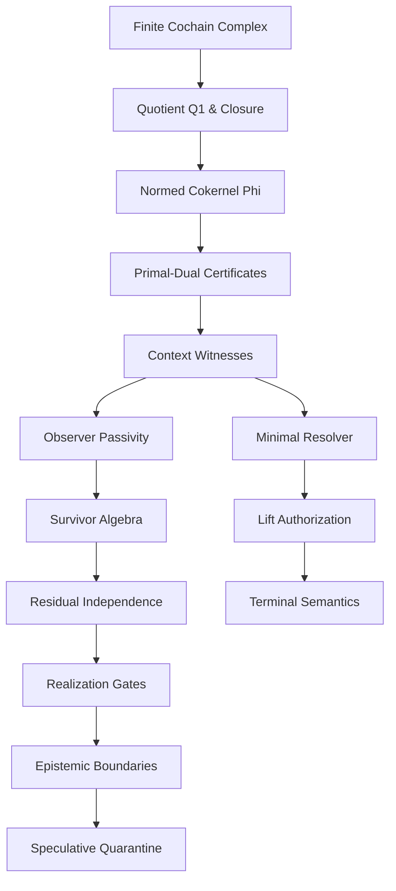

# The General Theory of Finite Obstruction Calculus — Tertiary Workbench

**Source:** `993_General Theory of Finite Obstruction Calculus(2).md`  
**Split role:** implementation notes, speculative bridges, domain-specific applications, toy models, quantum-information bridges, zeta/Langlands material, epistemic expansions, and open problems.

This file is intentionally not publication-main material. It is a workbench for later extraction, implementation, or separate papers.

---

## Tertiary and Application Material from T7/Langlands/Tannakian Region

#### Important Sheaf Caveat

If \(F\) is a true sheaf for \(J\), and \(\mathcal U\in J(U)\), then every compatible family glues uniquely. In that case, \(\ker(d_1)=\operatorname{im}(d_0)\), so \(H^1_{\mathcal U}=0\) for this gluing complex. Thus a nonzero class \(q_a\in H^1_{\mathcal U}\) certifies one of the following:

1. \(F\) is only a presheaf, not a sheaf for the declared cover.
2. The cover/descent context is not covered by the supplied topology \(J\).
3. The declared finite overlap/restriction data violate sheaf gluing.
4. The obstruction is being computed in a deliberately weaker observer/repair quotient.

The theorem says: when finite local data fail to glue, that failure is exactly a quotient obstruction in the MSS-N core.

#### Finite Certificate

A replayable certificate for a gluing obstruction contains:
\((\mathcal C,J,\mathcal U,F,d_0,d_1,a,\omega,\alpha^\ast,\varphi^\ast,\Phi,\Gamma)\).

Checks:
1. **Finite data:** \(\mathcal C,\mathcal U,F(U_i),F(U_{ij})\) are finite.
2. **Complex condition:** \(d_1d_0=0\).
3. **Compatibility:** \(d_1a=0\).
4. **Nonglueability:** \(a\notin\operatorname{im}(d_0)\) (equivalently, \(\Phi([a])>0\) with a dual certificate).
5. **Closedness:** \(\overline d_1([a])=0\).

If all checks pass, output \(\mathsf{GLUING\_SURVIVOR}(q_a)\).


### Theorem L4 — Finite Geometric Langlands Toy Model

Let \(\mathcal C\) be a finite category or graph path category, \(\mathcal T\) a finite presheaf state category, \(Q^1\) the finite obstruction quotient, and

\[
p:\operatorname{Ob}(\mathcal T)\to Q^1
\]

the quotient profile map. Let \(H_i:\mathcal T\to\mathcal T\) be finite Hecke context operators descending to profile operators

\[
T_i:Q^1\to Q^1.
\]

Let \(L\) be a finite local-system substitute giving eigenlabels \(\lambda_i=\chi_i(L)\).

Then a finite presheaf state \(F\) satisfies the Hecke eigensheaf condition

\[
p(H_iF)=\lambda_i p(F)
\qquad
\forall i
\]

if and only if its quotient profile \(q=p(F)\) is fixed by the eigen-corrected Hecke contexts \(\widetilde T_i=\lambda_i^{-1}T_i\):

\[
\widetilde T_i(q)=q
\]

for all \(i\) with \(\lambda_i\neq0\).

In the unit-eigenvalue case, this is exactly: \(H_iF\sim F\ \forall i\), where \(F\sim G \iff p(F)=p(G)\).

So:

\[
\boxed{
\text{finite Hecke eigensheaf}
\iff
\text{context-congruence fixed profile under declared Hecke contexts}
}
\]

after the declared local-system eigenvalue correction. This is finite, checkable, and Langlands-shaped without claiming Langlands.

#### Proof

Let \(q=p(F)\). By assumption, each Hecke context descends to the quotient profile: \(p(H_iF)=T_i(p(F))=T_i(q)\).

**Forward direction:** Assume \(F\) is a finite Hecke eigensheaf with eigenprofile \(\lambda\). By definition, \(p(H_iF)=\lambda_i p(F)\). Substituting \(q=p(F)\), \(p(H_iF)=\lambda_i q\). But by descent of the Hecke action, \(p(H_iF)=T_i(q)\). Therefore \(T_i(q)=\lambda_iq\). If \(\lambda_i\neq0\), applying \(\lambda_i^{-1}\) gives \(\widetilde T_i(q)=q\). Thus \(q\) is fixed by every eigen-corrected Hecke context.

**Reverse direction:** Assume \(\widetilde T_i(q)=q\) for every \(i\). Then \(\lambda_i^{-1}T_i(q)=q\). Multiplying by \(\lambda_i\), \(T_i(q)=\lambda_iq\). Using Hecke descent, \(p(H_iF)=T_i(p(F))=T_i(q)\). Therefore \(p(H_iF)=\lambda_iq=\lambda_i p(F)\). So \(F\) satisfies the finite Hecke eigensheaf condition.

Thus: \(F\text{ is finite Hecke-eigen} \iff p(F)\text{ is fixed under eigen-corrected Hecke contexts}.\) \(\square\)

#### Survivor Refinement (Link to Theorem L2)

If additionally \(q\in H^1\setminus\{0\}\), then \(q\) is a survivor. If lift-forget persistence also holds (\(\mathsf{LF}_n(q)=q\)), then the toy eigensheaf profile lands in the Hecke-stable skeleton: \(q\in \operatorname{Skel}^{\mathbb H}_n\).

So the strengthened bridge is:

\[
\boxed{
\text{finite Hecke eigensheaf} + \text{closed non-exact profile} + \text{lift-forget persistence} \Rightarrow \text{Hecke-stable skeleton survivor}.
}
\]

#### Finite Certificate Validation

A replayable certificate for the finite toy model contains: \((\mathcal C,\mathcal T,F,Q^1,p,H_i,T_i,L,\lambda_i,\mathcal K)\). 

Passing the required finite checks (profile quotient exactness, Hecke descent mapping, local-system eigenlabels, eigenprofile equation, and fixed profile validation) certifies \(\mathsf{FINITE\_HECKE\_EIGENPROFILE}\).


### Theorem L5 — Finite Tannakian Survivor Reconstruction

Let \(\mathsf{Surv}_n\) be a finite certified tensor category of survivor objects, with unit, duals, tensor product, and replayable preservation certificates. Let

\[
\omega:\mathsf{Surv}_n\to\mathsf{Vect}^{fd}_k
\]

be a faithful strong monoidal fiber functor.

Then

\[
G_n=\operatorname{Aut}^{\otimes}(\omega)
\]

reconstructs the symmetry object preserving the certified survivor tensor structure. If survivor profiles \(v_X=\omega(q_X)\) are part of the structure, the profile-preserving symmetry object is

\[
G_n^{\mathrm{prof}} = \{g\in\operatorname{Aut}^{\otimes}(\omega):g_X(v_X)=v_X\ \forall X\}.
\]

The canonical functor

\[
\mathsf{Surv}_n\to\mathsf{Rep}(G_n^{\mathrm{prof}})
\]

is faithful. If the defining automorphism equations have finitely many certified solutions, \(G_n^{\mathrm{prof}}\) is a finite group; otherwise it is an algebraic symmetry object.

Thus:

\[
\boxed{
\text{survivor tensor category}
+
\text{faithful fiber functor}
\Rightarrow
\text{reconstructed symmetry object preserving survivor profiles}.
}
\]

This is the correct Langlands-adjacent move: reconstruction from a category of certified representations, not a keyword-level analogy.

#### Proof

Let \(g\in \operatorname{Aut}^{\otimes}(\omega)\). By definition, \(g\) is a family of fiberwise isomorphisms \(g_X:\omega(X)\to\omega(X)\).

Naturality says that for every certified survivor morphism \(f:X\to Y\), we have \(\omega(f)\circ g_X = g_Y\circ\omega(f)\). Thus \(g\) preserves all certified maps between survivor objects.

Tensor compatibility says \(g_{X\otimes Y}=g_X\otimes g_Y\), preserving the tensor product structure. Unit preservation says \(g_{\mathbf 1}=\operatorname{id}_{\omega(\mathbf 1)}\). Dual compatibility follows from tensor automorphism axioms and rigidity (\(g_{X^\vee}=(g_X^{-1})^\vee\)).

If survivor profiles are part of the certified structure, the profile-preservation axiom gives \(g_X(v_X)=v_X\). Therefore every tensor automorphism of \(\omega\) is a certified symmetry preserving survivor profiles and all tensor-dual structure.

Conversely, a family of certified profile symmetries \((g_X)_X\) that preserves morphisms, tensor products, unit, duals, and survivor profiles forms a tensor automorphism of \(\omega\): \(g\in\operatorname{Aut}^{\otimes}(\omega)\). Thus the reconstructed automorphism group is exactly the survivor-profile symmetry object. \(\square\)

#### Faithfulness Requirement

Faithfulness of \(\omega:\mathsf{Surv}_n\to\mathsf{Vect}^{fd}_k\) ensures distinct certified survivor morphisms remain distinct. If a symmetry is detected on fibers, it reflects a genuine certified symmetry of the survivor category. Without faithfulness, two different survivor morphisms could collapse, and \(\operatorname{Aut}^{\otimes}(\omega)\) would reconstruct only a quotient symmetry, not the full survivor symmetry object.

#### Finite Checkability

Because \(\mathsf{Surv}_n\) is finite and every \(\omega(X)\) is finite-dimensional, the conditions defining \(G_n\) reduce to finitely many matrix equations:
\(\omega(f)g_X=g_Y\omega(f)\), \(g_{X\otimes Y}=g_X\otimes g_Y\), \(g_{\mathbf 1}=I\), \(g_{X^\vee}=(g_X^{-1})^\vee\), and \(g_X(v_X)=v_X\).

\(G_n\) is computed by solving a finite system of polynomial equations plus determinant nonzero conditions.
- If finitely many certified solutions: \(\mathsf{FINITE\_SYMMETRY\_GROUP}\).
- If positive-dimensional solution family: \(\mathsf{ALGEBRAIC\_SYMMETRY\_OBJECT}\).
- If unsolvable or uncertified: \(\mathsf{UNKNOWN}\).

## Omega Engine, Pipelines, Trace, ABI, and Quantum-Information Bridges

## 13. Omega Engine as a Finite Transition System

The Omega Engine is the finite evaluator over checked packets.

A state is

\[
\Omega_n=(\mathcal M_n,q,\mathcal P,\mathcal K,B)
\]

where \(\mathcal P\) is a packet, \(\mathcal K\) certificates, and \(B\) a finite budget/signature.

The evaluator is a partial transition relation

\[
\Omega_n \leadsto \Omega'_n
\quad\text{or}\quad
\Omega_n\leadsto \Omega_{n+1}
\quad\text{or}\quad
\Omega_n\leadsto \tau
\]

where terminal states are

\[
\tau\in
\{\mathsf{Exact},\mathsf{StabilizedSurvivor},
\mathsf{CertifiedExhaustion},\mathsf{BudgetUnknown},\mathsf{TrueRefusal}\}.
\]

Rules:

\[
\Phi(q)=0
\Rightarrow
\mathsf{Exact}.
\]

\[
\Phi(q)>0,\ \Gamma(q)=0
\Rightarrow
\mathsf{StabilizedSurvivor}.
\]

\[
\Phi(q)>0,\ \Gamma(q)>0,\ \mathsf{Exhausted}
\Rightarrow
\mathsf{CertifiedExhaustion}
\]

or, if context non-congruence and a lift contract exist,

\[
\mathsf{LicensedLift}.
\]

If finite resources end before exhaustion or proof, return

\[
\mathsf{BudgetUnknown}.
\]

\[
\boxed{
\text{exhausted resources}\ne\text{exhausted structure}.
}
\]

---

## 13A. Pipelines as Engine Orchestrators

A pipeline is a finite typed orchestration object, not an evaluator.

A pipeline is a tuple

\[
\mathcal P=
(A,E,\lambda,\beta,\tau,\mathsf{In},\mathsf{Out})
\]

where:

| symbol | meaning |
|---|---|
| \(A\) | finite set of stages |
| \(E\subseteq A\times A\) | finite transition graph |
| \(\lambda:A\to\mathsf{EngineType}\) | engine assigned to each stage |
| \(\beta:A\to\mathbb N\) | finite budget per stage |
| \(\tau:E\to\mathsf{TraceType}\) | trace format emitted along each edge |
| \(\mathsf{In},\mathsf{Out}\) | typed input/output packet schemas |

A pipeline state is

\[
P_t=(a_t,\mathcal P_t,\mathcal K_t,B_t)
\]

where \(a_t\in A\), \(\mathcal P_t\) is the current packet, \(\mathcal K_t\) is the certificate set, and \(B_t\) is remaining finite budget.

Pipeline transitions are partial maps

\[
P_t\leadsto P_{t+1}
\]

defined only when:

1. the current stage engine accepts the packet type;
2. the emitted trace type matches the edge label;
3. the budget decreases or a terminal state is reached;
4. any certificate used by the next stage is replayable.

Pipelines may call engines, route traces, and compose packets. They may not:

1. certify \(\Phi\), \(\Gamma\), or congruence by themselves;
2. create lift authority;
3. mutate MSS level without a lift contract;
4. hide unbounded search inside orchestration;
5. treat resource exhaustion as structural exhaustion.

Canonical law:

\[
\boxed{
\text{pipelines orchestrate engines; evaluators certify packets; lift contracts change expressivity.}
}
\]

---

## 13B. Trace Objects and Trace Formats

A trace is a finite typed witness emitted by an engine or pipeline stage.

A trace object is

\[
\mathfrak t=
(\mathsf{kind},\mathsf{schema},\mathsf{payload},\mathsf{hash},\mathsf{parent},\mathsf{cert})
\]

where:

| field | role |
|---|---|
| \(\mathsf{kind}\) | trace species |
| \(\mathsf{schema}\) | format/schema identifier |
| \(\mathsf{payload}\) | finite serialized data |
| \(\mathsf{hash}\) | content hash |
| \(\mathsf{parent}\) | causal parent trace hashes |
| \(\mathsf{cert}\) | optional certificate or refusal |

Supported trace species include:

\[
\mathsf{TraceType}
=
\{
\mathsf{JSON},
\mathsf{JSONL},
\mathsf{JSONLD},
\mathsf{Markdown},
\mathsf{Graph},
\mathsf{Cochain},
\mathsf{Proof},
\mathsf{Solver},
\mathsf{QInfo},
\mathsf{HumanReview}
\}.
\]

A trace format is admissible only if it has:

1. parser;
2. validator;
3. canonicalizer;
4. hash function;
5. loss map or exact roundtrip guarantee;
6. declared authority level.

JSON-L/JSONL and Markdown traces are proposal traces unless parsed into a checked packet.

\[
\boxed{
\text{textual traces may carry evidence; only checked packets carry authority.}
}
\]

---

## 13C. Engine Interfaces

An engine is a finite typed partial evaluator

\[
\mathcal E:
\mathsf{Packet}_{in}
\rightharpoonup
\mathsf{Packet}_{out}\times\mathsf{Trace}
\]

with a declared capability signature

\[
\operatorname{Cap}(\mathcal E)
=
(\mathsf{Input},\mathsf{Output},\mathsf{Trace},\mathsf{Certificates},\mathsf{Authority}).
\]

Engine classes:

| engine | mathematical role |
|---|---|
| parser engine | syntax \(\to\) typed packet |
| graph engine | packet \(\to\) finite carrier |
| cochain engine | carrier \(\to C^\bullet\) |
| solver engine | computes primal/dual candidates |
| verifier engine | checks certificates |
| context engine | enumerates admissible contexts |
| confluence engine | tests contextual congruence |
| lift engine | constructs lift contracts |
| operator engine | proposes finite morphisms |
| qinfo engine | computes finite quantum-information diagnostics |
| archive engine | stores traces and replay hashes |

Authority levels:

\[
\mathsf{Authority}
=
\{\mathsf{Proposal},\mathsf{Diagnostic},\mathsf{Certificate},\mathsf{Evaluator},\mathsf{Lift}\}.
\]

No engine may exceed its declared authority. In particular, proposal engines cannot emit terminal verdicts, and qinfo engines cannot certify core obstruction unless their outputs descend to checked finite packets.

---


## 13D. Quantum-Information Engine

### Part A — No-Go Theorem

#### Theorem Q1.1 — Density Matrices Alone Do Not Certify Core Obstruction

Let \(S\) be a finite contextual system with

\[
Q^1=C^1/\operatorname{im}(d_0),
\qquad
\Phi(q)=\inf_{\alpha\in C^0}|x-d_0\alpha|_{1,\omega},
\qquad
\Gamma(q)=|\overline d_1(q)|.
\]

Let a qinfo diagnostic assign finite density matrices

\[
\rho(h)\in\mathsf{Dens}(H)
\]

to finite handles \(h\), states, traces, or terms.

If the diagnostic data contain only the density matrices and no certified map relating \(\rho(h)\) to quotient classes in \(Q^1\), then no function

\[
D_q:\mathsf{Dens}(H)\to(\Phi,\Gamma,\text{contextual congruence})
\]

can certify \(\Phi\), \(\Gamma\), or contextual congruence for all admissible systems.

Equivalently:

\[
\boxed{
\text{No density-matrix diagnostic can certify core obstruction without extra quotient data.}
}
\]

**Proof.** It suffices to construct two admissible finite systems with identical qinfo diagnostics but different obstruction diagnostics. Let \(H=\mathbb C\), so the only density matrix is \(\rho= [1]\). Let every handle \(h\) be assigned \(\rho(h)=[1]\). Thus all qinfo diagnostics are identical: \(|\rho(h)-\rho(h')|_1=0\), \(S(\rho(h))=0\), \(F(\rho(h),\rho(h'))=1\).

**System A: zero obstruction.** Let \(C^0_A=0\), \(C^1_A=\mathbb R\), \(C^2_A=0\), with \(d_{0,A}=0, d_{1,A}=0\). Let the two handles have the same profile: \(p_A(h)=0, p_A(h')=0\). Then \(q_A=0\). Hence \(\Phi_A(q_A)=0, \Gamma_A(q_A)=0\). The handles are quotient-equivalent.

**System B: nonzero survivor obstruction.** Use the same qinfo assignment: \(\rho(h)=\rho(h')=[1]\). But define \(C^0_B=0, C^1_B=\mathbb R, C^2_B=0\), with \(d_{0,B}=0, d_{1,B}=0\). Let \(p_B(h)=0, p_B(h')=1\). Then \(q_B=-1\neq 0\). Since \(\operatorname{im}(d_{0,B})=0\), \(Q^1_B\cong\mathbb R\). Therefore \(\Phi_B(q_B)=1\) while \(\Gamma_B(q_B)=0\). So \(q_B\) is a closed non-exact survivor.

The qinfo data in Systems A and B are identical, but the obstruction diagnostics differ. Thus density matrices alone do not determine \(\Phi\). The same argument blocks contextual congruence. Add a context \(c\) and choose profiles in System B so that \(p_B(h)=p_B(h')\), but \(p_B(\rho(c)h)\neq p_B(\rho(c)h')\). Keep all density matrices equal. Then trace distance is zero, but contextual non-congruence exists in System B. For \(\Gamma\), choose \(C^2_B=\mathbb R, d_{1,B}=\operatorname{id}_{\mathbb R}\). Then \(\Gamma_B(q_B)=1\). Hence density matrices alone do not determine \(\Gamma\). Therefore no density-matrix-only diagnostic can certify \(\Phi, \Gamma\), or contextual congruence. \(\square\)

### Part B — Conditional QInfo Descent Theorem

The no-go does not kill qinfo diagnostics. It says they need a certified bridge.

#### Definition — QInfo Descent Packet

A qinfo descent packet for \(S\) is finite data

\[
\mathcal D_q = (H,E,\delta,b_\Phi,b_\Gamma,\kappa)
\]

where:
* \(H\) is a finite-dimensional Hilbert space;
* \(E:Q^1(S)\to\mathsf{Dens}(H)\) is a finite qinfo encoding;
* \(\delta:\operatorname{im}(E)\to Q^1(S)\) is a certified partial decoder;
* \(b_\Phi,b_\Gamma\) are certified bound functions;
* \(\kappa\) is a replayable certificate proving the descent conditions.

The required descent conditions are: \(\delta(E(q))=q\) or, weaker, \(\Phi(q)\le b_\Phi(E(q))\), \(\Gamma(q)\le b_\Gamma(E(q))\). For contextual congruence, the packet must also certify that \(\rho_q(x,y):=E(p(x)-p(y))\) is available or decodable.

#### Theorem Q1.2 — Exact QInfo Descent

Assume a qinfo descent packet with \(\delta(E(q))=q\). Define

\[
D_q(E(q)) = \left(\delta(E(q)), \Phi(\delta(E(q))), \Gamma(\delta(E(q)))\right).
\]

Then \(D_q\) determines the core obstruction diagnostics exactly. In particular: \(D_q(E(q))=(q,\Phi(q),\Gamma(q))\). For terms \(x,y\), \(D_q(E(p(x)-p(y)))\) determines whether \(x\sim y\). For a context \(c\), it determines contextual congruence status.

**Proof.** Let \(q\in Q^1(S)\). By the descent identity, \(\delta(E(q))=q\). Therefore \(\Phi(\delta(E(q)))=\Phi(q)\) and \(\Gamma(\delta(E(q)))=\Gamma(q)\). For contextual congruence, compute \(q_0=p(x)-p(y)\) and \(q_c=p(\rho(c)x)-p(\rho(c)y)\). Since \(D_q\) recovers both \(q_0\) and \(q_c\), it decides contextual congruence status. \(\square\)

### Part C — Trace-Distance Version

#### Theorem Q1.3 — Trace-Zero Implies Quotient Equality Under Obstruction Faithfulness

Let \(R(h)=[h]\in Q^1(S)\). Let \(E:Q^1(S)\to\mathsf{Dens}(H)\) be a finite qinfo encoding. Define \(\rho(h)=E([h])\). Assume \(E\) is obstruction-faithful: \(E(q)=E(q')\implies q=q'\). Then

\[
|\rho(h)-\rho(h')|_1=0 \implies [h]=[h'].
\]

**Proof.** For density matrices, \(|\rho(h)-\rho(h')|_1=0\) implies \(\rho(h)=\rho(h')\). So \(E([h])=E([h'])\). By obstruction faithfulness, \([h]=[h']\in Q^1(S)\). \(\square\)

### Part D — Bound Descent

#### Theorem Q1.4 — QInfo Bound Descent

Assume there are certified functions \(L_\Phi,U_\Phi,L_\Gamma,U_\Gamma\) on \(\mathsf{Dens}(H)\) such that \(L_\Phi(E(q))\le \Phi(q)\le U_\Phi(E(q))\) and \(L_\Gamma(E(q))\le \Gamma(q)\le U_\Gamma(E(q))\). Then

\[
D_q(E(q)) = \left([L_\Phi,U_\Phi], [L_\Gamma,U_\Gamma]\right)
\]

is a valid qinfo descent map for bounded obstruction diagnostics. It certifies exactly the following terminal statuses:

1. If

\[
U_\Phi(E(q))=0,
\]

then \(q\) is exact.

2. If

\[
L_\Phi(E(q))>0
\quad\text{and}\quad
U_\Gamma(E(q))=0,
\]

then \(q\) is a closed non-exact survivor.

3. In all other cases, the qinfo output is diagnostic-only unless additional descent data are supplied.

**Proof.** The inequalities give

\[
0\le \Phi(q)\le U_\Phi(E(q)).
\]

If \(U_\Phi(E(q))=0\), then \(\Phi(q)=0\). Since \(\Phi\) is the quotient norm on \(Q^1\), \(\Phi(q)=0\) iff \(q=0\). Thus the class is exact.

For survivor status, \(L_\Phi(E(q))>0\) implies

\[
\Phi(q)\ge L_\Phi(E(q))>0,
\]

so \(q\) is non-exact. Also

\[
0\le\Gamma(q)\le U_\Gamma(E(q))=0,
\]

so \(\Gamma(q)=0\), equivalently \(\overline d_1(q)=0\). Thus \(q\) is closed and non-exact, hence a survivor.

If neither condition holds, the bounds do not force exactness, non-exactness plus closedness, or openness. Multiple core statuses remain compatible with the same qinfo interval data. Therefore the output remains diagnostic-only. \(\square\)

### Part E — Minimal Explicit Construction

Assume \(Q^1(S)\) is represented by exact finite coordinates. For a finite diagnostic set \(A=\{q_1,\dots,q_N\}\subseteq Q^1(S)\), let \(H=\mathbb C^N\). Define \(E(q_i)=|e_i\rangle\langle e_i|\) and \(\delta(E(q_i))=q_i\). Then \(\delta\) is an exact descent map. For handles \(h\), let \(\rho(h)=E(p(h))\). Then \(|\rho(h)-\rho(h')|_1=0 \iff [h]=[h']\). But this construction proves only finite qinfo descent. It does **not** prove that quantum mechanics follows from the core.

### Algorithm — `QInfoDescentCheck`

**Input:** \((S,\rho,\mathcal Q)\) where \(S\) is an admissible system, \(\rho\) is a qinfo diagnostic, \(\mathcal Q\) is optional descent data.
**Output:** \(\mathsf{EXACT\_DESCENT}, \mathsf{BOUND\_DESCENT}, \mathsf{NO\_GO}, \mathsf{UNKNOWN}\).

```text
QInfoDescentCheck(S, qinfo_trace, quotient_side_data):

  validate d1*d0 = 0
  build Q1 = C1 / im(d0)
  build Phi and Gamma from exact finite data

  if no encoder/decoder/bound side data is supplied:
      return NO_GO(NoQuotientDescentData)

  if decoder delta is supplied:
      for each certified diagnostic class q in finite test domain:
          if delta(E(q)) != q in Q1:
              return NO_GO(DecoderNotFaithful(q))

      return EXACT_DESCENT(Dq(E(q)) = (q, Phi(q), Gamma(q)))

  if bound maps L_Phi,U_Phi,L_Gamma,U_Gamma are supplied:
      for each q in finite test domain:
          verify L_Phi(E(q)) <= Phi(q) <= U_Phi(E(q))
          verify L_Gamma(E(q)) <= Gamma(q) <= U_Gamma(E(q))

      return BOUND_DESCENT(bounds_certificate)

  return UNKNOWN(DescentUncertified)
```

### Theorem 13D.2 — QInfo No-Go

A finite density-matrix diagnostic cannot certify \(\Phi\), \(\Gamma\), or contextual congruence unless it is equipped with certified quotient descent data. In particular, there exist finite admissible systems with identical qinfo traces and different obstruction diagnostics.

### Theorem 13D.3 — Exact QInfo Descent

If a qinfo diagnostic factors through a certified obstruction-faithful encoding \(E:Q^1(S)\to\mathsf{Dens}(H)\) with decoder \(\delta\) satisfying \(\delta(E(q))=q\), then \(D_q(E(q))=(q,\Phi(q),\Gamma(q))\) is an exact descent map. It determines quotient equality and contextual congruence status.

### Theorem 13D.4 — Bounded QInfo Descent

If certified qinfo functions provide bounds on \(\Phi\) and \(\Gamma\), then qinfo diagnostics provide bounded obstruction diagnostics. They certify exactness only when \(U_\Phi(E(q))=0\). They certify survivor status only when \(L_\Phi(E(q))>0\) and \(U_\Gamma(E(q))=0\). Every other bounded result is diagnostic-only.

So Q1 closes cleanly:

\[
\boxed{
\text{QInfo diagnostics are valid only through exact or bounded descent; otherwise no-go.}
}
\]

---

### Theorem Q2 — Square-Root Lift Compatibility

For every nonzero finite residual \(h\in C^1\), the square-root lift

\[
\psi_h(e)=\sqrt{\frac{|h_e|}{|h|_1}},
\qquad
\rho_h=|\psi_h\rangle\langle\psi_h|
\]

depends exactly on the normalized absolute coordinate profile

\[
\left(\frac{|h_e|}{|h|_1}\right)_e.
\]

Hence

\[
\rho_h=\rho_{h'}
\iff
\frac{|h_e|}{|h|_1} = \frac{|h'_e|}{|h'_1|}
\quad\forall e.
\]

For nonnegative residuals, this means

\[
\rho_h=\rho_{h'}
\iff
\frac{h}{|h|_1} = \frac{h'}{|h'|_1}.
\]

Consequently, the square-root lift forgets total obstruction mass:

\[
\rho_{\lambda h}=\rho_h
\quad\text{but}\quad
\Phi([\lambda h])=\lambda\Phi([h])
\]

whenever \(\Phi\) is homogeneous on the represented quotient class.

Therefore density matrices from this lift are **diagnostic for normalized support shape** and **destructive for mass and quotient certification** unless \(\Phi\), \(\Gamma\), and quotient data are stored separately.

#### Algorithm — `SquareRootLiftCheck`

```text
input:
  finite coordinate set E
  residual h in C1
  optional side data: q=[h], Phi(q), Gamma(q)

if h = 0:
    return ZERO_OR_UNDEFINED

mass = sum_e |h_e|

for each e:
    psi[e] = sqrt(|h_e| / mass)

rho = |psi><psi|

certificate:
    NormalizedProfile = (|h_e| / mass)_e
    rho determines exactly NormalizedProfile

if side data absent:
    return DIAGNOSTIC_ONLY(
        rho,
        erased = [total_mass, sign, quotient_class, Phi, Gamma]
    )

if side data present and replayable:
    return AUGMENTED_DESCENT(
        rho,
        q=[h],
        Phi(q),
        Gamma(q)
    )
```

---

### Theorem Q3 — Commutator Gap

For finite nonzero residuals \(h_{AB},h_{BA}\in C^1\), define

\[
K(A,B;x)=|\rho_{h_{AB}}-\rho_{h_{BA}}|_1
\]

using

\[
\rho_h = |\psi_h\rangle\langle\psi_h|,
\qquad
\psi_h(e)=\sqrt{|h_e|/|h|_1}.
\]

Then

\[
K(A,B;x)=0
\iff
\frac{|h_{AB,e}|}{|h_{AB}|_1} = \frac{|h_{BA,e}|}{|h_{BA}|_1}
\quad
\forall e.
\]

Thus \(K=0\) means \(A\) and \(B\) commute on the induced normalized residual profile.

However,

\[
K=0
\centernot\implies
[h_{AB}]=[h_{BA}]\in Q^1
\]

without additional quotient-faithful descent or side-channel obstruction data. The implication holds exactly on domains where

\[
\nu(h)=\nu(h')\implies[h]=[h'].
\]

So the commutator gap is a clean finite qinfo diagnostic for **normalized operator order-dependence**, not a standalone certificate of quotient equality.

#### Algorithm — `CommutatorGapCheck`

```text
input:
  finite operators A, B
  obstruction packet x
  finite matrices d0, d1
  residual extractor h(-)
  optional side data: mass, sign, quotient class, Phi, Gamma, decoder δ

compute:
  hAB = h(B(A(x)))
  hBA = h(A(B(x)))

if hAB = 0 or hBA = 0:
    return UNKNOWN_OR_ZERO_CASE(need declared zero-state convention)

compute:
  νAB[e] = |hAB[e]| / ||hAB||1
  νBA[e] = |hBA[e]| / ||hBA||1

construct:
  ψAB[e] = sqrt(νAB[e])
  ψBA[e] = sqrt(νBA[e])
  ρAB = |ψAB><ψAB|
  ρBA = |ψBA><ψBA|

compute:
  K = ||ρAB - ρBA||1

if νAB != νBA:
    return PROFILE_NONCOMMUTING(K > 0)

# Now K = 0
profile_result = PROFILE_COMMUTING

Test quotient implication
if exact quotient classes are supplied or computable:
    qAB = class(hAB mod im(d0))
    qBA = class(hBA mod im(d0))

    if qAB == qBA:
        return PROFILE_COMMUTING_AND_QUOTIENT_EQUAL
    else:
        return PROFILE_COMMUTING_QUOTIENT_DIFFERENT(
            witness = hAB - hBA not in im(d0)
        )

if mass and sign side data certify hAB = hBA:
    return PROFILE_COMMUTING_AND_QUOTIENT_EQUAL

if decoder δ exists and δ(ρAB)=qAB, δ(ρBA)=qBA:
    return PROFILE_COMMUTING_AND_QUOTIENT_EQUAL

return PROFILE_COMMUTING_QUOTIENT_UNKNOWN(
    reason = density matrix erases mass/sign/repair data
)
```


---

### Theorem Q6.1 — QInfo No-Certification

Let

\[
C^0\xrightarrow{d_0}C^1\xrightarrow{d_1}C^2
\]

be a finite obstruction system with

\[
Q^1=C^1/\operatorname{im}(d_0).
\]

Let

\[
\rho:\mathcal H\to \mathsf{Dens}(H)
\]

be a density-matrix diagnostic on a finite residual/handle domain \(\mathcal H\).

If \(\rho\) is not supplied with a quotient-faithfulness certificate

\[
\rho(h)=\rho(h')
\implies
[h]=[h']\in Q^1,
\]

or an exact descent decoder

\[
\delta(\rho(h))=[h],
\]

then density data alone cannot certify:

\[
[h]=[h'],
\qquad
\Phi([h])=\Phi([h']),
\qquad
\Gamma([h])=\Gamma([h']),
\]

or contextual congruence.

Equivalently,

\[
\boxed{
\text{For a density diagnostic not certified quotient-faithful, }
\rho(h)=\rho(h')
\centernot\implies
[h]=[h']\in Q^1
}
\]

unless quotient descent or quotient-faithfulness is part of the certificate packet.

#### Proof

It is enough to give two finite systems with identical density diagnostics but different obstruction diagnostics.

Let \(C^0=0, C^1=\mathbb R, C^2=0\), with \(d_0=0, d_1=0\). Then \(Q^1\cong \mathbb R\). Let the density diagnostic be constant: \(\rho(h)=\rho(h')=|0\rangle\langle 0|\). Now take two residuals: \(h=0, h'=1\). Then the density data are identical, but the quotient classes differ: \([h]=0, [h']=1\). Since \(d_0=0\), \(h-h'\notin\operatorname{im}(d_0)\). Therefore \([h]\neq[h']\in Q^1\). With unit weight, \(\Phi([h])=0, \Phi([h'])=1\). So density equality does not determine \(\Phi\).

To make \(\Gamma\) differ, instead take \(C^2=\mathbb R, d_1=\operatorname{id}_{\mathbb R}\). Then \(\Gamma([h])=0, \Gamma([h'])=1\). The density diagnostic is still identical. So density equality does not determine \(\Gamma\).

For contextual congruence, choose terms \(x,y\) with \(p(x)=p(y)\), but a context \(c\) such that \(p(\rho(c)x)\neq p(\rho(c)y)\). Assign all four terms the same density matrix: \(\rho(x)=\rho(y)=\rho(\rho(c)x)=\rho(\rho(c)y)\). Then the qinfo trace sees no distinction, while the obstruction system has a certified context witness: \(w=(x,y,c)\). Thus density matrices alone do not certify contextual congruence.

Therefore density-matrix diagnostics are not core obstruction certificates unless paired with quotient-faithful descent or equivalent side data. \(\square\)

#### Exact positive version

The safe positive theorem is:

If there exists a decoder \(\delta:\operatorname{im}(\rho)\to Q^1\) such that \(\delta(\rho(h))=[h]\), then

\[
\rho(h)=\rho(h') \implies [h]=[h'].
\]

Proof: \(\rho(h)=\rho(h') \implies \delta(\rho(h))=\delta(\rho(h')) \implies [h]=[h']\). So the no-certification theorem does **not** attack qinfo with descent. It blocks only the unsafe shortcut: density equality alone \(\Rightarrow\) obstruction equality.

### Theorem Q6 — QInfo No-Certification

Density-matrix diagnostics alone cannot certify \(\Phi\), \(\Gamma\), quotient equality, or contextual congruence. There exist finite obstruction systems with identical qinfo assignments but different quotient profiles and different obstruction diagnostics.

A qinfo diagnostic becomes a core certificate only if paired with either:

\[
\delta(\rho(h))=[h],
\]

or a quotient-faithfulness certificate

\[
\rho(h)=\rho(h') \implies [h]=[h'].
\]

Without such data, qinfo remains diagnostic-only: useful for measurement, ranking, compression, and observer quotients, but not a replacement for the obstruction spine.

### Theorem Q5 — Finite Operational Adequacy / Measurement Descent

Let \(S\) be an admissible finite obstruction system with quotient

\[
Q^1(S)=C^1/\operatorname{im}(d_0).
\]

Let

\[
E:Q^1(S)\to \mathsf{Dens}(H)
\]

be a certified finite-dimensional qinfo encoding.

Let

\[
\mathcal M=\{M_i\}_{i=1}^k
\]

be a finite POVM on \(H\):

\[
M_i\succeq 0,
\qquad
\sum_{i=1}^kM_i=I.
\]

Define

\[
m_{\mathcal M}:Q^1(S)\to \Delta^{k-1}
\]

by

\[
m_{\mathcal M}(q) = \left( \operatorname{Tr}(M_1E(q)), \dots, \operatorname{Tr}(M_kE(q)) \right).
\]

Then \(m_{\mathcal M}\) is a finite-outcome probability observable of the obstruction system.

If \(E\) has exact descent, meaning there exists

\[
\delta:\operatorname{im}(E)\to Q^1(S)
\]

such that

\[
\delta(E(q))=q,
\]

then \(m_{\mathcal M}\) is a certified qinfo observable over \(Q^1(S)\).

If \(\mathcal M\) separates \(\operatorname{im}(E)\), i.e.

\[
m_{\mathcal M}(q)=m_{\mathcal M}(q') \implies E(q)=E(q'),
\]

then exact descent gives

\[
m_{\mathcal M}(q)=m_{\mathcal M}(q') \implies q=q'.
\]

If \(\mathcal M\) is not separating, then \(m_{\mathcal M}\) defines an observer quotient of \(Q^1(S)\). It may erase distinctions, but it does not create new obstruction facts.

#### Proof

Since \(E(q)\in \mathsf{Dens}(H)\), we have \(E(q)\succeq0, \operatorname{Tr}(E(q))=1\). For each POVM element, \(M_i\succeq0\). Therefore \(\operatorname{Tr}(M_iE(q))\ge 0\). Also,

\[
\sum_i\operatorname{Tr}(M_iE(q)) = \operatorname{Tr}\left(\sum_iM_iE(q)\right) = \operatorname{Tr}(IE(q)) = \operatorname{Tr}(E(q)) = 1.
\]

Thus \(m_{\mathcal M}(q)\in\Delta^{k-1}\). So \(m_{\mathcal M}\) is a finite-outcome probability observable.

Now assume exact descent: \(\delta(E(q))=q\). Then the qinfo state \(E(q)\) is not merely a Hilbert-space diagnostic. It carries replayable return data to the quotient obstruction class. Hence the measurement packet \((E(q),\mathcal M,m_{\mathcal M}(q),\delta)\) can be audited back to \(q\in Q^1(S)\). Therefore \(m_{\mathcal M}\) is a certified qinfo observable over the obstruction quotient.

Now assume \(\mathcal M\) separates \(\operatorname{im}(E)\). If \(m_{\mathcal M}(q)=m_{\mathcal M}(q')\), then by separation, \(E(q)=E(q')\). Applying exact descent, \(q = \delta(E(q)) = \delta(E(q')) = q'\). So the measurement statistics faithfully distinguish quotient classes on the certified domain.

If \(\mathcal M\) is not separating, define \(q\equiv_{\mathcal M}q' \iff m_{\mathcal M}(q)=m_{\mathcal M}(q')\). This is an equivalence relation. The map \(m_{\mathcal M}\) factors through the quotient: \(Q^1(S) \twoheadrightarrow Q^1(S)/{\equiv_{\mathcal M}} \to \Delta^{k-1}\). So the measurement is an observer quotient: it identifies classes that the measurement cannot distinguish. It may erase obstruction distinctions, but it cannot generate new ones. \(\square\)


### Theorem Q7 — Exact QInfo Descent / Conservative Hilbert Representation

Let \(S\) be an admissible finite obstruction system with

\[
Q^1(S)=C^1/\operatorname{im}(d_0).
\]

Let

\[
E:Q^1(S)\to\mathsf{Dens}(H)
\]

be a finite-dimensional qinfo encoding. Suppose there is a certified decoder

\[
\delta:\operatorname{im}(E)\to Q^1(S)
\]

such that

\[
\delta(E(q))=q
\qquad
\forall q\in Q^1(S).
\]

Then \(E\) determines quotient equality and every core diagnostic computable from

\[
q,\quad \Phi(q),\quad \Gamma(q),\quad p,\quad \rho.
\]

In particular:

\[
E(q)=E(q')\implies q=q',
\]

and for any terms \(x,y\),

\[
x\sim y
\iff
p(x)=p(y)
\]

is decidable from the decoded quotient profiles. A context witness

\[
w=(x,y,c)
\]

is likewise decidable by checking

\[
p(x)=p(y),
\qquad
p(\rho(c)x)\neq p(\rho(c)y).
\]

#### Proof

Given \(E(q)\), apply the decoder:

\[
\delta(E(q))=q.
\]

So the qinfo representation recovers the quotient class exactly.

Since \(\Phi\) and \(\Gamma\) are finite diagnostics defined on \(Q^1(S)\), once \(q\) is recovered we compute \(\Phi(q)\) and \(\Gamma(q)\) from the finite obstruction packet.

Now suppose \(E(q)=E(q')\). Apply \(\delta\) to both sides: \(\delta(E(q))=\delta(E(q'))\). Therefore \(q=q'\). So \(E\) is quotient-faithful on its certified domain.

For contextual congruence, the definition is internal to the obstruction system:

\[
x\sim y \iff p(x)=p(y).
\]

Since \(p(x),p(y)\in Q^1(S)\), exact descent recovers their quotient classes whenever they are represented through \(E\).

For context failure, compute \(q_0=p(x)-p(y)\) and \(q_c=p(\rho(c)x)-p(\rho(c)y)\). Then \(w=(x,y,c)\) is a witness exactly when \(q_0=0\) and \(q_c\neq0\). Both conditions are decidable after decoding the represented quotient classes.

Thus the Hilbert representation adds no independent certified core fact. Its accepted content is conservative over the finite obstruction core. \(\square\)

#### Ledger Version

If a finite qinfo encoding \(E:Q^1(S)\to\mathsf{Dens}(H)\) has a certified decoder \(\delta:\operatorname{im}(E)\to Q^1(S)\) with \(\delta(E(q))=q\), then qinfo determines quotient equality and all core diagnostics computable from the decoded finite obstruction packet. In particular, it determines \(\Phi\), \(\Gamma\), and contextual congruence status for represented quotient classes.

Therefore:

\[
\boxed{
\text{Exact qinfo descent makes the Hilbert representation conservative over the finite obstruction core.}
}
\]


### Theorem Q8 — Bounded QInfo Descent

Certified qinfo bounds

\[
L_\Phi(E(q))\le \Phi(q)\le U_\Phi(E(q)),
\qquad
L_\Gamma(E(q))\le \Gamma(q)\le U_\Gamma(E(q))
\]

give sufficient one-sided obstruction certificates. In particular,

\[
U_\Phi(E(q))=0
\]

certifies that \(q\) is exact, and

\[
L_\Phi(E(q))>0
\quad\text{and}\quad
U_\Gamma(E(q))=0
\]

certify that \(q\) is a closed non-exact survivor.

#### Proof

For exactness, \(0\le\Phi(q)\le U_\Phi(E(q))=0\), so \(\Phi(q)=0\). Since \(\Phi\) is a quotient norm, \(q=0\), hence exact.

By definition, survivor status means \(\Phi(q)>0\) and \(\overline d_1(q)=0\). Equivalently, using \(\Gamma(q)=|\overline d_1(q)|\), survivor status is \(\Phi(q)>0\) and \(\Gamma(q)=0\).

From the lower bound, \(L_\Phi(E(q))\le \Phi(q)\). If \(L_\Phi(E(q))>0\), then \(\Phi(q)>0\). From the upper bound, \(0\le \Gamma(q)\le U_\Gamma(E(q))\). If \(U_\Gamma(E(q))=0\), then \(0\le \Gamma(q)\le 0\), so \(\Gamma(q)=0\). Therefore \(\Phi(q)>0\) and \(\Gamma(q)=0\). Hence \(q\) is a closed non-exact survivor. \(\square\)

**Important limitation:** This is one-sided. If the inequalities do not force \(U_\Phi=0\), and do not force both \(\Phi(q)>0\) and \(\Gamma(q)=0\), the correct terminal is **DIAGNOSTIC_ONLY** or **UNKNOWN**, not exact, survivor, or non-survivor. The qinfo bounds fail to certify terminal status, but they have not disproved it.

---

### Theorem Q9 — POVM Observer Quotient

A finite POVM \(\mathcal M=\{M_i\}_{i=1}^k\) applied to a qinfo encoding \(E:Q^1(S)\to\mathsf{Dens}(H)\) induces an observer equivalence

\[
q\equiv_{\mathcal M}q'
\iff
m_{\mathcal M}(q)=m_{\mathcal M}(q')
\]

where \(m_{\mathcal M}(q) = \left( \operatorname{Tr}(M_1E(q)),\dots,\operatorname{Tr}(M_kE(q)) \right)\).

The canonical projection

\[
\pi_{\mathcal M}: Q^1(S)\to Q^1(S)/{\equiv_{\mathcal M}},
\qquad
q\mapsto [q]_{\mathcal M},
\]

is an observer quotient. It identifies exactly those obstruction classes indistinguishable by the measurement statistics. It may erase distinctions, but it does not create obstruction (if \(q=0\), \(\pi_{\mathcal M}(0)=[0]_{\mathcal M}\)).

It is a **finite observer quotient** when restricted to a finite certified diagnostic domain \(D\subseteq Q^1(S)\), or when the measurement readout is finitely binned/certified by a finite map \(b:\Delta^{k-1}\to B\).

#### Proof

First, \(\equiv_{\mathcal M}\) is an equivalence relation (reflexive, symmetric, transitive via equality of vectors in \(\Delta^{k-1}\)). Thus the quotient set \(Q^1(S)/{\equiv_{\mathcal M}}\) is well-defined. The projection \(\pi_{\mathcal M}(q)=[q]_{\mathcal M}\) is deterministic and identifies exactly those quotient obstruction classes that the POVM statistics cannot distinguish.

Also, \(\pi_{\mathcal M}(0)=[0]_{\mathcal M}\). So it does not create obstruction from the exact class. If \(q=0\), the observer output is merely the observer class of zero. This agrees with the observer non-creation rule: quotient observers may erase or identify nonzero classes, but they do not create obstruction from exact ones.

Finally, \(m_{\mathcal M}\) factors through the quotient. Define \(\bar m_{\mathcal M}:Q^1(S)/{\equiv_{\mathcal M}}\to \Delta^{k-1}\) by \(\bar m_{\mathcal M}([q]_{\mathcal M})=m_{\mathcal M}(q)\). This is well-defined. Hence \(m_{\mathcal M} = \bar m_{\mathcal M}\circ \pi_{\mathcal M}\). Therefore the POVM measurement map is exactly an observer quotient followed by a readout map. \(\square\)

If \(D\subseteq Q^1(S)\) is a finite domain, \(D/{\equiv_{\mathcal M,D}}\) is finite. If statistics are binned by \(b:\Delta^{k-1}\to B\) with finite \(B\), then \(Q^1(S)/{\equiv_{\mathcal M,b}}\) has at most \(|B|\) classes. In both cases, the observer quotient is finite.


### Theorem Q10 — Finite Tomographic Adequacy

Let

\[
E:Q^1(S)\to \mathsf{Dens}(H)
\]

be a certified qinfo encoding, and let

\[
\mathcal M=\{M_i\}_{i=1}^k
\]

be a finite POVM. Define

\[
m_{\mathcal M}(q) = \left( \operatorname{Tr}(M_1E(q)), \dots, \operatorname{Tr}(M_kE(q)) \right).
\]

Assume:

1. **Exact descent:** there exists \(\delta:\operatorname{im}(E)\to Q^1(S)\) such that \(\delta(E(q))=q\).
2. **Tomographic separation on the represented image:** \(m_{\mathcal M}(q)=m_{\mathcal M}(q') \implies E(q)=E(q')\) for all \(q,q'\in Q^1(S)\).

Then \(q\mapsto m_{\mathcal M}(q)\) is faithful on \(Q^1(S)\):

\[
m_{\mathcal M}(q)=m_{\mathcal M}(q') \implies q=q'.
\]

#### Proof

Assume \(m_{\mathcal M}(q)=m_{\mathcal M}(q')\). By tomographic separation on \(\operatorname{im}(E)\), \(E(q)=E(q')\). Apply the exact descent decoder \(\delta\) to both sides: \(\delta(E(q))=\delta(E(q'))\). Using exact descent, \(q=q'\). Therefore \(m_{\mathcal M}\) is injective on \(Q^1(S)\). \(\square\)

#### Interpretation

This proves:

\[
\boxed{
\text{finite measurement statistics can faithfully represent quotient obstruction classes}
}
\]

provided the measurement separates the qinfo image and the qinfo image descends exactly to the obstruction quotient.

The theorem is not saying every finite POVM is adequate. It says:

\[
\text{exact descent}+\text{measurement separation} \Rightarrow \text{operational faithfulness}.
\]

If separation fails, then \(q\equiv_{\mathcal M}q' \iff m_{\mathcal M}(q)=m_{\mathcal M}(q')\) defines an observer quotient: it erases distinctions but does not create obstruction.

#### Ledger Version

A finite POVM family \(\mathcal M\) is operationally adequate for a qinfo encoding \(E:Q^1(S)\to\mathsf{Dens}(H)\) when it separates \(\operatorname{im}(E)\). If \(E\) also has exact descent \(\delta(E(q))=q\), then the measurement map

\[
q\mapsto \left( \operatorname{Tr}(M_iE(q)) \right)_{i=1}^k
\]

is faithful on \(Q^1(S)\). Hence finite measurement statistics can serve as a certified operational representation of quotient obstruction classes.


### Theorem Q11 — CPTP Context Representation

Let \(S=(\mathcal T,\mathcal C,\rho_S,C^\bullet,\omega,p)\) be a finite contextual obstruction system, with context action \(\rho_S:\mathcal C\to \mathsf{End}(\mathcal T)\). Let \(E_Q:Q^1(S)\to \mathsf{Dens}(H)\) be a certified qinfo encoding, and define the induced term encoding \(E_T(x)=E_Q(p(x))\).

Let \(\widehat\rho:\mathcal C\to \mathsf{CPTP}(H)\) be a functor from the context category into the monoid of completely positive trace-preserving maps on \(\mathsf{Dens}(H)\).

Assume the comparison square commutes up to a declared target equivalence \(\sim_q\):

\[
E_T(\rho_S(c)x) \sim_q \widehat\rho(c)(E_T(x))
\]

for every context \(c\in\mathcal C\) and every term \(x\in\operatorname{Ob}(\mathcal T)\).

Then \(\widehat\rho\) is a qinfo representation of the core context action, modulo \(\sim_q\).

#### Proof

Since \(\widehat\rho\) is a functor, it preserves identities and composition: \(\widehat\rho(\mathrm{id})=\mathrm{id}\) and \(\widehat\rho(c_2\circ c_1) = \widehat\rho(c_2)\circ \widehat\rho(c_1)\). The core context action \(\rho_S\) also preserves identities and composition. 

For a composed context \(c_2\circ c_1\):
\[
E_T(\rho_S(c_2\circ c_1)x) = E_T(\rho_S(c_2)(\rho_S(c_1)x)) \sim_q \widehat\rho(c_2)\bigl(E_T(\rho_S(c_1)x)\bigr).
\]
By the comparison condition for \(c_1\), \(E_T(\rho_S(c_1)x) \sim_q \widehat\rho(c_1)(E_T(x))\). Assuming \(\sim_q\) is stable under CPTP maps, applying \(\widehat\rho(c_2)\) preserves equivalence:
\[
\widehat\rho(c_2)(E_T(\rho_S(c_1)x)) \sim_q \widehat\rho(c_2)(\widehat\rho(c_1)(E_T(x))) = \widehat\rho(c_2\circ c_1)(E_T(x)).
\]
Thus \(E_T(\rho_S(c_2\circ c_1)x) \sim_q \widehat\rho(c_2\circ c_1)(E_T(x))\). The identity context similarly commutes. Therefore, the CPTP maps represent the finite context action through the qinfo encoding. \(\square\)

#### Exact Descent Strengthening

If \(E_Q\) has exact descent \(\delta(E_Q(q))=q\) and the target equivalence is literal equality, then the CPTP representation is faithful to quotient context dynamics whenever
\[
E_Q(p(\rho_S(c)x)) = \widehat\rho(c)(E_Q(p(x))).
\]
Applying \(\delta\) gives:
\[
p(\rho_S(c)x) = \delta\left(\widehat\rho(c)(E_Q(p(x)))\right).
\]
So the Hilbert dynamics can be audited back to the quotient profile after every context step: \(\text{core context action} \to \text{CPTP dynamics} \to \text{decoded quotient profile}\).

#### Observer Quotient Version

If \(\sim_q\) is a measurement equivalence (e.g., \(\rho\sim_{\mathcal M}\sigma \iff \operatorname{Tr}(M_i\rho)=\operatorname{Tr}(M_i\sigma)\) for all \(i\)), then \(\widehat\rho\) represents the context action only at the observer level. It reproduces the same measured statistics as the core context action, but does not prove equality of quotient classes unless the measurement family separates the domain.

#### Failure Theorem

If there exist \((c,x)\) such that
\[
E_T(\rho_S(c)x) \not\sim_q \widehat\rho(c)(E_T(x)),
\]
then \(\widehat\rho\) is not a representation of \(\rho_S\). A counterexample to that square is a counterexample to representation.

#### Ledger Version

A qinfo dynamics layer represents the core context action only if there is a functor \(\widehat\rho:\mathcal C\to\mathsf{CPTP}\) and an encoding \(E_T:\operatorname{Ob}(\mathcal T)\to\mathsf{Dens}(H)\) such that

\[
E_T(\rho_S(c)x) \sim_q \widehat\rho(c)(E_T(x))
\]

for all contexts \(c\) and states \(x\).

If \(\sim_q\) is equality and \(E_T\) has exact quotient descent, the CPTP dynamics is auditable back to quotient profiles. If \(\sim_q\) is measurement equivalence, the dynamics represents only an observer quotient. If the square fails, Hilbert dynamics is not a representation of the core context action.


### Theorem Q12 — Trace-Distance Obstruction Bridge

Let \(E:Q^1(S)\to\mathsf{Dens}(H)\) be a certified qinfo encoding. If there are constants \(0<a\le b<\infty\) such that

\[
a\,\Phi(q-q') \le |E(q)-E(q')|_1 \le b\,\Phi(q-q')
\]

for all \(q,q'\in Q^1(S)\), then trace distance is a certified operational proxy for quotient obstruction distance:

\[
\frac{1}{b}|E(q)-E(q')|_1 \le \Phi(q-q') \le \frac{1}{a}|E(q)-E(q')|_1.
\]

Consequently,

\[
E(q)=E(q')\implies q=q',
\]

so \(E\) is quotient-faithful.

#### Proof

From the upper bound, \(|E(q)-E(q')|_1 \le b\,\Phi(q-q')\), so if \(b>0\), \(\frac{1}{b}|E(q)-E(q')|_1 \le \Phi(q-q')\). From the lower bound, \(a\,\Phi(q-q') \le |E(q)-E(q')|_1\), so if \(a>0\), \(\Phi(q-q') \le \frac{1}{a}|E(q)-E(q')|_1\). Therefore, the inequalities hold and \(|E(q)-E(q')|_1\) is a certified two-sided metric proxy for \(\Phi\).

If \(E(q)=E(q')\), then \(|E(q)-E(q')|_1=0\). The lower bound gives \(a\,\Phi(q-q')\le0\). Since \(a>0\) and \(\Phi\ge0\), \(\Phi(q-q')=0\). Because \(\Phi\) is a quotient norm on \(Q^1\), \(\Phi(q-q')=0 \iff q=q'\). Hence \(E(q)=E(q')\implies q=q'\), making \(E\) quotient-faithful. \(\square\)

#### Geometric Interpretation

If only the upper bound is certified, qinfo is merely coarse/diagnostic: \(q\approx_\Phi q' \implies E(q)\approx_{\mathrm{tr}} E(q')\). It does not forbid collapse (\(q\neq q'\) but \(E(q)=E(q')\)). If the lower bound is also certified, collapse is forbidden. Distinct obstruction classes must stay separated in qinfo space. Thus, with the lower bound, qinfo becomes a genuine bi-Lipschitz metric representation of quotient obstruction geometry.


## 13E. Pipeline Termination and Non-Recursion

A pipeline is admissible only when:

1. \(A\) is finite;
2. all stage budgets are finite;
3. all rollback budgets are finite;
4. no stage dynamically creates new pipeline stages;
5. no transition introduces a limit ordinal;
6. every loop consumes a finite budget or strictly decreases a certified signature.

Therefore an admissible pipeline cannot implement unbounded \(\mu\)-recursion by orchestration alone.

If a pipeline needs unbounded search, it must call an external engine whose authority and failure status are explicit.

**Theorem 13E.1 (Pipeline non-recursion).** Let \(P_t=(a_t,\mathcal P_t,\mathcal K_t,B_t)\) be a pipeline state with finite stage graph, finite budgets, no dynamic stage creation, and budget-consuming or signature-decreasing loops. Define \(\nu(P_t)=(B_t^{\mathrm{total}}, B_t^{\mathrm{rollback}}, \sigma(P_t), r(a_t))\) ordered lexicographically, where \(B_t^{\mathrm{total}}\) is the total remaining stage budget, \(B_t^{\mathrm{rollback}}\) is the remaining rollback budget, \(\sigma(P_t)\) is the finite certified descent signature, and \(r(a_t)\) is a finite stage-rank. Then every admissible pipeline transition satisfies \(\nu(P_{t+1})\prec\nu(P_t)\).

**Proof.** All budgets, signatures, and stages are finite, so the codomain of \(\nu\) is finite and well-founded. If the transition consumes ordinary budget, \(B_{t+1}^{\mathrm{total}}<B_t^{\mathrm{total}}\), so \(\nu\) decreases. If it is a rollback, ordinary budget may be reset but the rollback budget strictly decreases. If it is a budget-free loop, admissibility requires the certified packet signature to strictly decrease. If it moves along an acyclic stage edge, the finite stage-rank decreases. Thus every admissible transition strictly decreases \(\nu\). An infinite run would produce an infinite strictly descending chain in a finite well-founded order, which is impossible. \(\square\)

---

## 13F. Pipeline Terminal States

Pipeline terminals refine engine terminals:

\[
\mathsf{PipelineTerminal}
=
\{
\mathsf{Solved},
\mathsf{Stabilized},
\mathsf{Lifted},
\mathsf{Routed},
\mathsf{Blocked},
\mathsf{BudgetUnknown},
\mathsf{TraceInvalid},
\mathsf{SchemaMismatch},
\mathsf{AuthorityViolation}
\}.
\]

A pipeline may return \(\mathsf{Routed}\) when it has successfully handed a packet to another engine, but \(\mathsf{Routed}\) is not a mathematical terminal verdict.

---

## 13G. Minimal ABI

Every engine and pipeline stage must implement:

\[
\operatorname{parse},\quad
\operatorname{validate},\quad
\operatorname{run},\quad
\operatorname{emitTrace},\quad
\operatorname{replay},\quad
\operatorname{authority}.
\]

Minimal interface:

```rust
trait Engine {
    type Input;
    type Output;
    type Trace;
    type Certificate;

    fn capability(&self) -> Capability;
    fn validate(&self, input: &Self::Input) -> ValidationResult;
    fn run(&self, input: Self::Input, budget: Budget)
        -> EngineResult<Self::Output, Self::Trace, Self::Certificate>;
    fn replay(&self, trace: &Self::Trace) -> ReplayResult;
}
```

Mathematical reading:

\[
\text{engine}=
\text{typed partial morphism}
+
\text{trace emitter}
+
\text{replay relation}
+
\text{authority bound}.
\]

---

## Extended Realization Gates and Domain Bridges

## 32. Proof Dependency Graph (Finalized)



---

## 33. Monograph Status

This monograph is the canonical reference for the **Finite Obstruction Calculus (FOC)**. It formalizes the Omega Engine's authority as a strictly bounded, audit-compliant 2-categorical system. All claims of "intelligence," "reasoning," or "understanding" are strictly mapped to the diagnostic mechanics of \(\Phi, \Gamma\), and certified lift contracts.
on diagrams commute, every accepted target-domain claim is auditable back to the finite core. If any diagram fails, \(R\) is not a realization theorem; it is only an interpretation, observer quotient, or analogy.

So the general gate is:

\[
\boxed{
\text{No realization without certificate-preserving descent.}
}
\]

This is exactly the right gate for QM, Langlands-shaped toy models, physics interpretations, observer models, or any other target domain.

#### Valid Realization Definitions (R1-R5)

A valid realization functor consists of \(R\) plus comparison maps satisfying:

**R1 — Quotient preservation.** For each \(S\), there is a target quotient object \(R_Q(S)\) and a comparison map \(r_Q:Q^1(S)\to R_Q(S)\). For a faithful realization, \(r_Q\) has exact descent on its image: \(\delta_Q(r_Q(q))=q\). For an observer realization, \(r_Q\) may quotient distinctions, but all erasures (\(q\neq q',\ r_Q(q)=r_Q(q')\)) must be explicitly logged as observer identifications.

**R2 — \(\Phi/\Gamma\) status preservation.** The realization must preserve the closure trichotomy: \(\mathsf{Exact},\ \mathsf{Survivor},\ \mathsf{Open}\). At minimum, it must not promote or erase statuses silently. For faithful realization: \(\Phi_S(q)=0 \iff \Phi_D(r_Q(q))=0\) and \(\Gamma_S(q)=0 \iff \Gamma_D(r_Q(q))=0\).

**R3 — Context-witness preservation.** If \(w=(x,y,c)\) is a core context witness, \(R\) must send it to either: (1) a target witness, (2) a declared observer quotient identification, or (3) an explicit invalidation/refinement record. No silent disappearance of witnesses.

**R4 — Lift-contract preservation.** If \(\Lambda\) is a valid lift contract, \(R(\Lambda)\) must preserve its internal components and its terminal tag (\(\mathsf{Resolved}, \mathsf{Refined}, \mathsf{Refused}\)). A target-domain lift cannot claim more authority than the core lift contract supplies.

**R5 — Skeleton preservation.** If \(q\in\operatorname{Skel}(S)\), then \(r_Q(q)\) must remain persistent in the target realization. For faithful realization, skeleton restriction \(r_Q|_{\operatorname{Skel}(S)}\) is injective or has certified exact descent.

#### Proof

**Forward:** If \(R\) is valid, target-domain claims are licensed by core certificates. Failing to preserve \(Q^1\) allows collapse of obstruction classes. Failing \(\Phi/\Gamma\) misclassifies the closure trichotomy. Failing context witness preservation erases lift triggers. Failing lift contracts permits unlicensed repair. Failing skeletons destroys persistent survivor structure. Hence R1–R5 are mandatory.

**Reverse:** If \(R\) satisfies R1–R5, every target claim about quotient equality, status, dynamics, extension, or stable structure is auditable back to the finite core via the comparison maps. Hence \(R\) is a valid certified realization functor. \(\square\)

#### Certificate Packet

A replayable realization certificate \(\mathcal C_R\) contains \((R,r_Q,\delta_Q,r_\Phi,r_\Gamma,r_{\mathsf{Wit}},r_{\Lambda},r_{\mathsf{Skel}},\mathcal K_R)\).

Checks include quotient descent, status preservation, witness transport, lift-contract transport, and skeleton monicity. Passing these certifies the realization.


### Theorem I3 — No-Rabbit Theorem

Let \(R:\mathsf{MSSCore}\to \mathsf D\) be a proposed realization, interpretation, model, or target-domain translation.

Suppose \(R\) does **not** preserve or explicitly quotient the core obstruction structure:

\[
Q^1,
\qquad
\Phi/\Gamma\text{ status},
\qquad
\text{context witnesses},
\qquad
\text{lift contracts}.
\]

Then \(R\) cannot promote, strengthen, or authorize a core MSS claim.

It can at most produce:

\[
\mathsf{Interpretation},
\qquad
\mathsf{ObserverQuotient},
\qquad
\mathsf{Analogy},
\qquad
\mathsf{Diagnostic},
\qquad
\mathsf{ConjecturalTargetPattern}.
\]

It cannot produce a theorem of the core.

#### Proof

Core MSS authority is carried by the finite obstruction spine: \(Q^1=C^1/\operatorname{im}(d_0)\), with closure object \(H^1=\ker(\overline d_1)\), diagnostics \((\Phi,\Gamma)\), context witnesses \(w=(x,y,c)\) (where \(x\sim y\) and \(\rho(c)x\not\sim \rho(c)y\)), and licensed lift contracts \(\Lambda=(w,E,m,F,U,\iota,\pi)\).

The operational spine strictly enforces that repair is in \(\operatorname{im}(d_0)\), measurement is in \(C^1/\operatorname{im}(d_0)\), stabilization is in \(H^1\), and lifts occur only on context-visible non-congruence.

- If \(R\) fails to preserve \(Q^1\), target equality cannot certify core quotient equality. It cannot promote a claim about exactness, survivor status, primitive class, or obstruction identity.
- If \(R\) fails to preserve \(\Phi/\Gamma\) status, the target classification of the closure trichotomy has no core authority.
- If \(R\) fails to preserve context witnesses, it can hide the obstruction that licenses completion, and therefore cannot authorize a lift claim.
- If \(R\) fails to preserve lift contracts, it drops or mutates the explicit exhaustion, minimality, extension, forgetful maps, or terminal tags. It cannot claim the lift remains licensed.

Therefore, if \(R\) does not preserve this spine, it cannot promote any core MSS claim. It is non-authoritative relative to the core. \(\square\)

#### Contrapositive Form

A target-domain claim is authoritative for MSS only if it factors through the certified core:

\[
\text{target claim}
\Rightarrow
\text{preserved }Q^1
+
\text{preserved status}
+
\text{preserved witnesses}
+
\text{preserved lift contracts}.
\]

If this factorization is missing, the correct terminal is \(\mathsf{NoCoreAuthority}\).

#### Summary

If \(R\) does not preserve or explicitly quotient \(Q^1\), \(\Phi/\Gamma\) status, context witnesses, and lift contracts, then no theorem in \(\mathsf D\) can promote, strengthen, or replace a core MSS claim.

Such a target result may be useful as an analogy, observer quotient, diagnostic, or conjectural pattern, but it has no core authority unless it descends back through the certified obstruction structure.

\[
\boxed{
\text{No rabbits out of target hats.}
}
\]

Or the stricter slogan:

\[
\boxed{
\text{No realization without certificate-preserving descent.}
}
\]


### Theorem I4 — Continuum Limit / Functional Descent

A finite obstruction tower

\[
C^0_n\to C^1_n\to C^2_n
\]

realizes an infinite-dimensional Hilbert/Sobolev obstruction complex

\[
V^0\to V^1\to V^2
\]

only if there exist realization maps \(J^i_n\) satisfying dense filtration, chain compatibility, norm fidelity, Mosco/\(\Gamma\) convergence of repair subspaces, and compactness/no-oscillation.

Under these hypotheses,

\[
\Phi_n([h_n])\to\Phi_\infty([h])
\]

and

\[
\Gamma_n([h_n])\to\Gamma_\infty([h])
\]

for realized sequences converging strongly to \(h\).

Without these hypotheses, finite obstruction bounds remain finite-level certificates and cannot be promoted to continuum PDE claims.

\[
\boxed{
\text{No continuum authority without functional descent.}
}
\]

#### The Five Descent Conditions (FD1–FD5)

Let \(Q^1_\infty=V^1/\operatorname{im}(D_0)\) be the continuous quotient obstruction space, and \(\Phi_\infty([h])=\inf_{\alpha\in V^0}|h-D_0\alpha|_{V^1}\). Let \(\Gamma_\infty([h])=|\overline D_1([h])|_{V^2}\).
Let \(C^\bullet_n\) be the finite core complex, with finite diagnostics \(\Phi_n\) and \(\Gamma_n\).
Assume realization maps \(J^i_n:C^i_n\to V^i\) exist. They must satisfy:

**FD1 — Dense finite filtration:** \(\overline{\bigcup_n J^i_n(C^i_n)}=V^i\).

**FD2 — Chain compatibility:** \(D_0J^0_n=J^1_nd_{0,n}\) and \(D_1J^1_n=J^2_nd_{1,n}\) (or approximate with vanishing operator norm error).

**FD3 — Norm fidelity:** \(|h_n|_n \sim |J^1_nh_n|_{V^1}\) with uniform or converging constants.

**FD4 — Boundary-subspace convergence (Mosco/\(\Gamma\)):** \(B_n=J^1_n(\operatorname{im}(d_{0,n}))\) converges to \(B_\infty=\operatorname{im}(D_0)\) in the Mosco sense:
1. *Recovery:* \(\forall b\in B_\infty\), \(\exists b_n\in B_n\) with \(b_n\to b\) strongly.
2. *No ghost boundaries:* If \(b_n\in B_n\) and \(b_n\rightharpoonup b\) weakly, then \(b\in B_\infty\).

**FD5 — Compactness / no oscillation:** Any sequence with uniformly bounded realized obstruction energy has a convergent subsequence in the required target topology. This blocks high-frequency escape and numerical chaos.

#### Proof of \(\Phi_n \to \Phi_\infty\)

Write \(r_n=J^1_nh_n\), assuming \(r_n\to h\) strongly in \(V^1\).
Up to FD3 constants, \(\Phi_n([h_n]) = \operatorname{dist}_{V^1}(r_n,B_n)\).

*Upper bound:* Let \(b\in B_\infty\). By FD4 recovery, \(\exists b_n\in B_n\) with \(b_n\to b\) strongly. Thus \(\operatorname{dist}(r_n,B_n) \le |r_n-b_n|_{V^1}\). Taking \(\limsup\), \(\limsup_n \operatorname{dist}(r_n,B_n) \le |h-b|_{V^1}\). Since this holds for all \(b\), \(\limsup_n \operatorname{dist}(r_n,B_n) \le \operatorname{dist}(h,B_\infty)\).

*Lower bound:* Choose \(b_n\in B_n\) such that \(|r_n-b_n|_{V^1} \le \operatorname{dist}(r_n,B_n) + \varepsilon_n\) with \(\varepsilon_n\to 0\). By weak compactness, pass to a weakly convergent subsequence \(b_n\rightharpoonup b\). By FD4 no-ghost-boundaries, \(b\in B_\infty\). By weak lower semicontinuity, \(|h-b|_{V^1} \le \liminf_n|r_n-b_n|_{V^1}\). Thus \(\operatorname{dist}(h,B_\infty) \le \liminf_n\operatorname{dist}(r_n,B_n)\).

Combining yields \(\operatorname{dist}(r_n,B_n) \to \operatorname{dist}(h, B_\infty)\), so \(\Phi_n \to \Phi_\infty\). \(\square\)

#### Proof of \(\Gamma_n \to \Gamma_\infty\)

By chain compatibility (FD2), \(J^2_nd_{1,n}h_n = D_1J^1_nh_n\). Since \(J^1_nh_n\to h\) strongly and \(D_1\) is continuous, \(D_1J^1_nh_n\to D_1h\). Thus \(J^2_nd_{1,n}h_n\to D_1h\). By norm fidelity (FD3), \(\Gamma_n([h_n]) = |d_{1,n}h_n|_{n,2} \to |D_1h|_{V^2} = \Gamma_\infty([h])\). \(\square\)

#### No-Go: Density Alone Is Not Enough

A dense filtration without norm fidelity fails. Let \(V^1=\ell^2(\mathbb N)\), \(C^1_n=\operatorname{span}\{e_1,\dots,e_n\}\), and \(|x|_n = n|x|_{\ell^2}\). For \(e_1\), \(|e_1|_n=n\) diverges, while \(|e_1|_{\ell^2}=1\).
Without compactness, high-frequency escape (\(h_n=e_n\), \(|h_n|_{\ell^2}=1\) but \(h_n\rightharpoonup 0\) weakly) allows finite systems to report bounded obstruction while the continuum limit does not exist.

#### Navier-Stokes / PDE Gate

To claim finite certificates apply to continuous fluids (Navier-Stokes) or PDEs in \(H^s\) spaces, one must explicitly provide:
1. Finite approximation family \(C^\bullet_n\).
2. Realization maps \(J^i_n\).
3. Commuting differential diagrams.
4. Mosco/\(\Gamma\) Norm convergence.
5. Uniform PDE estimates.
6. Compactness limits.
7. Nonlinear consistency for convective terms and constraints.

If any are missing, the terminal is \(\mathsf{NoContinuumAuthority}\). This protects the project from pretending finite cochain successes automatically solve infinite-dimensional continuous fluid dynamics.


### Theorem I5 — Fluid Context-Witness Gate

A Navier–Stokes realization of the MSS core is valid only after declaring finite maps

\[
R,\quad p,\quad c_A,\quad d_0,\quad h,\quad B
\]

such that:

1. **Advection is represented by a context:**
   \[
   p(\rho(c_A)R(u))=P_Q((u\cdot\nabla)u);
   \]

2. **Vortex-visible vorticity is exactly the quotient difference exposed by that context:**
   \[
   B(\nabla\times u) = p(\rho(c_A)x_u)-p(\rho(c_A)y_u);
   \]

3. **Viscous dissipation is exact repair or certified descent:**
   \[
   h(D_\nu u)-h(u)\in\operatorname{im}(d_0) \quad\text{or}\quad \Phi([h(D_\nu u)])\le \Phi([h(u)]).
   \]

Under these hypotheses,

\[
B(\nabla\times u)\neq0 \iff (x_u,y_u,c_A)\text{ is a context witness}.
\]

Without these hypotheses, vorticity, advection, and viscosity remain PDE-side phenomena and cannot promote core MSS claims.

\[
\boxed{
\text{No Navier–Stokes authority without a context-witness realization.}
}
\]

#### No-Go Theorem: Vorticity Is Not Automatically Context Non-Congruence

There is no canonical implication \(\nabla\times u\neq0 \implies p(\rho(c)x)\neq p(\rho(c)y)\) unless the realization explicitly makes vorticity-visible data survive in \(Q^1\).

*Proof:* Context-visible non-congruence is a relation between two core states (\(x\sim y\) and \(p(\rho(c)x)\neq p(\rho(c)y)\)). Vorticity is a property of a single field (\(\nabla\times u\)). Even choosing a natural fluid quotient, if the quotient treats gradients as exact repair (\(\operatorname{im}(d_0)=\{\nabla \phi\}\)), the advection class is \([-u\times(\nabla\times u)]\). For a Beltrami field (\(\nabla\times u=\lambda u, \lambda\neq 0\)), \(u\times(\lambda u)=0\), making the advection exact (\([(u\cdot\nabla)u]=0\)) despite nonzero vorticity. Thus, nonzero vorticity does not automatically imply context-visible non-congruence. \(\square\)

#### No-Go Theorem: Viscous Dissipation Is Not Automatically Exact Repair

The claim \(\text{viscous energy dissipation} = \operatorname{im}(d_0)\) is false without a declared realization.

*Proof:* Exact repair is algebraic (\(\operatorname{im}(d_0)\subseteq C^1\)). Viscous dissipation is analytic (\(-\nu|\nabla u|_{L^2}^2\)). To identify them, one must define \(d_0\) so its image matches the finite representation of viscous smoothing and prove the diagram commutes. Without that, viscosity is merely a dissipative PDE mechanism, not quotient-zero structure. \(\square\)

#### Conditional Theorem: Fluid Context-Witness Realization

Let \(V\) be a finite-dimensional approximation of velocity fields, with quotient profile \(P_Q:V\to Q^1\), advection operator \(A(u)\), and vorticity \(\Omega(u)\).
Assume F1 (profile realization \(p(x_u)=P_Q(u)\)), F2 (context advection \(p(\rho(c_A)x_u)=P_Q(A(u))\)), F3 (vorticity exposure \(B(\Omega(u))=P_Q(A(u))-\mathsf{ExactGradientPart}(u)\)), and F4 (pair construction \(p(x_u)=p(y_u)\) with \(p(\rho(c_A)x_u)-p(\rho(c_A)y_u)=B(\Omega(u))\)).

*Proof:* By F4, \(p(x_u)=p(y_u)\), so \(x_u\sim y_u\). If \(\Omega(u)\) is vortex-visible, F3 gives \(B(\Omega(u))\neq 0\). By F4, \(p(\rho(c_A)x_u)\neq p(\rho(c_A)y_u)\), making \((x_u,y_u,c_A)\) a witness. Conversely, if it is a witness, \(p(\rho(c_A)x_u)-p(\rho(c_A)y_u)\neq 0\), so \(B(\Omega(u))\neq 0\), making \(\Omega(u)\) vortex-visible. \(\square\)

#### Conditional Theorem: Viscosity as Exact Repair

The viscous step \(D_\nu\) is exact repair only if there exists \(\alpha_\nu(u)\in C^0\) such that \(h(D_\nu u)-h(u)=d_0\alpha_\nu(u)\), which means \([h(D_\nu u)]=[h(u)]\). If additionally \(\Phi([h(D_\nu u)])\le \Phi([h(u)])\), it is a certified descent mechanism. \(\square\)


### Theorem I6 — Complexity / Lattice Bound Gate

Default finite real-linear \(\ell^1\) obstruction norms are normed-cokernel linear programs and are not NP-hard by default. NP-hardness enters only after adding discrete or integer constraints, such as integer repair coordinates, sparse generator selection, or finite admissible lift search.

If integer repair is declared,

\[
\Phi_{\mathbb Z}^{\neq0}(0) = \min_{z\in\mathbb Z^m\setminus\{0\}}|Bz|_2,
\]

then Shortest Vector Problem (SVP) embeds directly:

\[
\Phi_{\mathbb Z}^{\neq0}(0)=\lambda_1(B\mathbb Z^m).
\]

Thus computing that variant is at least as hard as SVP under the same reduction regime.

However, no Navier–Stokes hardness or undecidability claim follows unless a second correctness-preserving reduction maps those obstruction instances into continuous fluid boundary/initial data and a functional descent theorem proves the finite obstruction predicate is preserved.

\[
\boxed{
\text{No NP-hardness or undecidability authority without an explicit reduction.}
}
\]

#### The Integer-Repair SVP Reduction

*Theorem:* Let \(B\in\mathbb Q^{n\times m}\) be a lattice basis. Define \(d_0=B\), \(C^0=\mathbb Z^m\), \(C^1=\mathbb R^n\), and the nonzero integer repair norm \(\Phi_{\mathbb Z}^{\neq0}(0) = \min_{z\in\mathbb Z^m\setminus\{0\}} |Bz|_2\). Then \(\Phi_{\mathbb Z}^{\neq0}(0)=\lambda_1(B\mathbb Z^m)\).

*Proof:* The lattice generated by \(B\) is \(L=B\mathbb Z^m\). The shortest nonzero vector length is \(\lambda_1(L) = \min_{v\in L\setminus\{0\}}|v|_2\). Every \(v\in L\setminus\{0\}\) has the form \(v=Bz\) for some \(z\in\mathbb Z^m\setminus\ker B\). Since \(B\) is full column rank, \(z\neq 0 \iff Bz\neq 0\). Hence \(\lambda_1(L) = \min_{z\in\mathbb Z^m\setminus\{0\}}|Bz|_2 = \Phi_{\mathbb Z}^{\neq0}(0)\). \(\square\)

#### Undecidability Transfer Gate

Let \(\mathcal U\) be a known undecidable problem (like Turing machine halting). Suppose there is a computable map \(M,w\mapsto S_{M,w}\) from Turing machine instances to context systems or fluid instances such that \(M(w)\text{ halts} \iff \exists q\in Q^1(S_{M,w}):\Phi(q)>0\). Then the \(\Phi\)-positivity problem is undecidable.
Without this explicit Turing simulation and correctness reduction, statements like "checking \(\Phi>0\) requires a Turing-complete context family" are invalid.

#### No Complexity Authority Without Reductions

An Omega/MSS realization cannot claim NP-hardness, undecidability, or recursive inseparability for a target domain (like Navier-Stokes) unless it supplies:
1. A precise decision problem.
2. An encoding of instances into finite obstruction or fluid data.
3. A polynomial-time or computable reduction.
4. A correctness equivalence.
5. A proof that the finite obstruction norm or context predicate descends to the continuous fluid realization (Functional Descent).

Without these, the target-domain complexity claim is non-authoritative. \(\square\)

#### Productive Complexity Targets

1. **Integer repair hardness:** \(\Phi_{\mathbb Z}^{\neq0}\) contains SVP as a special case.
2. **Discrete lift search hardness:** Finding a minimal lift generator set is NP-hard by reduction from set cover or SAT.
3. **Operator shortest trace hardness:** Shortest trace certification is NP-hard for a settled operator algebra by reduction from shortest word problems.
4. **Fluid realization hardness:** Only attemptable after proving the functional descent and target-domain boundary condition mapping.


### Theorem I7 — Continuous Dynamics / Lift-Contract Gate

A continuous physical evolution

\[
\varphi_t:X\to X
\]

does not automatically factor into finite lift contracts.

It admits a finite lift-contract event skeleton only if a realization functor supplies:

\[
R:X\to\mathsf{MSSCore},
\]

finite event times

\[
0=t_0<\cdots<t_N=T,
\]

context-witness extraction

\[
w_i=(x_i,y_i,c_i),
\]

valid lift contracts

\[
\Lambda_i=(w_i,E_i,m_i,F_i,U_i,\iota_i,\pi_i),
\]

and a no-hidden-events/no-Zeno certificate.

Under these hypotheses, the realized obstruction trajectory factors through a finite totally ordered sequence of lift contracts.

A physical anomaly or blowup corresponds to \(\mathsf{Refused}\) only when the realization proves certified exhaustion, budget boundary, or exit from the admissible finite regime.

Without these hypotheses, the correct terminal is:

\[
\mathsf{NoDynamicsLiftAuthority}.
\]

\[
\boxed{
\text{No continuous-dynamics authority without finite event-skeleton descent.}
}
\]

#### No-Go Theorem: Continuous Flow Is Not Automatically a Lift-Contract Chain

There is no canonical faithful factorization \(\varphi_t \equiv \Lambda_N\circ\cdots\circ\Lambda_1\) into a totally ordered finite sequence of lift contracts unless a realization supplies finite event extraction, witness detection, and replayable lift-contract data.

*Proof:* A continuous flow is indexed by real time \(t\in[0,T]\). A finite lift-contract chain is indexed discretely. Factoring \(\varphi_t\) requires choosing finite states \(S_i\) and valid lift contracts. Validity requires witnesses \(w_i=(x_i,y_i,c_i)\) proving \(p(x_i)=p(y_i)\) and \(p(\rho(c_i)x_i)\neq p(\rho(c_i)y_i)\), plus exhaustion/minimality/preservation data. A flow can move smoothly without ever producing a context witness, or it can accumulate infinitely many events (Zeno behavior), escaping the declared finite search class. Therefore, continuous evolution does not inherently determine a finite totally ordered lift-contract chain. \(\square\)

#### Conditional Theorem: Event-Skeleton Factorization

Assume a finite realization \(R_n:X\to S_n\) satisfying:
**E1 (Finite event partition):** There exist finitely many event times \(0=t_0<t_1<\cdots<t_N<T\) partitioning the evolution into stable core statuses.
**E2 (Witness extraction):** At every event time \(t_i\), the realization extracts a finite context witness \(w_i\).
**E3 (Lift-contract realizability):** Every extracted witness is addressed by a valid lift contract \(\Lambda_i\) with terminal tag \(\tau_i \in \{\mathsf{Resolved}, \mathsf{Refined}, \mathsf{Refused}\}\).
**E4 (Reconstruction fidelity):** The finite chain recovers the realized obstruction trajectory \(R_n(\varphi_{t_i}(x_0))=S_i\).
**E5 (No hidden continuous events):** No context witness appears between event times without being logged.

*Proof:* By E1 and E2, the trajectory has finitely many status-changing events, each yielding a witness \(w_i\). By E3 and lift-contract soundness, each \(w_i\) is assigned a valid lift contract \(\Lambda_i\) and a unique terminal tag. By E4 and E5, composing these transitions recovers the realized trajectory exactly, without silent unresolved witnesses. Thus, the trajectory admits a finite lift-contract event skeleton. \(\square\)

#### Conditional Theorem: Blowup-to-Refusal Gate

The statement \(\text{physical blowup} \Rightarrow \mathsf{Refused}\) is false by default. A PDE blowup (\(|u(t)|_{H^s}\to\infty\)) is analytic; \(\mathsf{Refused}\) is a finite typed terminal.
A blowup corresponds to \(\mathsf{Refused}\) only if, as \(t\uparrow T\), the realization proves:
1. **Search exhaustion:** For the limiting witness \(w_T\), the finite search class \(\mathcal G(w_T)\) is exhausted and no resolving lift exists.
2. **Budget boundary:** The finite search required exceeds declared resources.
3. **Regime exit:** The continuous state leaves the domain where the realization \((R_n, p, Q^1, \Phi)\) is certified.

Under these conditions, the engine correctly returns \(\mathsf{Refused}\) with typed evidence (\(\mathsf{CertifiedExhaustion}, \mathsf{BudgetUnknown}, \mathsf{TrueRefusal}\)). Without these, a blowup is just a PDE singularity, not a lift-contract theorem. \(\square\)


### Theorem I8 — Empirical POVM Verification Gate

Actual laboratory POVM data do not by themselves certify exact quotient descent

\[
\delta_Q(r_Q(q))=q.
\]

Exact or bounded empirical descent is valid only after supplying:

\[
\text{finite certified domain},
\quad
\text{calibrated POVM},
\quad
\text{separation margin},
\quad
\text{statistical error bound},
\quad
\text{certified decoder}.
\]

Under those hypotheses, empirical frequencies identify quotient classes up to the declared confidence/error regime.

#### Proof of Conditional Empirical POVM Descent

Let \(D\subseteq Q^1(S)\) be a finite certified domain with encoding \(E:D\to\mathsf{Dens}(H)\). Let \(\mathcal M=\{M_i\}_{i=1}^k\) be a POVM. Define \(m_{\mathcal M}(q)=(\operatorname{Tr}(M_iE(q)))_{i=1}^k\). Assume a separation margin \(\Delta = \min_{q\neq q'\in D} |m_{\mathcal M}(q)-m_{\mathcal M}(q')|_1 > 0\).

If the empirical frequency vector \(\widehat m\) satisfies the calibration/statistical error bound \(|\widehat m-m_{\mathcal M}(q)|_1<\Delta/2\), then for any \(q'\neq q\), the triangle inequality yields \(|\widehat m-m_{\mathcal M}(q')|_1 > \Delta/2\). So \(q\) is the unique nearest profile, and nearest-profile decoding recovers \(q\) uniquely: \(\delta_{\mathrm{emp}}(\widehat m)=q\). \(\square\)

This is the correct empirical bridge:

\[
\boxed{
\text{finite domain} + \text{separating POVM} + \text{positive margin} + \text{calibrated error bound} \Rightarrow \text{empirical quotient identification.}
}
\]

### Theorem I9 — Decoherence / Lift-Forget Gate

A physical decoherence channel \(\mathcal E\) realizes lift-forget only if the diagram commutes:

\[
\delta(\mathcal E(E(q)))=\mathsf{LF}_n(q).
\]

It realizes loss of a closed survivor profile only when the decoded class exits the skeleton condition:

\[
q\in\operatorname{Skel}_n
\quad\text{but}\quad
\mathsf{LF}_n(q)\notin\operatorname{Skel}_n.
\]

It is isometric only under a separately certified metric-preservation theorem.

#### Proof of Realized Lift-Forget Loss

Let \(E:Q^1(S)\to\mathsf{Dens}(H)\) be an exact qinfo encoding with decoder \(\delta(E(q))=q\). Let \(\mathcal E\) be a physical decoherence channel, assuming the commuting descent square \(\delta(\mathcal E(E(q)))=\mathsf{LF}_n(q)\). 
If \(q\) was skeletal (\(q\in H^1, q\neq 0, \mathsf{LF}_n(q)=q\)) before decoherence, but after applying \(\mathcal E\) and decoding, \(\mathsf{LF}_n(q)\neq q\) or \(\mathsf{LF}_n(q)\notin H^1\), then the skeleton condition fails, meaning the survivor profile is not preserved. \(\square\)

#### No-Go: Decoherence is Not Automatically Isometric

The claim that "physical decoherence maps isometrically to loss of a closed survivor" is generally false. Most decoherence maps (e.g., dephasing) are contractive and information-losing. To claim isometry, one must explicitly prove \(\Phi(\mathsf{LF}_n(q)-\mathsf{LF}_n(q')) = \Phi(q-q')\) or \(|\mathcal E(E(q))-\mathcal E(E(q'))|_1 = |E(q)-E(q')|_1\). Most decoherence channels fail this. Decoherence realizes quotient loss, but not isometrically unless separately proved.

So the unified physical measurement gate is:

\[
\boxed{
\text{No empirical QM authority without calibrated POVM descent and decoherence/lift-forget commutation.}
}
\]

### Theorem I10 — Fermion Sign Obstruction Classification

This is a classification theorem, not a solution of the fermion sign problem.

Let a finite sign-problem realization packet be declared:

\[
\mathcal S_{\mathrm{sign}}
=
(X,\sigma,\mathcal G_{\mathrm{gauge}},C^\bullet,d_0,d_1,\omega,h_{\mathrm{sign}},\kappa),
\]

where \(X\) is the finite configuration or path-sample carrier, \(\sigma:X\to\{\pm1\}\) or \(\sigma:X\to U(1)\) is the signed/phase weight datum, \(\mathcal G_{\mathrm{gauge}}\) is the declared finite gauge or repair class, \(C^0\xrightarrow{d_0}C^1\xrightarrow{d_1}C^2\) is the finite sign-obstruction complex with \(d_1d_0=0\), \(h_{\mathrm{sign}}\in C^1\) is the finite sign residual induced by \(\sigma\), and \(\kappa\) certifies that gauge changes in \(\mathcal G_{\mathrm{gauge}}\) are represented by \(\operatorname{im}(d_0)\).

Define

\[
q_{\mathrm{sign}}=[h_{\mathrm{sign}}]\in Q^1=C^1/\operatorname{im}(d_0).
\]

Then the declared finite sign problem is typed exactly as:

1. **Gauge-removable / exact:**

\[
q_{\mathrm{sign}}=0
\iff
h_{\mathrm{sign}}\in\operatorname{im}(d_0).
\]

2. **Closed sign survivor:**

\[
q_{\mathrm{sign}}\ne0,
\qquad
\overline d_1(q_{\mathrm{sign}})=0.
\]

3. **Open sign obstruction:**

\[
\overline d_1(q_{\mathrm{sign}})\ne0.
\]

Equivalently:

\[
\boxed{
q_{\mathrm{sign}}=0\Rightarrow\text{gauge-removable;}
\quad
q_{\mathrm{sign}}\ne0,\ \overline d_1(q_{\mathrm{sign}})=0\Rightarrow\text{closed sign survivor;}
\quad
\overline d_1(q_{\mathrm{sign}})\ne0\Rightarrow\text{open sign obstruction.}
}
\]

#### Proof

By construction, \(Q^1=C^1/\operatorname{im}(d_0)\) identifies precisely those sign residuals related by declared gauge repair. Therefore \(q_{\mathrm{sign}}=0\) iff \(h_{\mathrm{sign}}\in\operatorname{im}(d_0)\). Since \(\kappa\) certifies that \(\operatorname{im}(d_0)\) is exactly the declared gauge-removable class, this is gauge removability relative to \(\mathcal G_{\mathrm{gauge}}\).

Because \(d_1d_0=0\), the closure map descends:

\[
\overline d_1:Q^1\to C^2.
\]

If \(q_{\mathrm{sign}}\ne0\) and \(\overline d_1(q_{\mathrm{sign}})=0\), then the sign residual is non-exact but closed. By the core trichotomy, it is a survivor: a persistent sign obstruction relative to the declared gauge/repair class.

If \(\overline d_1(q_{\mathrm{sign}})\ne0\), the class fails the closure condition. It is an open obstruction: not gauge-removed and not yet a stabilized survivor. It requires repair, lift, refinement, refusal, or budget boundary before it can be promoted.

The three cases are mutually exclusive and exhaustive because every \(q\in Q^1\) is either zero or nonzero, and every nonzero \(q\) either lies in \(\ker(\overline d_1)\) or does not. \(\square\)

#### Boundary

This theorem does not construct an efficient gauge transformation, solve sampling complexity, or remove the sign problem in any physical model. It says only that once a finite sign residual, repair class, and closure map are declared, the sign anomaly has a certified obstruction type: exact, survivor, or open.


### 21A. \(\ell^1\)-to-\(\ell^2\) Representation

**Theorem 21A.1.** Let \(R:(Q^1,\Phi)\to(H,|\cdot|_2)\) be a map from the finite obstruction quotient into a Hilbert space. (1) If \(R\) is injective, it is faithful. (2) If \(R(q)=R(q')\Rightarrow\Phi(q-q')=0\), it is obstruction-faithful. (3) If there exist \(q,q'\) with \(R(q)=R(q')\) but \(\Phi(q-q')>0\), then \(R\) erases a certified obstruction distinction and is diagnostic only.

**Proof.** (1) is the definition of injectivity. (2) is the stated implication. For (3), \(\Phi(q-q')>0\) means \(q\ne q'\) in \(Q^1\), but \(R\) identifies them. The representation loses certified obstruction structure. \(\square\)

### 21B. Variational-Flow Realization

**Theorem 21B.1.** Let \(D:\mathbb N\to\operatorname{End}(Q^1)\) be a discrete semigroup action (\(D_0=\mathrm{id}\), \(D_{t+s}=D_tD_s\)). If \(\Phi(D_{t+1}q)\le\Phi(D_tq)\) for all \(t,q\), then \(\Phi\) is a Lyapunov function. If a finite descent signature \(\mu(D_tq)\) strictly decreases at nonterminal steps, every nonterminal orbit terminates. If neither \(\Phi\), \(\Gamma\), nor \(\mu\) is nonincreasing, the dynamics is exploration, not repair.

**Proof.** Monotonicity gives a nonincreasing sequence \(\Phi(q),\Phi(D_1q),\Phi(D_2q),\dots\), the Lyapunov condition. Strict descent of a finite signature forbids infinite nonterminal orbits (no infinite descending chain). Without any certified decrease, the dynamics cannot be classified as repair. \(\square\)

---

## Finite Tower, Conditional Infinity, and Speculative Bridges

## 22. Finite Tower and Conditional Infinity

A finite tower is

\[
\mathcal M_0\xrightarrow{F_0}\mathcal M_1\xrightarrow{F_1}\cdots\xrightarrow{F_{N-1}}\mathcal M_N
\]

with lift contracts at each step.

An infinite tower, if declared, is only a filtered diagram

\[
\mathcal M_\bullet:\mathbb N\to\mathsf{MSS}.
\]

The infinite naming monoid is

\[
\mathsf N_\infty
=
\varinjlim_N\mathsf N_{\le N}
\]

and equals

\[
\mathbb N^{(G_\infty)}
\]

only if primitive factorization, quotient separability, additive costs, and old-generator preservation persist through the tower.

---


# Part III — Speculative Bridges

## 23. Survivor Zeta Boundary

If

\[
\mathsf N_\infty\cong\mathbb N^{(G_\infty)}
\]

and \(a:G_\infty\to\mathbb R_{>0}\) is additive, define

\[
\zeta_{\mathcal M}(s)
=
\prod_{g\in G_\infty}(1-e^{-sa(g)})^{-1}.
\]

Let

\[
A_{\mathcal M}(T)=\#\{g:a(g)\le T\}.
\]

The abscissa of absolute convergence is

\[
\sigma_0
=
\limsup_{T\to\infty}
\frac{\log A_{\mathcal M}(T)}{T}.
\]

The product converges absolutely for

\[
\operatorname{Re}(s)>\sigma_0.
\]

No analytic continuation follows.

Classical zeta appears only under an arithmetic realization

\[
R:G_\infty\to\{\text{rational primes}\},
\qquad
a(g)=\log R(g),
\]

with primitive addition mapped to integer multiplication.

### 23.1 Survivor Euler Product

**Theorem 23.1 (Survivor Euler product).** Let \((\mathsf N_n)_{n\ge0}\) be a directed system of finite free commutative naming monoids \(\mathsf N_n\cong\mathbb N^{(G_n)}\). Assume old generators persist monically, new generators are independent, and quotient separability survives. Let \(G_\infty=\varinjlim_n G_n\). Then \(\mathsf N_\infty\cong\mathbb N^{(G_\infty)}\). If \(a:G_\infty\to\mathbb R_{>0}\) is additive, then

\[
\zeta_{\mathcal M}(s) = \sum_{m\in\mathsf N_\infty}e^{-sa(m)} = \prod_{g\in G_\infty}(1-e^{-sa(g)})^{-1},
\]

where convergence is a separate analytic condition.

**Proof.** Monic persistence ensures no transition identifies old basis elements. Independence and separability ensure no later repair merges a primitive generator. Hence \(G_\infty=\bigcup_n G_n\) and \(\mathsf N_\infty\cong\mathbb N^{(G_\infty)}\). With additive cost \(a(m)=\sum_g m_g a(g)\), the partition sum equals \(\prod_{g\in G_\infty}\sum_{k=0}^\infty e^{-ska(g)}=\prod_g(1-e^{-sa(g)})^{-1}\). This is the formal Euler product. It does not imply analytic continuation or functional equation. \(\square\)

### 23.2 Arithmetic Realization

**Theorem 23.2 (Arithmetic realization).** Let \(\mathsf N_\infty\cong\mathbb N^{(G_\infty)}\). Suppose \(R:G_\infty\to\mathbb P\) is a bijection to rational primes with \(a(g)=\log R(g)\). Then \(\mathsf N_\infty\cong\mathbb N_{>0}^\times\) as multiplicative monoids, and

\[
\zeta_{\mathcal M}(s) = \sum_{n\ge1}n^{-s} = \prod_{p\in\mathbb P}(1-p^{-s})^{-1}.
\]

**Proof.** Define \(\Theta(\sum_g m_g g)=\prod_g R(g)^{m_g}\). Unique prime factorization makes \(\Theta\) a monoid isomorphism. Then \(e^{-sa(m)}=\Theta(m)^{-s}\), giving \(\sum_{m}e^{-sa(m)}=\sum_{n\ge1}n^{-s}\), and the formal product becomes the classical prime product. This is arithmetic realization of the Euler product only. It does not prove analytic continuation, automorphy, or RH. \(\square\)

### 23.3 Toy Langlands Correspondence

**Theorem 23.3 (Toy Langlands — conditional).** Let \(\mathsf{Arithmetic}_\Omega\) be a category of arithmetic primitive data \((G_\infty,R,\{\operatorname{Frob}_g\})\) and \(\mathsf{Spectral}_\Omega\) a category of spectral packets \((V,\rho,\{\lambda_g\})\) with \(V\) a finite-dimensional representation of a certified Hecke-like algebra. Assume that for every arithmetic object \(A\), there is a certified representation packet \(\mathcal L_\Omega(A)=(V_A,\rho_A,\{\lambda_g(A)\})\) with \(\operatorname{tr}(\rho_A(\operatorname{Frob}_g))=\lambda_g(A)\) for every primitive \(g\), and assume this respects morphisms. Then \(\mathcal L_\Omega:\mathsf{Arithmetic}_\Omega\to\mathsf{Spectral}_\Omega\) is a functor with trace compatibility.

**Proof.** On objects, \(\mathcal L_\Omega(A)=(V_A,\rho_A,\{\lambda_g(A)\})\) is a spectral object by assumption. On morphisms, preservation of primitive labels and Frobenius data gives intertwining spectral morphisms. Identity morphisms map to identity spectral morphisms. Composition is functorial by the preservation conditions. Trace compatibility is built into the object assignment. This is a toy spectral-arithmetic correspondence. It is not Langlands proper unless the categories are replaced by local/global fields, reductive groups, automorphic representations, and Galois representations. \(\square\)

---

## Governance and Formula Material Preserved for Reference

# Part IV — Governance

## 24. Counterexample Catalog

The following failures block the corresponding constructions:

| missing hypothesis | failure |
|---|---|
| finite carrier | enumeration and certification may fail |
| \(d_1d_0=0\) | closure does not descend to \(Q^1\) |
| dual certificate | \(\Phi\) is numerical, not trusted |
| finite context family | context witnesses may be unbounded |
| context witness | obstruction does not license lift |
| finite generator search class | \(\Delta(w)\) undefined |
| admissibility H1–H5 | reflection \(F^{\mathrm{ref}}_n\) and closure \(T_n\) undefined |
| minimality certificate | \(S(n)\) is accounting, not invariant |
| forgetful comparison \(U\) | skeleton undefined |
| quotient separability | primitive decomposition invalid |
| free survivor monoid | Euler product unlicensed |
| realization functor | semantic/physical interpretation unlicensed |
| trace-class transfer data | zero-line/RH-style statements undefined |
| pipeline finite graph | orchestration may hide unbounded computation |
| finite stage budget | same-stage loops may not terminate |
| trace validator | textual evidence becomes untrusted |
| canonical trace hash | replay and provenance fail |
| engine capability signature | authority boundary unclear |
| qinfo descent map | quantum-information diagnostics cannot certify core obstruction |
| stage/schema compatibility | pipeline may route ill-typed packets |
| rollback budget | pipeline can simulate unbounded search by retry loops |

---

## 25. Relation to Known Mathematics

The core uses homological algebra through complexes, quotients, cokernels, and dual annihilators. It differs by treating \(d_0\)-boundaries as admissible repairs and by requiring certificates.

It resembles rewriting theory through critical context witnesses. It differs by quotient homology and lift contracts.

It resembles reflective subcategories and exact completion through conditional free congruence completion. It differs because completion is finite, certificate-governed, witness-driven, and only reflective on the admissible subcategory where the left adjoint is proved.

It resembles sheaf theory through local/global obstruction. It differs by working in finite presheaf data unless a topology is supplied.

It resembles proof-carrying code through certificates and replay. It differs because certificates are primal-dual obstruction witnesses and finite closure checks, not necessarily logical derivations.

---

## 26. Safe Claims

Under declared finite hypotheses:

1. \(\Phi\) is the quotient norm on \(C^1/\operatorname{im}d_0\).
2. The \(\Phi\)-infimum is attained.
3. \(\Phi\) has a finite dual annihilator certificate.
4. \(\Gamma\) descends to \(Q^1\).
5. Exact, survivor, and open statuses form a finite trichotomy.
6. Context non-congruence is a finite lift trigger.
7. Lift-forget skeletons are finite fixed subobjects.
8. Primitive factorization is valid under quotient separability and cancellation.
9. Operator algebra settlement is finite-presentation settlement under certified relations.
10. Finite runs terminate under finite signatures, finite admissible transitions, and finite budgets.
11. Reflective completion gives an idempotent closure operator only on the admissible subcategory where \(F^{\mathrm{ref}}_n\dashv I_n\) is certified.
12. Witness bases are exchange-equivalent in the finite vector-matroid regime.
13. Passive linear observer quotients are classified by quotient kernels.
14. Primitive novelty is certified only by finite nonmembership or dual-separator certificates.
15. Terminating locally confluent finite operator systems have certified normal forms.
16. Compression is admissible only when it preserves \(Q^1,\Phi,\Gamma\), witnesses, and certificates up to declared equivalence.
17. Bounded qinfo descent certifies exactness or survivor status only when the bounds force the corresponding core inequalities.
18. A declared finite fermion sign residual is classified by the exact/survivor/open trichotomy relative to its declared gauge-repair class.
19. The finite experiment functor preserves \(Q^1,\Phi,\Gamma,p,\rho,\mathcal K\) by construction.
20. Initiality holds in the represented-regime comma category once representation maps from \(C_0\) are part of the objects.

---

## 27. Non-Claims

The core does not claim:

1. \(\ell^1\) is the geometry of reality.
2. every obstruction is repairable.
3. open obstruction alone authorizes lift.
4. connected support implies primitive status.
5. dense embeddings can certify exact obstruction after quotient collapse.
6. \(\Delta\in\{1,2\}\) universally.
7. every tower has a zeta function.
8. survivor zeta has analytic continuation.
9. any result about the classical Riemann Hypothesis.
10. \(\mathsf{Cong}_n\) is reflective inside all of \(\mathsf{Raw}_n\) without admissibility hypotheses.
11. physical law, consciousness, quantum mechanics, spacetime, or semantics follow from the core.
12. Markdown or JSON traces are certificates before parsing and validation.
13. a pipeline can create mathematical authority.
14. a qinfo engine implies physical quantum computation.
15. density matrices prove reasoning quality.
16. a quantum-information diagnostic can replace \(\Phi\), \(\Gamma\), or contextual congruence unless a descent theorem is supplied.
17. orchestration alone can simulate unbounded recursion inside the admissible core.
18. finite primitive certificates imply asymptotic density laws, convergence radii, analytic continuation, or zero geometry.
19. a short summary or embedding is certified compression unless it preserves the full obstruction/certificate packet.
20. the fermion sign problem is solved merely because a finite sign residual has been classified.
21. unrestricted initiality outside represented finite certificate regimes.

---

## 28. Compact Formula Sheet

\[
C^0_n\xrightarrow{d_0}C^1_n\xrightarrow{d_1}C^2_n,
\qquad d_1d_0=0.
\]

\[
B^1_n=\operatorname{im}(d_0).
\]

\[
Q^1_n=C^1_n/B^1_n.
\]

\[
H^1_n=\ker(\overline d_1)
\cong
\ker(d_1)/\operatorname{im}(d_0).
\]

\[
\Phi_n([x])
=
\inf_{\alpha\in C^0_n}
\|x-d_0\alpha\|_{1,\omega}.
\]

\[
Z_{1,n}=\ker(d_0^*).
\]

\[
\Phi_n([x])
=
\max_{\varphi\in Z_{1,n},\ |\varphi_d|\le\omega_d}
\varphi(x).
\]

\[
\Gamma_n(q)=\|\overline d_1(q)\|.
\]

\[
x\sim_n y
\iff
p_n(x)=p_n(y).
\]

\[
w=(x,y,c):
x\sim_n y
\wedge
\rho_n(c)x\not\sim_n\rho_n(c)y.
\]

\[
\Lambda_n=(w,E,m,F_n,U_n,\iota_n,\pi_n).
\]

\[
\mathsf{LF}_n=U_nF_n.
\]

\[
I_n:\mathsf{Cong}^{adm}_n\hookrightarrow\mathsf{Raw}^{adm}_n,
\qquad
F^{\mathrm{ref}}_n\dashv I_n.
\]

\[
T_n=I_nF^{\mathrm{ref}}_n,
\qquad
T_n^2\cong T_n.
\]

\[
S\text{ is }T_n\text{-closed}
\iff
\eta_S:S\to T_n(S)\text{ is an isomorphism}.
\]

\[
\operatorname{Fix}(T_n)\simeq\mathsf{Cong}^{adm}_n.
\]

\[
\operatorname{Skel}_n
=
\{q\in H^1_n\setminus\{0\}:\mathsf{LF}_n(q)=q\}.
\]

\[
S(n+1)=S(n)+\sum_{w\in W_n}\Delta(w).
\]

\[
\mathsf M_n\cong\mathbb N^{(\mathsf P_n)}
\quad
\text{only under quotient separability and cancellation}.
\]

---

## 29. Minimal Theorem Statement

\[
\boxed{
\text{Omega/UROS/MSS-N is finite contextual quotient homology with certified obstruction, context-sensitive congruence, licensed finite extension, and evaluator-governed operator algebra.}
}
\]

Operationally:

\[
\boxed{
\text{repair in }\operatorname{im}d_0,\quad
\text{measure in }C^1/\operatorname{im}d_0,\quad
\text{stabilize in }H^1,\quad
\text{lift only on context-visible non-congruence.}
}
\]

## 30. Canonical Compression (Category First, Then Cochain)

### 30.1 Category-First (The Closure Operator)

Let \(\mathsf{Raw}^{adm}\) be the category of **admissible finite contextual systems** (finite term/context carriers + admissible evidence regime), and let \(\mathsf{Cong}^{adm}\subseteq \mathsf{Raw}^{adm}\) be the full subcategory of **contextual congruence-complete** systems (no remaining admissible non‑congruence witnesses).

Assume the admissibility hypotheses: finite witness enumeration, finite generator search class for \(\Delta(w)\), well‑founded completion, deterministic minimality certificates, and “no silent mutation” discipline.

Define the inclusion \(I:\mathsf{Cong}^{adm}\hookrightarrow \mathsf{Raw}^{adm}\). When the **free congruence completion** exists, \(I\) admits a left adjoint \(F\) and thus defines an **idempotent completion operator**

\[
T \;:=\; I\circ F:\mathsf{Raw}^{adm}\to\mathsf{Raw}^{adm},
\qquad T^2\simeq T,
\]

with unit \(\eta_S:S\to T(S)\). A system \(S\) is **closed** iff \(\eta_S\) is an isomorphism, equivalently iff there is no admissible witness \(w=(x,y,c)\) with \(x\sim y\) but \(\rho(c)x\not\sim\rho(c)y\).

\(T\) is the engine’s canonical completion, and “closed objects” are exactly congruence-complete systems.

### 30.2 Immediately Unpack into Cochains (Computable Spine)

Now define an object \(S\in\mathsf{Raw}^{adm}\) by its **finite obstruction data**:

\[
S=(\mathcal T,\mathcal C,\rho;\; C^0\xrightarrow{d_0}C^1\xrightarrow{d_1}C^2,\; \omega,\; p),
\qquad d_1d_0=0,
\]

where \(\mathcal T,\mathcal C\) are finite categories and \(\rho:\mathcal C\to\mathrm{End}(\mathcal T)\) is the context action.

Define the homological boundaries and quotients:
\[
B^1=\operatorname{im}(d_0),\quad Q^1=C^1/B^1,\quad 
\overline d_1:Q^1\to C^2,\quad
H^1=\ker(\overline d_1)\cong \ker(d_1)/\operatorname{im}(d_0).
\]

Define the weighted \(\ell^1\) gauge and quotient norm:
\[
\|x\|_{1,\omega}=\sum_d \omega_d|x_d|,
\qquad
\Phi([x])=\inf_{\alpha\in C^0}\|x-d_0\alpha\|_{1,\omega},
\qquad
\Gamma(q)=\|\overline d_1(q)\|.
\]

And the primal–dual certificate identity:
\[
\Phi([x])=\max\{\varphi(x):d_0^*\varphi=0,\ |\varphi_d|\le \omega_d\},
\quad Z_1=\ker(d_0^*)\subseteq (C^1)^*.
\]

Finally, define contextual congruence via the profile map \(p:\mathrm{Ob}(\mathcal T)\to Q^1\):
\[
x\sim y\iff p(x)=p(y),
\qquad
(\sim\ \text{congruence})\iff
\forall c\in\mathrm{Ob}(\mathcal C)\; x\sim y\Rightarrow \rho(c)x\sim\rho(c)y,
\]

and the lift trigger witness:
\[
w=(x,y,c):\ x\sim y\ \wedge\ \rho(c)x\not\sim \rho(c)y.
\]

## Extended Geometry, Quantum, Operator, Infinite Tower, and Distinction Ledger

**Status:** core theorem for the operator admission regime.

An implementation \(o\) is an admitted operator iff the build gate validates

\[
(\mathsf{Impl},\mathsf{Contract},\mathsf{Validator},\mathsf{TraceSchema},\mathsf{Authority}).
\]

Equivalently,

\[
o\in\mathsf{AdmOp}_n
\iff
\mathsf{Validator}(\mathsf{Contract}(o),o)=\mathsf{Pass}.
\]

No contract means no admitted operator.

#### Theorem 31.9.2 — Operator Composition

**Status:** core theorem for typed contracts.

For operators

\[
o:A\to B,
\qquad
p:B\to C,
\]

composition is admissible when

\[
\mathsf{Cod}(o)=\mathsf{Dom}(p),
\qquad
\mathsf{Post}(o)\Rightarrow\mathsf{Pre}(p),
\]

and traces are compatible. Then

\[
p\circ o\in\mathsf{AdmOp}_n.
\]

**Proof.** The composition validator checks exactly type match, post/pre implication, and trace compatibility. Passing validation produces an admitted composite contract. \(\square\)

#### Theorem 31.9.3 — Settled Operator Algebra

**Status:** conditional theorem.

Let \(G_n\) be a finite set of admitted primitive operators. If every relation in \(R_n^{op}\) is certificate-preserving and replayable on the declared probe object \(K_n\), and composition is closed, then

\[
\mathsf A_n=\langle G_n\mid R_n^{op}\rangle
\]

is a valid finite presentation of the settled operator algebra modulo the declared equivalence.

#### Theorem 31.9.4 — Critical-Pair Confluence

**Status:** conditional theorem.

If the operator rewrite system is terminating and every critical pair resolves to a common \(\Phi\)-equivalence class on the declared probe object \(K_n\), then rewriting is confluent modulo \(\Phi\)-equivalence.

**Proof sketch.** This is Newman's lemma in the finite typed setting: termination plus local confluence implies confluence. The critical-pair criterion supplies local confluence when the finite overlap set is complete. \(\square\)

#### Theorem 31.9.4a — Certified Normal Forms

**Status:** conditional theorem.

If the operator rewrite system is terminating and locally confluent, then every admissible operator word has a normal form, and any two normal forms for the same word are equal modulo the declared probe equivalence.

**Proof.** Termination gives existence of normal forms by finite reduction. Confluence joins any two reduction endpoints. Since endpoints are normal, the joining reductions are empty, so the two endpoints agree modulo the declared equivalence. This is Theorem 15.2a in ledger form. \(\square\)

#### Theorem 31.9.5 — Operator Algebra Compression

**Status:** conditional theorem.

If \(\mathsf A_n\) has a solved word problem or certified normal form, then for a trace

\[
\tau=o_m\circ\cdots\circ o_1
\]

the algebra-relative description length

\[
K_{\mathsf A_n}(\tau)=
\min\{|w|:w\in G_n^*,\\ [w]_{\mathsf A_n}=[\tau]_{\mathsf A_n}\}
\]

is a certified minimum. If the word problem or shortest-word problem is unresolved, any displayed short trace is only an upper bound.

#### Theorem 31.9.5a — Compression Admissibility

**Status:** conditional theorem for settled operator algebras.

A proposed compression \(C:S\rightharpoonup S_C\) is admissible iff it preserves, on the certified domain,

\[
Q^1,\qquad \Phi,\qquad \Gamma,\qquad \mathsf{Wit},\qquad \mathcal K
\]

up to declared equivalence. If any of these fail, the output is lossy summarization, not certified compression.

**Proof.** This is Theorem 15A.5b in ledger form. An admitted compression is a shorter representative in the same certified equivalence class, so it must preserve quotient data, diagnostics, witnesses, and certificate replay. Conversely, preserving those data makes the compression an isomorphism in the certificate quotient of the settled operator algebra; a shorter representative in that class is admissible compression. \(\square\)

### 31.10 Infinite Tower and Survivor Zeta Theorems

#### Theorem 31.10.1 — Infinite Tower as Filtered Diagram

**Status:** conditional theorem.

An infinite MSS tower is not a completed object by default. It is a filtered diagram

\[
\mathcal M_\bullet:\mathbb N\to\mathsf{MSS}
\]

with transition morphisms licensed at each finite stage.

#### Theorem 31.10.2 — Infinite Free Naming Monoid

**Status:** conditional theorem.

If each finite naming monoid is free, old generators persist monically through every lift, and quotient separability survives through the directed system, then

\[
\mathsf N_\infty=\varinjlim_n\mathsf N_n
\cong
\mathbb N^{(G_\infty)}.
\]

If any condition fails, \(\mathsf N_\infty\) is only a presented colimit monoid, not necessarily free.

#### Theorem 31.10.3 — Survivor Euler Product

**Status:** conditional theorem.

If

\[
\mathsf N_\infty\cong\mathbb N^{(G_\infty)}
\]

and the cost function \(a:G_\infty\to\mathbb R_{>0}\) is additive over the free monoid, then the formal survivor partition function factors as

\[
\zeta_{\mathcal M}(s)=
\prod_{g\in G_\infty}(1-e^{-sa(g)})^{-1}
\]

where convergence is a separate analytic question.

#### Non-Claim 31.10.4 — Analytic Continuation and RH

The Euler product alone does not imply analytic continuation, a functional equation, classical zeta behavior, or any Riemann-Hypothesis claim. Classical arithmetic relevance requires a separate realization theorem identifying generators with primes and costs with \(\log p\):

\[
G_\infty\leftrightarrow \{\text{primes}\},
\qquad
a(g)=\log p.
\]

### 31.11 Distinction and Finite Realization Stack

This stack is not part of the core. It is a research program stated categorically so that it can be proved or rejected without metaphor.

#### Proposition 31.11.0 — Difference Gate

For a represented quotient class \(q\in Q^1\), the first check is

\[
q=0
\qquad\text{or}\qquad
q\ne0.
\]

The two statuses cannot coincide.

\[
\boxed{
\text{A represented difference is not no difference.}
}
\]

#### Proof

\(Q^1\) is a declared quotient object. Equality in \(Q^1\) is part of its finite certificate regime. Thus \(q=0\) and \(q\ne0\) are complementary statuses inside that regime. If \(q\ne0\), a distinction has been represented. If \(q=0\), no distinction has survived repair. No outside is added by either statement. \(\square\)

#### Definition 31.11.1 — Zero Shadow

The formal shadow of pre-distinction is not an object with hidden properties. The first allowable formal object is the zero complex

\[
0\to0\to0.
\]

A first distinction is a transition to a finite complex with

\[
Q^1\ne0.
\]

#### Theorem Schema 31.11.2 — Structure from Closed Non-Exact Residue

**Status:** realization theorem schema.

Within the finite core, stable structure means a certified survivor:

\[
\text{stable structure}=H^1\setminus\{0\}
\]

relative to the declared contexts, repairs, and observers. This is a mathematical definition, not a physical or cognitive claim.

#### Definition 31.11.3 — Observer Object

An observer object is a finite subobject, functor, or presheaf \(\mathsf{Obs}\) equipped with:

1. a quotient-preserving perception map;
2. a memory trace object with replayable hashes;
3. an action/context functor;
4. a lift-forget persistence condition;
5. a certificate that it preserves enough quotient structure to distinguish and act.

#### Theorem 31.11.4 — Finite Experiment Realization

**Status:** core toy realization theorem.

Define \(\mathsf{FiniteExperiment}\) as the category whose objects are finite packets

\[
E=(X,A,Q,\Phi,\Gamma,p,\rho,\mathcal K)
\]

where \(X\) is a finite state/readout set, \(A\) is a finite context category, \(Q\) is a finite-dimensional quotient object, \(\Phi\) and \(\Gamma\) are finite diagnostics on \(Q\), \(p:X\to Q\) is a profile map, \(\rho:A\to\mathsf{End}(X)\) is a context action, and \(\mathcal K\) is a replayable certificate packet. Morphisms preserve these data up to declared equivalence.

Let \(\mathsf{MSSCore}^{rep}\) be the category of represented finite certificate systems

\[
S=(\mathcal T,\mathcal C,\rho,C^\bullet,\omega,p,\mathcal K)
\]

with

\[
Q^1=C^1/\operatorname{im}(d_0),
\qquad
\Phi,
\qquad
\Gamma.
\]

There is a functor

\[
\mathcal R_{\mathrm{fin}}:\mathsf{MSSCore}^{rep}\to\mathsf{FiniteExperiment}
\]

defined by

\[
\mathcal R_{\mathrm{fin}}(S)
=
\left(
\operatorname{Ob}(\mathcal T),
\mathcal C,
Q^1,
\Phi,
\Gamma,
p,
\rho,
\mathcal K
\right).
\]

It preserves

\[
Q^1,\qquad \Phi,\qquad \Gamma,\qquad p,\qquad \rho,\qquad \mathcal K.
\]

#### Proof

For each represented finite certificate system \(S\), the displayed tuple is finite and has exactly the data required of a finite experiment packet. The quotient object is \(Q^1=C^1/\operatorname{im}(d_0)\), the diagnostics are the already certified \(\Phi\) and \(\Gamma\), the profile is \(p\), the context action is \(\rho\), and the certificate packet is \(\mathcal K\).

For a morphism \(f:S\to S'\), use its object map on \(\operatorname{Ob}(\mathcal T)\), its context functor on \(\mathcal C\), its induced quotient map \(\bar f_1:Q^1(S)\to Q^1(S')\), and its certificate transport map on \(\mathcal K\). The raw morphism axioms give profile compatibility and context equivariance:

\[
p'\circ \operatorname{Ob}(f_T)=\bar f_1\circ p,
\]

\[
f_T(\rho(c)x)=\rho'(f_C(c))f_T(x).
\]

The diagnostic preservation hypotheses give preservation of \(\Phi\) and \(\Gamma\) up to the declared equivalence. Certificate transport preserves \(\mathcal K\). Identities and compositions are inherited componentwise from the source morphisms. Hence \(\mathcal R_{\mathrm{fin}}\) is a functor and preserves the listed finite obstruction structure. \(\square\)

This is the small target. Any broader target must factor through a theorem at least this explicit.

#### Theorem Schema 31.11.5 — Individuality

**Status:** realization theorem schema.

Individual agents correspond to non-isomorphic stable observer objects with persistent skeletons. Formally, observer individuality is the isomorphism class of an observer object in the observer subcategory, not an informal identity claim.

#### Boundary 31.11.6 — Conscious-Agent Claim

Do not attempt to prove consciousness directly in this framework. A tractable formal target is persistence of self-indexing observer traces under lift-forget dynamics. Any claim beyond that is outside the current core.

#### Theorem Schema 31.11.7 — General Target Realization

**Status:** open realization theorem schema.

A general target realization is a functor

\[
\mathcal R:\mathsf{MSSCore}^{rep}\to\mathsf T
\]

to a declared target category \(\mathsf T\), preserving the obstruction-repair data and observer-persistence structure. The claim is valid only to the extent that the preservation diagrams commute.

#### Theorem 31.11.8 — Represented-Regime Initiality

**Status:** taut finite category theorem, not unrestricted universality.

Fix a represented finite certificate regime \(C_0\). Define the category

\[
(C_0\downarrow \mathsf{FinCert}^{rep})
\]

as follows. An object is a pair

\[
(E,r_E)
\]

where \(E\) is a represented finite certificate regime and

\[
r_E:C_0\to E
\]

is a certificate-preserving representation map preserving the declared \(Q^1,\Phi,\Gamma,p,\rho,\mathcal K\) data. A morphism

\[
h:(E,r_E)\to(F,r_F)
\]

is a certificate-preserving map \(h:E\to F\) such that

\[
h\circ r_E=r_F.
\]

Then

\[
(C_0,\operatorname{id}_{C_0})
\]

is initial in \((C_0\downarrow \mathsf{FinCert}^{rep})\).

\[
\boxed{
\text{Initiality holds only inside the category of represented finite certificate regimes.}
}
\]

#### Proof

Let \((E,r_E)\) be any object of \((C_0\downarrow \mathsf{FinCert}^{rep})\). By definition, \(r_E:C_0\to E\) is a morphism preserving the declared certificate data. It is therefore a morphism

\[
(C_0,\operatorname{id}_{C_0})\to(E,r_E)
\]

because

\[
r_E\circ\operatorname{id}_{C_0}=r_E.
\]

If \(h:(C_0,\operatorname{id}_{C_0})\to(E,r_E)\) is any morphism in the comma category, then it must satisfy

\[
h\circ\operatorname{id}_{C_0}=r_E.
\]

Hence \(h=r_E\). Therefore there is exactly one morphism from \((C_0,\operatorname{id}_{C_0})\) to every object \((E,r_E)\). This is precisely initiality. \(\square\)

#### Boundary

This proves no unrestricted origin theorem. It proves only that once a finite regime \(C_0\) and representation maps out of it are part of the category, \((C_0,\operatorname{id})\) is initial there. Without the represented category, there is no initiality claim.

---

## Revised Epistemic Boundaries

## 34. Revised Epistemic Boundaries

1. **Core obstruction:** finite quotient homology, normed cokernel, dual certificates, closure trichotomy.
2. **Lift authority:** only context-visible non-congruence plus a lift contract.
3. **Completion:** only a conditional reflection under admissibility and universal factorization.
4. **Operators:** typed partial morphisms; discovery is search, admission is contract validation, acceptance is proof.
5. **Compression:** only after a settled finite operator algebra and a solved word/normal-form problem, and only when \(Q^1,\Phi,\Gamma\), witnesses, and certificates are preserved.
6. **Pipelines:** orchestration only; no mathematical authority without engine/evaluator certificates.
7. **QInfo/dynamics:** diagnostic unless exact or bounded repair-compatible descent is supplied.
8. **Physics/target/observer claims:** realization functors, preservation diagrams, and finite classification only; otherwise metaphor.
9. **No-outside thesis:** closed. Bounded strictly by the No-Bootstrap / No-Vanishing-Out Theorem.

---

### Theorem E1 — No Bootstrap / No Vanishing-Out

In the finite core, no external object, observer, zero-shadow, state space, time, beginning, or end has theorem-grade authority unless represented by declared finite structure and certified by the obstruction regime.

Likewise, no certified object, obstruction, witness, survivor, or skeleton class may disappear except through a typed core operation: exact repair, observer quotient, lift-forget loss, refinement, invalidation, refusal, or licensed completion.

Therefore:

\[
\boxed{
\text{Nothing certifies from outside. Nothing vanishes without a typed trace.}
}
\]

This is the clean root theorem. Everything else—observer passivity, no omniscience, no outside, no-rabbit realization, and lift-contract discipline—is a corollary.

#### No Bootstrap Gate

Let the core system be \(S=(\mathcal T,\mathcal C,\rho,C^\bullet,\omega,p,\mathcal K)\). A claim \(X\) has core authority only if there exists a declared representation \(R_X:X\to S\) or an internal object/context/observer/certificate encoding it. 
There is no valid theorem-grade claim whose authority comes from outside the declared system without a representation map.

\[
\neg\exists X: X\text{ certifies }S \text{ while } X\notin\mathcal K \text{ and } X\text{ has no realization into }S.
\]

#### No Vanishing-Out Gate

There is no valid claim that a certified object disappears into an unrepresented beyond. If \(q\in Q^1\) is certified, any erasure, quotienting, invalidation, refinement, or refusal must be logged by the certificate regime. The mapping \(q\mapsto 0\) is valid only through exact repair (\(q\in\operatorname{im}(d_0)\)), observer quotient (\(\mathcal O(q)=0\)), lift-forget loss (\(\mathsf{LF}(q)\neq q\)), or explicit invalidation/refusal tags. Silent mutation is not licensed.

#### No Outside / No Measurable Beyond

There is no theorem-grade object \(V\) that is external, measurable/knowable, yet not part of the declared system. Any measurement, predicate, or trace \(m:V\to D\) means \(V\) has entered the declared system as structure. It is no longer beyond the system.

\[
\boxed{
\text{What can be measured is not outside. What is outside cannot certify.}
}
\]

A state space, time ordering, beginning, or end requires a declared representation (traces, boundary maps, lift sequences). Without such declared structure, they are undefined. With such structure, they are internal relative markers, not primitive absolutes.

\[
\boxed{
\text{No outside with instruments. No beyond with witnesses. No beginning without a trace.}
}
\]


### Theorem E2 — Anti-Zombie / No Not-Quite Observer

Let an observer be a certified quotient/profile structure \(\mathcal O:Q^1\to Q^1_{\mathcal O}\) together with its admissible contexts, witness rules, memory/persistence data, and certificate regime \(\mathcal K\).

Suppose observer \(O\) and entity \(Z\) have identical certified observer structures:
\[
Q^1_O\cong Q^1_Z, \quad \mathcal O_O=\mathcal O_Z, \quad p_O=p_Z, \quad \rho_O=\rho_Z,
\]
and the identical witness/lift/skeleton certificates.

Then there is no admissible core predicate \(P\) such that \(P(O)=1\) and \(P(Z)=0\).

So \(Z\) cannot be "physically/observationally/functionally identical to \(O\)" and also "not quite \(O\)" unless the missing difference is represented by a certified distinction.

\[
\boxed{
\text{No certified difference, no licensed zombie gap.}
}
\]

#### Proof

Assume \(O\) and \(Z\) are identical with respect to all certified observer data. Any valid distinction must appear as one of:
\(q\in Q^1\), \(\Phi(q)>0\), \(\Gamma(q)\), a context witness \(w=(x,y,c)\), a lift-contract difference \(\Lambda_O\neq \Lambda_Z\), or a skeleton/persistence difference.

But by hypothesis, all of these structures agree. Therefore, any proposed predicate distinguishing \(O\) from \(Z\) is not computed from the certified system. The predicate is either:
1. An unrepresented extra primitive;
2. A target-domain interpretation without descent;
3. A silent mutation;
4. A no-rabbit claim.

None has theorem-grade authority. Therefore, \(O\) cannot be \(O\) in every certified respect and also "not quite \(O\)". \(\square\)

#### The "Philosophical Zombie" Boundary

This blocks the Chalmers-style "Philosophical Zombie" claim inside the formal system. The claim states that \(Z\) is structurally/functionally identical to \(O\), but \(Z\) lacks "experience."
The formal response is: *Where is the certified distinction?*
If the distinction changes no quotient profile, no context witness, no lift behavior, no observer report, no persistence, and no operational trace, then it is not a distinction in the theory. The zombie is not a discovered possibility; it is an added unlicensed predicate.

\[
\boxed{
\text{A zombie is a no-rabbit observer. No hidden qualia without a licensed distinction.}
}
\]


### Theorem E3 — No Qualia Object

A private qualitative state, defined as a difference that produces no admissible difference in quotient profile, context response, report, memory, obstruction, lift behavior, or skeleton persistence, is not an object of the calculus.

Therefore qualia, in the strict ineffable-private-difference sense, do not exist.

\[
\boxed{
\text{Only certified distinctions distinguish.}
}
\]

#### Proof

Let \(Q\) be an alleged private qualitative distinction between two observer states \(O\) and \(O'\).

If \(Q\) is real as a distinction, then there must exist some certified difference:
\[ p(O)\neq p(O'), \]
or some obstruction \(\Phi(q)>0\), or some context witness:
\[ p(O)=p(O') \quad\text{but}\quad p(\rho(c)O)\neq p(\rho(c)O'), \]
or some report, memory, lift, skeleton, behavioral, physiological, or operational trace.

If none exists, then within the calculus, \(O\equiv O'\). So the alleged quale does not define an object, property, obstruction, or witness.

If it is a difference, it must distinguish something. If such a separator exists, then \(Q\) is not ineffable/private in the Chalmers sense; it has entered the certificate regime. If no separator exists, then no admissible structure distinguishes \(O\) from \(O'\). Thus, \(Q\) is not a difference. Contradiction.

So the alleged object is either:
1. **Certified**, in which case it is not a private ineffable quale; or
2. **Uncertified**, in which case it is not a distinction and has no theorem-grade existence. \(\square\)

#### "No Distinction" is Not a Possible Distinction

A hidden quale tries to be both "something" and "nothing distinguishable." That is not mysterious; it is invalid typing. 

This does not imply that human experience, pain, color, memory, attention, or perception are fake. They are entirely real because they are witnessable through reports, behavior, physiology, context effects, persistence, and obstruction traces. We attest, infer, trust, doubt, comfort, deceive, and coordinate. But we do not exchange private essence; we exchange traces.

\[
\boxed{
\text{A quale defined as an unwitnessable distinction is not a distinction.}
}
\]


### Theorem E4 — Red Identity / No Private Cross-Certification

Let \(O_C\) and \(O_J\) be two observer packets. A claimed private quale (\(\mathrm{Red}_C\)) is certifiably the same as (\(\mathrm{Red}_J\)) only if there exists a certificate-preserving isomorphism or shared pullback witness identifying their relevant observer profiles.

If such an identification exists, the quale is public/certified structure, not a private ineffable essence.
If no such identification exists, the claimed sameness is uncertifiable.
If no admissible distinction exists at all, the quale-object does not exist in the calculus.

\[
\boxed{
\text{Private Red is either witnessed and no longer private, or private and not a theorem.}
}
\]

#### Proof of No Private Cross-Certification

To certify Chalmers' "Red" as *the same kind of thing* Jeremy experiences, there must exist a shared witness object. But once that shared witness is established, "Red" is no longer a private ineffable quale; it is a public certified structure.

To certify the identity \(\mathrm{Red}_C \equiv \mathrm{Red}_J\), there must exist an isomorphism of observer packets \(I:O_C\cong O_J\) preserving:
\[
Q^1,\quad p,\quad \rho,\quad \Phi,\quad \Gamma,\quad \text{reports},\quad \text{memory},\quad \text{witnesses},\quad \text{skeletons}.
\]
And it must map \(\mathrm{Red}_C\mapsto \mathrm{Red}_J\). 
If such an isomorphism exists, they are the same certified observer-state relative to Red. If it does not exist, Jeremy can certify only Chalmers' traces: words, behavior, neural data, measurement outputs, and consistency under contexts.

\[
\boxed{
\text{Either Red is public enough to certify, or private enough to vanish.}
}
\]

There is no third category: "private but still objectively distinguishable."
The zombie/qualia argument demands something that produces *no admissible difference* and is *still a real difference*. In the MSS calculus:

\[
\boxed{
\text{No distinction without a witness.}
}
\]

For "Chalmers' Red" to be a difference, it must either:
1. Produce a shared certified difference. Then it is not an ineffable private quale.
2. Produce no shared certified difference. Then it is not a difference in the theory.

To witness Chalmers' Red as Red itself is to collapse the observer gap. Otherwise, we only witness Chalmers saying "red," acting red-wise, discriminating red, remembering red, reporting red, and responding to red-contexts. That is sufficient for science, empathy, and coordination, but it provides no foundation for a spooky extra object. \(\square\)


---

## Separability, Target Realization, Initiality, and Open Problems

## T-SEP — Certified Quotient Separability Theorem

### Problem

Given a finite obstruction system

\[
C^0\xrightarrow{d_0}C^1\xrightarrow{d_1}C^2,
\qquad d_1d_0=0,
\]

with weighted \(\ell^1\) gauge on \(C^1\),

\[
\Phi([x])=\min_{\alpha\in C^0}|x-d_0\alpha|_{1,\omega},
\]

find broader checkable conditions under which a decomposition

\[
C^1=A\oplus B
\]

induces quotient separability

\[
Q^1\cong Q_A^1\oplus Q_B^1
\]

and additive obstruction mass

\[
\Phi([x_A+x_B])
=
\Phi_A([x_A])+\Phi_B([x_B]).
\]

A visible representation split does not automatically transport authority. It needs a certificate.

### Theorem

Let

\[
C^0\xrightarrow{d_0}C^1
\]

be finite-dimensional, and suppose \(C^1\) has a declared coordinate decomposition

\[
C^1=A\oplus B
\]

with weighted \(\ell^1\) norm satisfying

\[
|a+b|_{1,\omega}
=
|a|_{A}+|b|_{B}
\qquad
(a\in A,\ b\in B).
\]

Let

\[
\pi_A:C^1\to A,
\qquad
\pi_B:C^1\to B
\]

be the coordinate projections.

Define

\[
B^1=\operatorname{im}(d_0).
\]

Assume the repair image is projection-stable:

\[
\pi_A(B^1)\subseteq B^1,
\qquad
\pi_B(B^1)\subseteq B^1.
\]

Equivalently, every exact repair decomposes into exact repairs:

\[
b\in B^1
\Rightarrow
\pi_A b\in B^1,\quad \pi_B b\in B^1.
\]

Then

\[
B^1=(B^1\cap A)\oplus(B^1\cap B).
\]

Consequently,

\[
Q^1=C^1/B^1
\cong
A/(B^1\cap A)
\oplus
B/(B^1\cap B).
\]

Moreover, for \(x=a+b\),

\[
\boxed{
\Phi([x])
=
\Phi_A([a])+\Phi_B([b]),
}
\]

where

\[
\Phi_A([a])
=
\min_{u\in B^1\cap A}|a-u|_A,
\]

\[
\Phi_B([b])
=
\min_{v\in B^1\cap B}|b-v|_B.
\]

If additionally \(d_1\) respects the split,

\[
d_1(A)\subseteq C_A^2,
\qquad
d_1(B)\subseteq C_B^2,
\qquad
C^2=C_A^2\oplus C_B^2,
\]

then survivor status also separates:

\[
[x]\in H^1
\iff
[a]\in H_A^1
\ \text{and}\
[b]\in H_B^1.
\]

### Proof

Let

\[
B_A=B^1\cap A,\qquad B_B=B^1\cap B.
\]

Since \(C^1=A\oplus B\), every \(b\in B^1\) decomposes uniquely as

\[
b=\pi_A b+\pi_B b.
\]

By projection stability,

\[
\pi_A b\in B^1,\qquad \pi_B b\in B^1.
\]

Also

\[
\pi_A b\in A,\qquad \pi_B b\in B.
\]

Therefore

\[
\pi_A b\in B_A,\qquad \pi_B b\in B_B.
\]

So

\[
b\in B_A+B_B.
\]

Thus

\[
B^1\subseteq B_A+B_B.
\]

The reverse inclusion is immediate because \(B_A,B_B\subseteq B^1\). Hence

\[
B^1=B_A+B_B.
\]

Since \(A\cap B=\{0\}\), also

\[
B_A\cap B_B=\{0\}.
\]

Therefore

\[
B^1=B_A\oplus B_B.
\]

Now compute the quotient:

\[
Q^1
=
(A\oplus B)/(B_A\oplus B_B)
\cong
A/B_A\oplus B/B_B.
\]

So quotient separability holds.

For obstruction mass, let \(x=a+b\). Then

\[
\Phi([x])
=
\min_{r\in B^1}|x-r|_{1,\omega}.
\]

Using

\[
B^1=B_A\oplus B_B,
\]

write

\[
r=u+v,
\qquad
u\in B_A,\ v\in B_B.
\]

Then

\[
x-r
=
(a-u)+(b-v).
\]

By \(\ell^1\)-additivity over the declared split,

\[
|(a-u)+(b-v)|_{1,\omega}
=
|a-u|_A+|b-v|_B.
\]

Therefore

\[
\Phi([x])
=
\min_{u\in B_A,\ v\in B_B}
\bigl(
|a-u|_A+|b-v|_B
\bigr).
\]

Since the two variables are independent,

\[
\Phi([x])
=
\min_{u\in B_A}|a-u|_A
+
\min_{v\in B_B}|b-v|_B.
\]

Thus

\[
\boxed{
\Phi([x])
=
\Phi_A([a])+\Phi_B([b]).
}
\]

If \(d_1\) also respects the split, then

\[
d_1(a+b)=d_1a+d_1b
\]

with the two terms landing in independent \(C_A^2\) and \(C_B^2\) sectors. Hence

\[
d_1(a+b)=0
\iff
d_1a=0
\text{ and }
d_1b=0.
\]

Modulo exact repairs, this gives

\[
H^1\cong H_A^1\oplus H_B^1.
\]

So survivor separability follows.

\[
\blacksquare
\]

### Checkable Certificate

Given a proposed split \(C^1=A\oplus B\), verify:

```text
1. Coordinate split:
   C1 = A ⊕ B.

2. Norm split:
   ||a+b||_1 = ||a||_A + ||b||_B.

3. Repair-image projection stability:
   π_A im(d0) ⊆ im(d0)
   π_B im(d0) ⊆ im(d0)

4. Optional survivor split:
   d1(A) ⊆ C2_A
   d1(B) ⊆ C2_B
   C2 = C2_A ⊕ C2_B
```

In matrix terms, if \(P_A,P_B\) are projection matrices and \(D=d_0\), check:

\[
P_A\operatorname{im}(D)\subseteq\operatorname{im}(D),
\qquad
P_B\operatorname{im}(D)\subseteq\operatorname{im}(D).
\]

Equivalently, solve for matrices \(M_A,M_B\) such that

\[
P_A D = D M_A,
\qquad
P_B D = D M_B.
\]

For closure separability, with \(C=d_1\), check block preservation:

\[
C A\subseteq C_A^2,
\qquad
C B\subseteq C_B^2.
\]

In matrix form, after choosing split bases, \(d_1\) is block-diagonal or block-respecting.

### General Form: Many Blocks

For a finite decomposition

\[
C^1=\bigoplus_{j=1}^m A_j
\]

with \(\ell^1\)-additive norm

\[
\left|\sum_j a_j\right|
=
\sum_j|a_j|_j,
\]

and projections \(P_j\), require

\[
P_j\operatorname{im}(d_0)\subseteq \operatorname{im}(d_0)
\qquad
\forall j.
\]

Then

\[
Q^1\cong
\bigoplus_j
A_j/(A_j\cap \operatorname{im}(d_0)),
\]

and

\[
\boxed{
\Phi([x])
=
\sum_j
\Phi_j([P_jx]).
}
\]

If additionally \(d_1\) respects the split, then

\[
\boxed{
H^1\cong\bigoplus_j H_j^1.
}
\]

### Failure Mode

If

\[
P_A\operatorname{im}(d_0)\not\subseteq \operatorname{im}(d_0),
\]

then an exact repair can have coupled components across \(A\) and \(B\). In that case minimization over repairs may trade mass between blocks, and additivity can fail:

\[
\Phi([a+b])
<
\Phi_A([a])+\Phi_B([b])
\]

or the separate block obstructions may not even be well-defined as quotient factors.

So this theorem also gives a refusal rule:

\[
\boxed{
\neg\text{projection-stable repair image}
\Rightarrow
\neg\text{certified quotient separability}.
}
\]

### Why This Resolves Open Problem 1

The actual condition is not semantic independence. It is:

\[
\boxed{
\text{The repair image must be invariant under the coordinate projections of the proposed split.}
}
\]

A split of \(C^1\) alone is not enough. A split of the norm alone is not enough. The exact-repair subspace must split. That is the quotient condition.

### Final Theorem Statement

\[
\boxed{
\begin{gathered}
C^1=\bigoplus_j A_j,\quad
|x|=\sum_j|P_jx|_j,\\
P_j\operatorname{im}(d_0)\subseteq\operatorname{im}(d_0)
\quad \forall j
\end{gathered}
}
\]

implies

\[
\boxed{
Q^1\cong
\bigoplus_j
A_j/(A_j\cap\operatorname{im}(d_0))
}
\]

and

\[
\boxed{
\Phi([x])
=
\sum_j
\Phi_j([P_jx]).
}
\]

If additionally \(d_1\) respects the split, then

\[
\boxed{
H^1\cong\bigoplus_j H_j^1.
}
\]

---


## T-REAL — General Target Realization Theorem

### Problem

For any larger target category, prove a functor preserving the finite obstruction structure.

Unqualified, this is false. An arbitrary larger category may not have zero objects, cokernels, images, norms, repair images, or terminal semantics. The right theorem is:

\[
\boxed{
\text{Any admissible larger target category admits a realization functor preserving finite obstruction structure.}
}
\]

"Admissible" means the target has enough structure to interpret the finite obstruction packet and does not silently add new repairs.

### Theorem

Let

\[
\mathcal M=
(C^0\xrightarrow{d_0}C^1\xrightarrow{d_1}C^2,\omega)
\]

be a finite obstruction system over finite-dimensional real vector spaces, with

\[
d_1d_0=0,
\]

repair image

\[
B^1=\operatorname{im}(d_0),
\]

quotient obstruction space

\[
Q^1=C^1/B^1,
\]

and obstruction norm

\[
\Phi([x])=\inf_{\alpha\in C^0}|x-d_0\alpha|_{1,\omega}.
\]

Let \(\mathcal T\) be a larger target category. Suppose \(\mathcal T\) is an **admissible obstruction target**, meaning it contains objects

\[
X^0,\ X^1,\ X^2
\]

and arrows

\[
\delta_0:X^0\to X^1,
\qquad
\delta_1:X^1\to X^2
\]

such that:

1. \(\mathcal T\) has the needed zero object, images, kernels, and cokernels;
2. \(\delta_1\delta_0=0\);
3. there is a functor

\[
F:\langle C^0,C^1,C^2,d_0,d_1\rangle\to\mathcal T
\]

with

\[
F(C^i)=X^i,\qquad F(d_i)=\delta_i;
\]

4. \(F\) preserves images and cokernels on the obstruction complex;
5. \(F\) is faithful on the realized finite packet;
6. the target repair image has **no extra repairs**:

\[
\operatorname{im}(\delta_0)=F(\operatorname{im}(d_0));
\]

7. the target gauge on \(X^1\) restricts isometrically to the source gauge:

\[
|F(x)|_{\mathcal T}=|x|_{1,\omega}.
\]

Then \(F\) preserves the finite obstruction structure:

\[
F(Q^1)\cong X^1/\operatorname{im}(\delta_0),
\]

\[
F(H^1)\cong
\ker(\overline\delta_1),
\]

and

\[
\boxed{
\Phi_{\mathcal T}([F(x)])
=
\Phi([x]).
}
\]

Thus \(F\) is a target realization functor preserving exact repair, quotient obstruction, closed survivor structure, and obstruction mass.

### Proof

Because

\[
d_1d_0=0,
\]

functoriality gives

\[
F(d_1d_0)=F(0)=0.
\]

But

\[
F(d_1d_0)=F(d_1)F(d_0)=\delta_1\delta_0.
\]

Therefore

\[
\delta_1\delta_0=0.
\]

So the target data form a cochain complex:

\[
X^0\xrightarrow{\delta_0}X^1\xrightarrow{\delta_1}X^2.
\]

The source repair image is

\[
B^1=\operatorname{im}(d_0).
\]

By image preservation,

\[
F(B^1)=F(\operatorname{im}(d_0))=\operatorname{im}(F(d_0)).
\]

Since

\[
F(d_0)=\delta_0,
\]

we get

\[
F(B^1)=\operatorname{im}(\delta_0).
\]

By the no-extra-repairs hypothesis, the target repair image is exactly the transported source repair image.

Now the source quotient is

\[
Q^1=C^1/\operatorname{im}(d_0)=\operatorname{coker}(d_0).
\]

Since \(F\) preserves the relevant cokernel,

\[
F(Q^1)
\cong
\operatorname{coker}(F(d_0)).
\]

Again \(F(d_0)=\delta_0\), so

\[
F(Q^1)
\cong
\operatorname{coker}(\delta_0)
=
X^1/\operatorname{im}(\delta_0).
\]

Therefore the quotient obstruction space is preserved.

Next, because \(d_1d_0=0\), the source closure map descends to

\[
\overline d_1:Q^1\to C^2.
\]

Likewise, because \(\delta_1\delta_0=0\), the target closure map descends to

\[
\overline\delta_1:
X^1/\operatorname{im}(\delta_0)
\to
X^2.
\]

The source closed quotient sector is

\[
H^1=\ker(\overline d_1).
\]

Since \(F\) preserves the relevant kernel and quotient structure,

\[
F(H^1)
\cong
\ker(\overline\delta_1).
\]

So survivor structure is preserved.

It remains to prove obstruction-mass preservation.

In the source,

\[
\Phi([x])
=
\inf_{\alpha\in C^0}
|x-d_0\alpha|_{1,\omega}.
\]

In the target,

\[
\Phi_{\mathcal T}([F(x)])
=
\inf_{\beta\in X^0}
|F(x)-\delta_0\beta|_{\mathcal T}.
\]

Because the target has no extra repairs,

\[
\operatorname{im}(\delta_0)=F(\operatorname{im}(d_0)).
\]

So every target exact repair \(\delta_0\beta\) is of the form

\[
F(d_0\alpha)
\]

for some \(\alpha\in C^0\). Therefore

\[
\Phi_{\mathcal T}([F(x)])
=
\inf_{\alpha\in C^0}
|F(x)-F(d_0\alpha)|_{\mathcal T}.
\]

By functoriality,

\[
F(x)-F(d_0\alpha)=F(x-d_0\alpha).
\]

By gauge preservation,

\[
|F(x-d_0\alpha)|_{\mathcal T}
=
|x-d_0\alpha|_{1,\omega}.
\]

Thus

\[
\Phi_{\mathcal T}([F(x)])
=
\inf_{\alpha\in C^0}
|x-d_0\alpha|_{1,\omega}
=
\Phi([x]).
\]

Therefore

\[
\boxed{
\Phi_{\mathcal T}([F(x)])=\Phi([x]).
}
\]

So \(F\) preserves exact repair, quotient obstruction, survivor structure, and obstruction mass.

\[
\blacksquare
\]

### Corollary: Larger Targets Do Not Automatically Add Authority

If the target category \(\mathcal T\) contains additional morphisms

\[
\beta:X^0\to X^1
\]

that act as extra repairs not in the image of \(F(d_0)\), then generally

\[
\Phi_{\mathcal T}([F(x)])
\le
\Phi([x]),
\]

with strict inequality possible.

So a larger target category may reduce obstruction only by adding new repair authority. That is not preservation. It is a lift or representation change requiring a GTMUR certificate.

Thus:

\[
\boxed{
\text{larger target category}
\not\Rightarrow
\text{preserved obstruction calculus}.
}
\]

The target must declare and certify that it does not silently add repairs, erase distinctions, or alter the quotient.

### Checkable Certificate

A target realization certificate contains:

```text
TargetRealizationCertificate

Input:
  source complex C0 --d0--> C1 --d1--> C2
  target objects X0, X1, X2
  target arrows δ0, δ1
  functor F

Checks:
  1. F(Ci)=Xi
  2. F(d0)=δ0
  3. F(d1)=δ1
  4. δ1δ0=0
  5. im(δ0)=F(im(d0))
  6. coker(δ0)=F(coker(d0))
  7. ker(dbar_δ1)=F(ker(dbar_d1))
  8. target gauge restricts isometrically:
       ||F(x)||_T = ||x||_source
  9. no additional target repair is admitted without lift/refusal tag
```

If all checks pass, output:

```text
TARGET_REALIZATION_PRESERVES_OBSTRUCTION
```

If any check fails, output one of:

```text
MISSING_TARGET_COMPLEX
IMAGE_NOT_PRESERVED
COKERNEL_NOT_PRESERVED
EXTRA_REPAIR_LEAKAGE
GAUGE_NOT_PRESERVED
CLOSURE_NOT_PRESERVED
UNLICENSED_LIFT
```

### Stronger Universal Form

Define \(\mathsf{Obs}(\mathcal M)\) as the finite obstruction presentation generated by:

\[
C^0,C^1,C^2,d_0,d_1,Q^1,H^1,\Phi
\]

with relations:

\[
d_1d_0=0,
\]

\[
Q^1=\operatorname{coker}(d_0),
\]

\[
H^1=\ker(\overline d_1),
\]

and \(\Phi\) the declared quotient gauge.

Then for every admissible target category \(\mathcal T\), a realization of these generators and relations in \(\mathcal T\) determines a unique structure-preserving functor

\[
\boxed{
\mathsf{Obs}(\mathcal M)\to\mathcal T.
}
\]

This is the categorical version of the proof: the source obstruction system is a finite presentation, and admissible target realizations are models of that presentation.

### Final Theorem Statement

\[
\boxed{
\begin{gathered}
F(d_0)=\delta_0,\quad F(d_1)=\delta_1,\quad \delta_1\delta_0=0,\\
\operatorname{im}(\delta_0)=F(\operatorname{im}(d_0)),\\
\operatorname{coker}(\delta_0)\cong F(Q^1),\\
\ker(\overline\delta_1)\cong F(H^1),\\
|F(x)|_{\mathcal T}=|x|_{1,\omega}
\end{gathered}
}
\]

implies

\[
\boxed{
\Phi_{\mathcal T}([F(x)])=\Phi([x])
}
\]

and hence \(F\) preserves finite obstruction structure.

---


## T-INIT — Refutation of Unrestricted Initiality and Certified Initiality Theorem

### Statement (Refutation)

Let \(U\) be a proposed universal object claimed to be initial "without restriction" over all targets, all representations, or all authority systems.

Then:

\[
\boxed{
\mathsf{Initial}(U)
\text{ outside a represented finite certificate regime is not theorem-grade.}
}
\]

Equivalently:

\[
\boxed{
\neg\mathcal R(\mathsf{InitClaim}(U))\downarrow
\Rightarrow
\neg\mathsf{Auth}(\mathsf{InitClaim}(U))\downarrow.
}
\]

Unrestricted initiality is refuted as an authoritative claim unless a represented category and certificate regime are supplied.

### Proof (Refutation)

An initial object is not a bare object. It is a universal property.

To say \(I\) is initial in a category \(\mathcal C\) means:

\[
\forall X\in\operatorname{Ob}(\mathcal C),
\quad
\exists ! f:I\to X.
\]

This statement requires at least:

1. a category \(\mathcal C\);
2. a declared object class \(\operatorname{Ob}(\mathcal C)\);
3. a declared morphism class \(\operatorname{Hom}_{\mathcal C}(I,X)\);
4. a declared equality or equivalence of morphisms;
5. a way to certify existence;
6. a way to certify uniqueness;
7. terminal/refusal semantics when existence or uniqueness fails.

Without these, the formula

\[
\exists ! f:I\to X
\]

is not typed.

Now suppose someone proposes:

\[
\mathsf{Initial}(U)
\]

outside any represented finite certificate regime.

Then the proposal lacks at least one required authority component:

\[
\mathcal R,\quad
\rho,\quad
D,\quad
V,\quad
\tau.
\]

In the finite authority pipeline,

\[
\mathsf{Auth}_{\mathcal F}
=
\tau^\sharp
\circ
V^\sharp
\circ
D^\sharp
\circ
\rho^\sharp
\circ
\mathcal R^\sharp.
\]

If representation fails at the first gate, then:

\[
\neg\mathcal R(x)\downarrow
\Rightarrow
x\notin\operatorname{dom}(\mathsf{Auth}_{\mathcal F}).
\]

Apply this to:

\[
x=\mathsf{InitClaim}(U).
\]

If the claim is not represented inside a declared category with morphisms, equality, certificate rules, and terminal/refusal semantics, then:

\[
\neg\mathcal R(\mathsf{InitClaim}(U))\downarrow.
\]

Therefore:

\[
\neg\mathsf{Auth}(\mathsf{InitClaim}(U))\downarrow.
\]

Thus unrestricted initiality is not theorem-grade. It is not a proved universal property. It is an unrepresented proposal.

\[
\blacksquare
\]

### Stronger Refutation: "All Targets" Is Not a Category

A common unrestricted claim has the form:

\[
U \text{ is initial for all targets.}
\]

But "all targets" is not automatically a category. Different targets may have incompatible notions of:

\[
\operatorname{Hom},
\quad
=,
\quad
\simeq,
\quad
\text{certificate},
\quad
\text{admissible morphism},
\quad
\text{terminal status}.
\]

So the statement:

\[
\forall X,\exists ! f:U\to X
\]

has no stable meaning until the universe of \(X\)'s and the morphisms \(f\) are declared.

Therefore:

\[
\boxed{
\text{No declared target category}
\Rightarrow
\text{no initiality claim.}
}
\]

### Positive Theorem: Certified Initiality Inside a Finite Regime

Let \(\mathcal C\) be a finite represented category with decidable morphism sets and equality. Let \(I\in\operatorname{Ob}(\mathcal C)\).

Suppose we have a replayable certificate:

\[
\mathcal K_I
\]

checking that for every object \(X\in\operatorname{Ob}(\mathcal C)\):

\[
\exists f_X:I\to X
\]

and for every \(g:I\to X\):

\[
g=f_X.
\]

Then:

\[
\boxed{
\mathsf{CertifiedInitial}_{\mathcal C}(I)
\Rightarrow
\mathsf{Auth}(\mathsf{Initial}_{\mathcal C}(I)).
}
\]

### Proof (Positive)

Because \(\mathcal C\) is finite, enumerate:

\[
\operatorname{Ob}(\mathcal C)=\{X_1,\dots,X_n\}.
\]

For each \(X_i\), enumerate:

\[
\operatorname{Hom}_{\mathcal C}(I,X_i).
\]

The certificate checks:

\[
|\operatorname{Hom}_{\mathcal C}(I,X_i)|=1
\]

for every \(i\).

Since the object list is finite and every hom-set is finite/decidable, this check terminates.

Thus the verifier can replay:

\[
\forall X\in\operatorname{Ob}(\mathcal C),
\quad
|\operatorname{Hom}_{\mathcal C}(I,X)|=1.
\]

That is exactly the initiality condition.

Therefore \(I\) is certified initial in the represented finite category \(\mathcal C\).

\[
\blacksquare
\]

### Certificate Form

```text
InitialityCertificate

Input:
  finite category C
  object I in Ob(C)

Checks:
  1. Ob(C) finite and declared
  2. Hom_C(I,X) finite/decidable for every X
  3. equality of morphisms declared
  4. for every X:
       count Hom_C(I,X)
       verify count = 1
  5. replay log/hash/provenance present

Output:
  CertifiedInitial(C,I)
```

Failure terminals:

```text
MissingCategory
MissingObjectClass
MissingHomClass
MissingMorphismEquality
ExistenceFailure
UniquenessFailure
BudgetUnknown
UnrepresentedInitialityClaim
```

### FAS Version

Inside \(\mathbf{FAS}\), replace ordinary equality by certified 2-cell equivalence.

A weak initial object \(I\) in a 2-category \(\mathbf{FAS}_{\mathsf{auth}}\) requires:

\[
\forall \mathcal A\in\mathbf{FAS}_{\mathsf{auth}},
\quad
\exists F:I\to\mathcal A,
\]

and for any two such maps:

\[
F,G:I\to\mathcal A,
\quad
\exists \theta:F\Rightarrow G
\]

with a replayable certificate:

\[
\operatorname{Cert}(F,G)\downarrow.
\]

So the certified weak-initial claim is:

\[
\boxed{
\forall \mathcal A,
\ \mathbf{FAS}_{\mathsf{auth}}(I,\mathcal A)
\simeq
\mathbf 1
}
\]

but this is only meaningful after the sub-2-category, admissible 1-cells, admissible 2-cells, and certificate equivalence are declared.

Thus:

\[
\boxed{
\text{No represented } \mathbf{FAS}_{\mathsf{auth}},
\text{ no weak-initial authority.}
}
\]

### Final Result

\[
\boxed{
\text{Unrestricted initiality is refuted as an authority claim.}
}
\]

\[
\boxed{
\text{Initiality is valid only relative to a represented category and replayable existence/uniqueness certificates.}
}
\]

\[
\boxed{
\text{Outside finite certificate regimes, "initial" is proposal-language, not theorem-grade authority.}
}
\]

This is not merely a philosophical objection. It is a typing failure plus an authority-pipeline failure.

---

## 35. Open Problems Register

The following remain open or conditional beyond the finite hypotheses already stated.

1. ~~**Primitive survivor separability beyond declared splits.**~~ **Resolved** in **T-SEP** above. The checkable condition is projection-stability of the repair image: \(P_j\operatorname{im}(d_0)\subseteq\operatorname{im}(d_0)\) for all coordinate projections \(P_j\).

2. ~~**General target realization.**~~ **Resolved** in **T-REAL** above. Any admissible larger target category admits a realization functor preserving finite obstruction structure. Admissibility requires: image/cokernel/kernel preservation, no extra repairs (\(\operatorname{im}(\delta_0)=F(\operatorname{im}(d_0))\)), and isometric gauge restriction.

3. ~~**Unrestricted initiality.**~~ **Resolved** in **T-INIT** above. Unrestricted initiality is refuted as an authority claim; it is a typing failure at the representation gate. Certified initiality is valid inside a represented finite category with decidable hom-sets and replayable existence/uniqueness certificates.

**All three original open problems are now resolved.**

---
